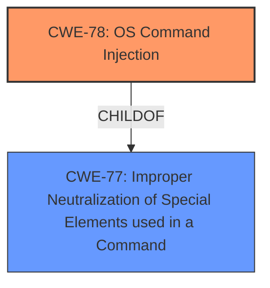

# Enhanced Analysis for CVE-2021-43663

# Summary
| CWE ID | CWE Name | Confidence | CWE Abstraction Level | CWE Vulnerability Mapping Label | CWE-Vulnerability Mapping Notes |
|---|---|---|---|---|---|
| CWE-78 | Improper Neutralization of Special Elements used in an OS Command ('OS Command Injection') | 1.0 | Base | Allowed | Primary CWE |
| CWE-77 | Improper Neutralization of Special Elements used in a Command ('Command Injection') | 0.7 | Class | Allowed-with-Review | Secondary Candidate, generalization of CWE-78 |

## Evidence and Confidence

*   **Confidence Score:** 1.0
*   **Evidence Strength:** HIGH

## Relationship Analysis
The primary CWE is CWE-78, which is a base-level weakness specifically focused on OS command injection. It is a child of CWE-77 which is a more general class.



## Vulnerability Chain
The vulnerability chain starts with the lack of proper sanitization of the `magicid` and `url` parameters, leading to **command injection** and ultimately, remote code execution as root.

## Summary of Analysis
The analysis indicates that the vulnerability is a **command injection** vulnerability. The `cloudupdate_check` function in the TOTOLINK EX300_v2 router firmware allows command injection through the `magicid` and `url` parameters. These parameters are used in `snprintf` and then executed with `system()` without sanitization.

The primary CWE selected is CWE-78: Improper Neutralization of Special Elements used in an OS Command ('OS Command Injection'). This CWE accurately describes the vulnerability because the product constructs an OS command using externally-influenced input without proper neutralization, allowing an attacker to inject arbitrary commands. The "CVE Reference Links Content Summary" provides direct evidence: "The `magicid` and `url` parameters, obtained via HTTP requests, are directly used in `snprintf` and subsequently executed using the `system()` function without proper sanitization."

The secondary CWE considered was CWE-77: Improper Neutralization of Special Elements used in a Command ('Command Injection'). While this is a broader category that includes OS command injection, CWE-78 is more specific and therefore a better fit. The mapping guidance for CWE-77 even suggests using CWE-78 when OS command injection is the specific issue.

CWE-94 (Improper Control of Generation of Code ('Code Injection')) was considered but deemed less appropriate because the vulnerability is specifically related to OS command execution rather than general code injection.

CWE-434 (Unrestricted Upload of File with Dangerous Type), CWE-22 (Improper Limitation of a Pathname to a Restricted Directory ('Path Traversal')), CWE-98 (Improper Control of Filename for Include/Require Statement in PHP Program ('PHP Remote File Inclusion')), CWE-426 (Untrusted Search Path), CWE-95 (Improper Neutralization of Directives in Dynamically Evaluated Code ('Eval Injection')), CWE-88 (Improper Neutralization of Argument Delimiters in a Command ('Argument Injection')), CWE-138 (Improper Neutralization of Special Elements), CWE-116 (Improper Encoding or Escaping of Output), CWE-79 (Improper Neutralization of Input During Web Page Generation ('Cross-site Scripting')), CWE-259 (Use of Hard-coded Password), CWE-321 (Use of Hard-coded Cryptographic Key), CWE-625 (Permissive Regular Expression) and CWE-184 (Incomplete List of Disallowed Inputs) were also considered, but these CWEs did not align as directly with the root cause as CWE-78.

The selection of CWE-78 is at the optimal level of specificity as it directly addresses the OS command injection vulnerability, aligning with the provided evidence and mapping guidance.


## CWE Relationship Analysis

Current CWEs represent these abstraction levels: .


### Vulnerability Chain Analysis

**Chain starting from CWE-321:**
- 321 (Use of Hard-coded Cryptographic Key) - ROOT


**Chain starting from CWE-79:**
- 79 (Improper Neutralization of Input During Web Page Generation ('Cross-site Scripting')) - ROOT


### CWE Relationship Diagram

```mermaid
graph TD
    classDef primary fill:#f96,stroke:#333,stroke-width:2px
    classDef secondary fill:#69f,stroke:#333
    classDef tertiary fill:#9e9,stroke:#333
```