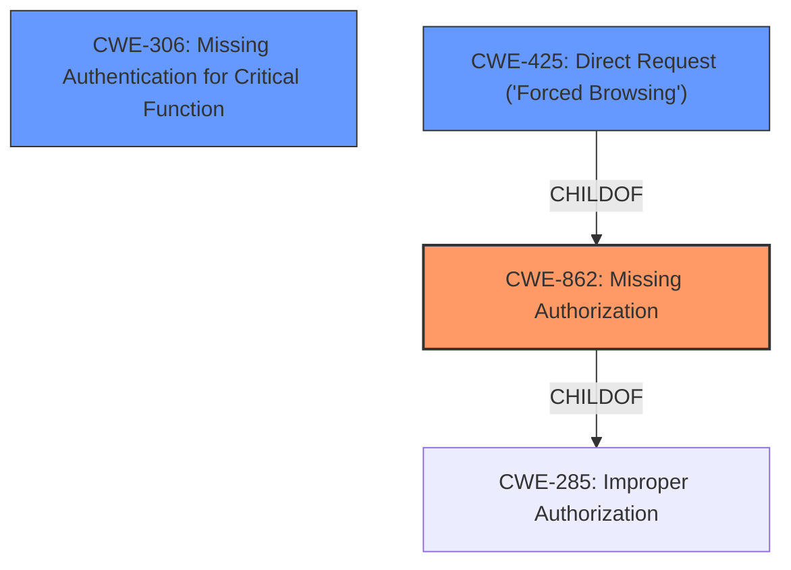

# Analysis Report for CVE-2021-43703

# Vulnerability Analysis Report: CVE-2021-43703

## Description


## Analysis (with Relationship Data)

# Summary
| CWE ID  | CWE Name                                                                   | Confidence | CWE Abstraction Level | CWE Vulnerability Mapping Label | CWE-Vulnerability Mapping Notes |
| :-------- | :------------------------------------------------------------------------- | :---------- | :---------------------- | :------------------------------ | :------------------------------ |
| CWE-862   | Missing Authorization                                                      | 0.95       | Base                    | Primary                         | Allowed                       |
| CWE-306   | Missing Authentication for Critical Function                               | 0.85       | Base                    | Secondary                       | Allowed                       |
| CWE-425   | Direct Request ('Forced Browsing')                                       | 0.75       | Base                    | Secondary                       | Allowed                       |

## Evidence and Confidence

*   **Confidence Score:** 0.90
*   **Evidence Strength:** HIGH

## Relationship Analysis
The primary weakness is **Missing Authorization (CWE-862)**, which is a child of **Improper Authorization (CWE-285)**. The attack vector leverages a **Direct Request (CWE-425)** due to the missing authorization. **Missing Authentication for Critical Function (CWE-306)** is related since the administrator console should require authentication. These relationships indicate a progression from the root cause (missing authorization) to the exploitation method (direct request) and highlight the absence of proper authentication mechanisms.


## Vulnerability Chain
The vulnerability chain starts with the **lack of authorization checks (CWE-862)** on the admin.php resource. This **missing authorization** allows for a **direct request (CWE-425)** to the administrator console, bypassing the intended access controls. The server-side script **fails to properly enforce access control**, which means that JavaScript redirect is the only method for preventing unauthorized access. This reliance on client-side controls highlights the core issue. Because there is no authentication required to reach the admin console, **Missing Authentication for Critical Function (CWE-306)** is also present.

## Summary of Analysis
The analysis is based on the provided vulnerability description and supporting CVE Reference Links Content Summary. The **root cause** is clearly identified as an **Incorrect Access Control** issue, which translates to **Missing Authorization (CWE-862)**. The vulnerability description states that you can directly access the administrator console after disabling JavaScript, meaning there is no server-side authorization implemented. The CVE Reference Links Content Summary confirms that the application **does not properly terminate the script execution after redirection is triggered**, indicating a server-side enforcement failure.

The graph relationships helped clarify the chain of events, starting with the missing authorization check and leading to the direct request. The selected CWEs are at the optimal level of specificity, with **CWE-862 (Missing Authorization)** being the most precise representation of the vulnerability. While other CWEs like **CWE-285 (Improper Authorization)** are related, they are too abstract to accurately describe the specific weakness.

**CWE Considerations:**

*   **CWE-862: Missing Authorization:** This is the primary CWE. The vulnerability description and CVE Reference Links Content Summary explicitly state that there is a **lack of proper authorization checks** on the `admin.php` resource. This allows unauthorized users to directly access the administrator console. Confidence: 0.95
*   **CWE-306: Missing Authentication for Critical Function:** This is a secondary CWE. The admin console should always require authentication, and the fact that it can be accessed without any authentication at all is a serious flaw. Confidence: 0.85
*   **CWE-425: Direct Request ('Forced Browsing'):** This is a secondary CWE. The vulnerability is exploited by directly requesting the admin.php resource, bypassing the intended access controls. Confidence: 0.75

Other CWEs Considered but Not Used:

*   **CWE-863: Incorrect Authorization**: While related to authorization issues, it is not as precise as **CWE-862** because it focuses on incorrect checks rather than the absence of checks.
*   **CWE-285: Improper Authorization**: Too abstract. **CWE-862** provides a more specific description of the missing authorization.
*   **CWE-705: Incorrect Control Flow Scoping**: It does not accurately describe the **root cause** of the vulnerability, which is related to access control rather than control flow.
*   **CWE-79: Improper Neutralization of Input During Web Page Generation ('Cross-site Scripting')**: There is no evidence of XSS in the description.
*   **CWE-639: Authorization Bypass Through User-Controlled Key**: This vulnerability doesn't involve manipulating a user-controlled key to bypass authorization.


## CWE Relationship Analysis

Current CWEs represent these abstraction levels: .


### Vulnerability Chain Analysis

**Chain starting from CWE-306:**
- 306 (Missing Authentication for Critical Function) - ROOT


**Chain starting from CWE-79:**
- 79 (Improper Neutralization of Input During Web Page Generation ('Cross-site Scripting')) - ROOT


### CWE Relationship Diagram

```mermaid
graph TD
    classDef primary fill:#f96,stroke:#333,stroke-width:2px
    classDef secondary fill:#69f,stroke:#333
    classDef tertiary fill:#9e9,stroke:#333
```


*Report generated on 2025-04-02 10:58:46*
