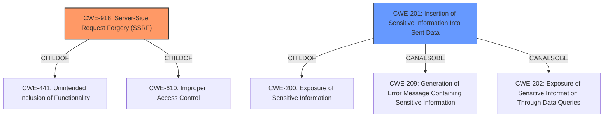

# Enhanced Analysis for CVE-2021-43780

# Summary
| CWE ID  | CWE Name                                                                              | Confidence | CWE Abstraction Level | CWE Vulnerability Mapping Label | CWE-Vulnerability Mapping Notes |
| ------- | ------------------------------------------------------------------------------------- | ---------- | ----------------------- | ------------------------------- | ------------------------------- |
| CWE-918 | Server-Side Request Forgery (SSRF)                                                    | 1          | Base                    | Primary                         | Allowed                       |
| CWE-200 | Insertion of Sensitive Information Into Sent Data | 0.6         | Base                    | Secondary                         | Allowed                       |

## Evidence and Confidence

*   **Confidence Score:** 0.8
*   **Evidence Strength:** HIGH

## Relationship Analysis
The primary CWE is CWE-918 (Server-Side Request Forgery), which is a base-level CWE. It has parent-child relationships to CWE-441 (Unintended Inclusion of Functionality) and CWE-610 (Improper Access Control). CWE-201 (Insertion of Sensitive Information Into Sent Data) is also a base-level CWE and a peer of CWE-209 (Generation of Error Message Containing Sensitive Information). CWE-201 is a child of CWE-200 (Exposure of Sensitive Information) and it can also be CWE-209 or CWE-202 (Exposure of Sensitive Information Through Data Queries).


## Vulnerability Chain
The vulnerability chain starts with the **improper** implementation of URL-loading data sources, leading to **Server-Side Request Forgery (SSRF)**. This then exposes internal resources and potentially sensitive information.
  - The root cause is the lack of proper validation and sanitization of URLs.
  - The weakness is the SSRF.
  - The impact is internal network scanning and data exfiltration.

## Summary of Analysis
The primary weakness is **Server Side Request Forgery (SSRF)** (CWE-918). The provided text explicitly states that the implementation of URL-loading data sources in Redash versions 10.0 and prior is vulnerable to advanced methods of **Server Side Request Forgery (SSRF)**. The vulnerability allows attackers to potentially scan internal networks and access internal resources. The fix involves using the Advocate library for making HTTP requests instead of the `requests` library directly, which provides more robust URL validation and protection against SSRF attacks. This confirms that the application makes HTTP requests to URLs provided by users without sufficient validation or sanitization. The high retriever score for CWE-918 also supports this classification.

CWE-201 (Insertion of Sensitive Information Into Sent Data) is considered as a secondary candidate because successful SSRF attacks can lead to the exposure of sensitive information. However, the vulnerability description focuses primarily on the SSRF itself rather than the specific types of information exposed, so my confidence is lower.

I considered other CWEs, such as CWE-20 (Improper Input Validation), but it is too general. CWE-918 provides a more specific description of the vulnerability. I also considered CWE-863 (Incorrect Authorization) and CWE-306 (Missing Authentication for Critical Function), but these are not the primary issues. The core problem is that the server makes requests to arbitrary URLs without proper validation, which is best captured by CWE-918.

The selected CWEs are at the optimal level of specificity. CWE-918 is a base-level CWE that accurately describes the root cause of the vulnerability.


## CWE Relationship Analysis

Current CWEs represent these abstraction levels: .


### Vulnerability Chain Analysis

**Chain starting from CWE-306:**
- 306 (Missing Authentication for Critical Function) - ROOT


**Chain starting from CWE-201:**
- 201 (Insertion of Sensitive Information Into Sent Data) - ROOT


### CWE Relationship Diagram

```mermaid
graph TD
    classDef primary fill:#f96,stroke:#333,stroke-width:2px
    classDef secondary fill:#69f,stroke:#333
    classDef tertiary fill:#9e9,stroke:#333
```