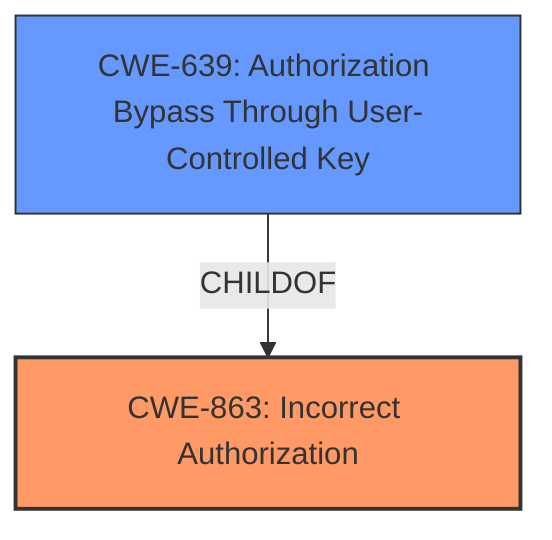

# Analysis for CVE-2021-43781

# Summary
| CWE ID | CWE Name | Confidence | CWE Abstraction Level | CWE Vulnerability Mapping Label | CWE-Vulnerability Mapping Notes |
|---|---|---|---|---|---|
| CWE-863 | Incorrect Authorization | 0.9 | Class | Allowed-with-Review | Primary CWE: The product performs an authorization check, but it does not correctly perform the check. |
| CWE-639 | Authorization Bypass Through User-Controlled Key | 0.7 | Base | Allowed | Secondary CWE: The system's authorization functionality does not prevent one user from gaining access to another user's data or record by modifying the key value identifying the data. |

## Evidence and Confidence

*   **Confidence Score:** 0.8
*   **Evidence Strength:** HIGH

## Relationship Analysis
The primary CWE is CWE-863, Incorrect Authorization, which is a Class-level CWE. CWE-639, Authorization Bypass Through User-Controlled Key, is a Base-level CWE and a child of CWE-863. The relationship signifies that CWE-639 is a more specific case of CWE-863.

## Vulnerability Chain
The vulnerability chain starts with the **improper permission check** which leads to an authenticated user being able to publish draft records of other users via REST API calls.

## Summary of Analysis
The initial analysis identified that the vulnerability lies in the **incorrect authorization**, specifically in the `publish()` method of the `invenio-drafts-resources` service. The provided evidence states that the record being published was not passed to the permission check function (`self.require_permission`).

The primary CWE selected is CWE-863 (Incorrect Authorization) because the product performs an authorization check, but **does not properly check permissions** when a record is published. This aligns with the description of CWE-863, which states, "The product performs an authorization check when an actor attempts to access a resource or perform an action, but it does not correctly perform the check."

CWE-639 (Authorization Bypass Through User-Controlled Key) was also considered because an authenticated user is able to publish draft records of other users if they know the record identifier. This suggests a potential bypass through a user-controlled key (the record identifier). However, CWE-639 is a more specific case that involves modifying the key value, and the vulnerability description doesn't explicitly state that the user is *modifying* the key, only that they need to *know* it. Thus, CWE-639 is marked as a secondary candidate.

The final decision to prioritize CWE-863 as the primary CWE is based on the root cause as identified in the vulnerability description key phrases: "**does not properly check permissions**". This aligns directly with the definition of CWE-863.

Relevant CWE Information:

# Enhanced Context (25 CWEs)
The following CWEs were identified as potentially relevant to this vulnerability:

## CWE-226: Sensitive Information in Resource Not Removed Before Reuse
**Abstraction Level**: Base
**Similarity Score**: 0.78
**Source**: dense

**Description**:
The product releases a resource such as memory or a file so that it can be made available for reuse, but it does not clear or "zeroize" the information contained in the resource before the product performs a critical state transition or makes the resource available for reuse by other entities.

**Mapping Guidance**:
- Usage: Allowed
- Rationale: This CWE entry is at the Base level of abstraction, which is a preferred level of abstraction for mapping to the root causes of vulnerabilities.

**Why Not Used:** This CWE focuses on the reuse of resources without clearing sensitive information, which is not the primary issue in the vulnerability description. The vulnerability is about **improper permission checks**, not the handling of sensitive information within resources.

## CWE-668: Exposure of Resource to Wrong Sphere
**Abstraction Level**: Class
**Similarity Score**: 0.78
**Source**: dense

**Description**:
The product exposes a resource to the wrong control sphere, providing unintended actors with inappropriate access to the resource.

**Mapping Guidance**:
- Usage: Discouraged
- Rationale: CWE-668 is high-level and is often misused as a catch-all when lower-level CWE IDs might be applicable. It is sometimes used for low-information vulnerability reports [REF-1287]. It is a level-1 Class (i.e., a child of a Pillar). It is not useful for trend analysis.

**Why Not Used:** Although this could be a consequence of the **improper permission check**, it's too high-level. The core issue is the **lack of proper authorization**, not the general exposure of a resource.

## CWE-538: Insertion of Sensitive Information into Externally-Accessible File or Directory
**Abstraction Level**: Base
**Similarity Score**: 0.77
**Source**: dense

**Description**:
The product places sensitive information into files or directories that are accessible to actors who are allowed to have access to the files, but not to the sensitive information.

**Mapping Guidance**:
- Usage: Allowed
- Rationale: This CWE entry is at the Base level of abstraction, which is a preferred level of abstraction for mapping to the root causes of vulnerabilities.

**Why Not Used:** This CWE is about the placement of sensitive information, which is not relevant to the vulnerability. The issue is about **improper authorization**, not the mishandling of sensitive information.

## CWE-497: Exposure of Sensitive System Information to an Unauthorized Control Sphere
**Abstraction Level**: Base
**Similarity Score**: 0.77
**Source**: dense

**Description**:
The product does not properly prevent sensitive system-level information from being accessed by unauthorized actors who do not have the same level of access to the underlying system as the product does.

**Mapping Guidance**:
- Usage: Allowed
- Rationale: This CWE entry is at the Base level of abstraction, which is a preferred level of abstraction for mapping to the root causes of vulnerabilities.

**Why Not Used:** This CWE focuses on system-level information exposure, which is not the primary issue. The vulnerability is about **improper authorization** to publish records.

## CWE-404: Improper Resource Shutdown or Release
**Abstraction Level**: Class
**Similarity Score**: 0.77
**Source**: dense

**Description**:
The product does not release or incorrectly releases a resource before it is made available for re-use.

**Mapping Guidance**:
- Usage: Allowed-with-Review
- Rationale: This CWE entry is a Class and might have Base-level children that would be more appropriate

**Why Not Used:** This CWE is about resource management, which is not related to the described vulnerability. The core issue is **improper permission checks**.

## CWE-212: Improper Removal of Sensitive Information Before Storage or Transfer
**Abstraction Level**: Base
**Similarity Score**: 0.77
**Source**: dense

**Description**:
The product stores, transfers, or shares a resource that contains sensitive information, but it does not properly remove that information before the product makes the resource available to unauthorized actors.

**Mapping Guidance**:
- Usage: Allowed
- Rationale: This CWE entry is at the Base level of abstraction, which is a preferred level of abstraction for mapping to the root causes of vulnerabilities.

**Why Not Used:** The vulnerability is about **improper authorization**, not the mishandling of sensitive information before storage or transfer.

## CWE-639: Authorization Bypass Through User-Controlled Key
**Abstraction Level**: Base
**Similarity Score**: 0.77
**Source**: dense

**Description**:
The system's authorization functionality does not prevent one user from gaining access to another user's data or record by modifying the key value identifying the data.

**Mapping Guidance**:
- Usage: Allowed
- Rationale: This CWE entry is at the Base level of abstraction, which is a preferred level of abstraction for mapping to the root causes of vulnerabilities.

**Why Used as Secondary:** While not the primary cause, this is a potential contributing factor. The authenticated user needs to know the record identifier to exploit the vulnerability, suggesting a potential bypass through a user-controlled key. However, the description doesn't explicitly state that the user is *modifying* the key, only that they need to *know* it.

## CWE-552: Files or Directories Accessible to External Parties
**Abstraction Level**: Base
**Similarity Score**: 0.77
**Source**: dense

**Description**:
The product makes files or directories accessible to unauthorized actors, even though they should not be.

**Mapping Guidance**:
- Usage: Allowed
- Rationale: This CWE entry is at the Base level of abstraction, which is a preferred level of abstraction for mapping to the root causes of vulnerabilities.

**Why Not Used:** This CWE is about file access, which is not directly related to the described vulnerability. The core issue is **improper