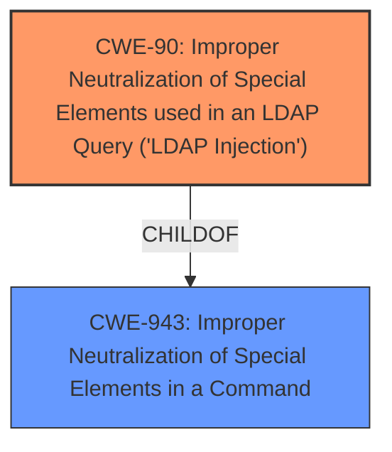

# Raw Analyzer Response for CVE-2021-43782

# Summary
| CWE ID | CWE Name | Confidence | CWE Abstraction Level | CWE Vulnerability Mapping Label | CWE-Vulnerability Mapping Notes |
|---|---|---|---|---|---|
| CWE-90 | Improper Neutralization of Special Elements used in an LDAP Query ('LDAP Injection') | 1.0 | Base | Allowed | Primary CWE |

## Evidence and Confidence

*   **Confidence Score:** 1.0
*   **Evidence Strength:** HIGH

## Relationship Analysis
The primary relationship that influenced the decision was the ChildOf relationship between CWE-90 and CWE-943. CWE-90 is a base level CWE which makes it ideal for mapping.

## Vulnerability Chain
The vulnerability chain starts with **improper input sanitization** of the `ldap_id` attribute, leading to **LDAP Injection**, which allows a malicious user to force account suspension or takeover.

## Summary of Analysis
The analysis is based on the provided evidence, specifically the "CVE Reference Links Content Summary" and "Vulnerability Description Key Phrases".

The "CVE Reference Links Content Summary" states:
- "**Root cause of vulnerability:** The vulnerability is caused by Tuleap not properly sanitizing the search filter built from the `ldap_id` attribute of a user during the daily synchronization process. This occurs when checking if the user still exists in the LDAP directory."
- "**Weaknesses/vulnerabilities present:** - **LDAP Injection:** The primary weakness is an indirect LDAP injection vulnerability. The `ldap_id` attribute is not properly escaped, allowing a malicious user to inject arbitrary LDAP queries. - **Insufficient Input Sanitization:** The application fails to sanitize user-controlled input (`ldap_id`) before using it in an LDAP search filter."

The "Vulnerability Description Key Phrases" states:
- "**rootcause:** **improper input sanitization**"

The graph relationships influenced the final selection by confirming that CWE-90 is a base level CWE, which is a preferred level of abstraction for mapping to the root causes of vulnerabilities.

CWE-90 is selected because it accurately represents the vulnerability where **improper sanitization** of the `ldap_id` attribute allows for **LDAP injection**. The CWE description matches the vulnerability description: "The product constructs all or part of an LDAP query using externally-influenced input from an upstream component, but it does not neutralize or incorrectly neutralizes special elements that could modify the intended LDAP query when it is sent to a downstream component."

Relevant CWE Information:

# Enhanced Context (25 CWEs)

## CWE-807: Reliance on Untrusted Inputs in a Security Decision
This CWE was not selected because the core issue isn't the reliance on untrusted inputs for a security decision, but the **lack of proper sanitization** leading to **LDAP injection**.

## CWE-74: Improper Neutralization of Special Elements in Output Used by a Downstream Component ('Injection')
This CWE was not selected because it's a class-level CWE and CWE-90 is more specific to the **LDAP injection** vulnerability.

## CWE-303: Incorrect Implementation of Authentication Algorithm
This CWE was not selected as the vulnerability is not related to the incorrect implementation of an authentication algorithm.

## CWE-639: Authorization Bypass Through User-Controlled Key
This CWE was not selected as the vulnerability is not directly related to authorization bypass through user-controlled keys but more on **improper sanitization** leading to **LDAP injection**.

## CWE-472: External Control of Assumed-Immutable Web Parameter
This CWE was not selected as the vulnerability is not about externally controllable immutable web parameters, but **improper sanitization** of `ldap_id`.

## CWE-1390: Weak Authentication
This CWE was not selected as the vulnerability is not directly related to weak authentication mechanisms.

## CWE-184: Incomplete List of Disallowed Inputs
This CWE was not selected because the issue isn't an incomplete list of disallowed inputs, but **improper sanitization** of the `ldap_id` attribute.

## CWE-204: Observable Response Discrepancy
This CWE was not selected because the vulnerability doesn't involve observable response discrepancies.

## CWE-668: Exposure of Resource to Wrong Sphere
This CWE was not selected because this CWE is high-level and CWE-90 is more specific to the **LDAP injection** vulnerability.

## CWE-319: Cleartext Transmission of Sensitive Information
This CWE was not selected because the vulnerability is not related to cleartext transmission of sensitive information.

## CWE-863: Incorrect Authorization
This CWE was not selected because the root cause is **improper sanitization** leading to **LDAP injection**, and the authorization issue is a consequence of that.

## CWE-285: Improper Authorization
This CWE was not selected as the root cause is **improper sanitization** leading to **LDAP injection**.

## CWE-116: Improper Encoding or Escaping of Output
While encoding/escaping is related to sanitization, CWE-90 is more specific to the **LDAP injection** context.

## CWE-79: Improper Neutralization of Input During Web Page Generation ('Cross-site Scripting')
This CWE was not selected because the vulnerability is specific to **LDAP injection**, not XSS.

## CWE-386: Symbolic Name not Mapping to Correct Object
This CWE was not selected as it does not apply to this vulnerability.

## CWE-494: Download of Code Without Integrity Check
This CWE was not selected as it does not apply to this vulnerability.

## CWE-202: Exposure of Sensitive Information Through Data Queries
This CWE was not selected as it does not apply to this vulnerability.

## CWE-201: Insertion of Sensitive Information Into Sent Data
This CWE was not selected as it does not apply to this vulnerability.

## CWE-178: Improper Handling of Case Sensitivity
This CWE was not selected as it does not apply to this vulnerability.

## CWE-367: Time-of-check Time-of-use (TOCTOU) Race Condition
This CWE was not selected as it does not apply to this vulnerability.

## CWE-209: Generation of Error Message Containing Sensitive Information
This CWE was not selected as it does not apply to this vulnerability.

## CWE-352: Cross-Site Request Forgery (CSRF)
This CWE was not selected because it is not relevant to the described vulnerability.

## CWE-41: Improper Resolution of Path Equivalence
This CWE was not selected because it is not relevant to the described vulnerability.