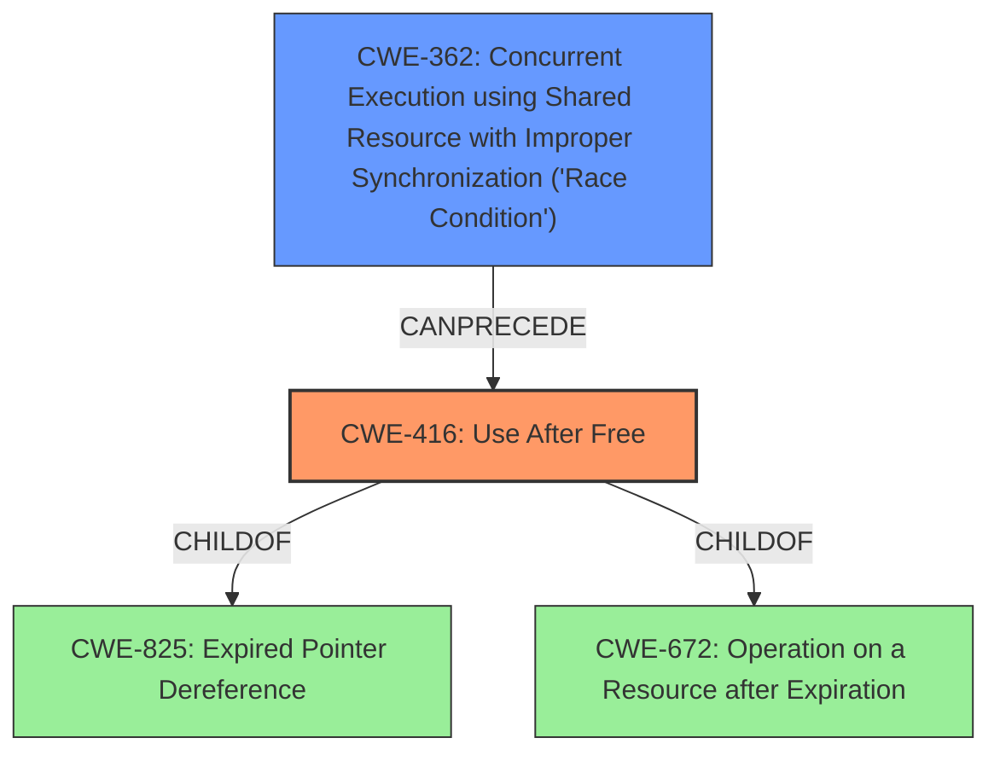

# Analysis for CVE-2021-43790

# Summary
| CWE ID | CWE Name | Confidence | CWE Abstraction Level | CWE Vulnerability Mapping Label | CWE-Vulnerability Mapping Notes |
|---|---|---|---|---|---|
| CWE-416 | Use After Free | 1.0 | Variant | Allowed | Primary CWE |
| CWE-362 | Concurrent Execution using Shared Resource with Improper Synchronization ('Race Condition') | 0.7 | Class | Allowed-with-Review | Secondary CWE |

## Evidence and Confidence

*   **Confidence Score:** 0.9
*   **Evidence Strength:** HIGH

## Relationship Analysis
The primary CWE is CWE-416 **(Use After Free)**, which is a Variant. It has parent relationships to CWE-825 and CWE-672. CWE-362 **(Race Condition)** is a Class and a secondary CWE. It can precede CWE-416, indicating it could set the stage for the **use-after-free**. The relationships influenced the inclusion of both CWE-416 as the primary issue and CWE-362 as a contributing factor.

## Vulnerability Chain
The vulnerability chain starts with **improper object lifecycle management during deallocation**, potentially involving a **race condition** (CWE-362), which leads to a **use-after-free** (CWE-416). The impact is memory corruption and data races.

## Summary of Analysis
The primary weakness is a **use-after-free** vulnerability (CWE-416) that occurs when an `Instance` object is deallocated before all its fields have been properly destructed. This can lead to memory corruption, data races, and other related issues. The `CVE Reference Links Content Summary` section states: "The `Instance` object in Lucet's `lucet-runtime` was being deallocated before the destructors of all its fields had completed, creating a **use-after-free** vulnerability if another thread reallocated the memory." Additionally, the summary highlights a race condition caused by premature memory release back to the pool allocator. The patch description further supports this by stating that the vulnerability was resolved by modifying the `InstanceHandle` destructor to ensure that the underlying memory for the `Instance` is not returned to the memory pool until after all of the `Instance` object's destructors have been executed, thus preventing the **race condition**.

CWE-416 is selected as the primary CWE because the **use-after-free** condition is explicitly mentioned in the vulnerability description and CVE details. It is also at the preferred Variant level of abstraction.

CWE-362 is included as a secondary CWE because the vulnerability summary mentions a **race condition** that can contribute to the **use-after-free**. This aligns with CWE-362's description of concurrent execution with improper synchronization, potentially leading to unexpected resource modification.

Other CWEs considered but not selected:

*   CWE-415 (**Double Free**): While related to memory management issues, the vulnerability description focuses on reusing memory after it has been freed, not freeing it multiple times.
*   CWE-667 (**Improper Locking**): Although locking issues might be indirectly related, the core issue is the timing of deallocation relative to field destruction, which directly causes the **use-after-free**, and the **race condition** more directly applies.
*   CWE-123 (**Write-what-where Condition**): This is a potential impact of a **use-after-free**, but not the root cause itself.
*   CWE-401 (**Missing Release of Memory after Effective Lifetime**): The vulnerability focuses on premature release, not the absence of release.

The selected CWEs are at the optimal level of specificity because they directly address the **use-after-free** condition and the contributing **race condition**, based on the evidence in the vulnerability description and CVE details.