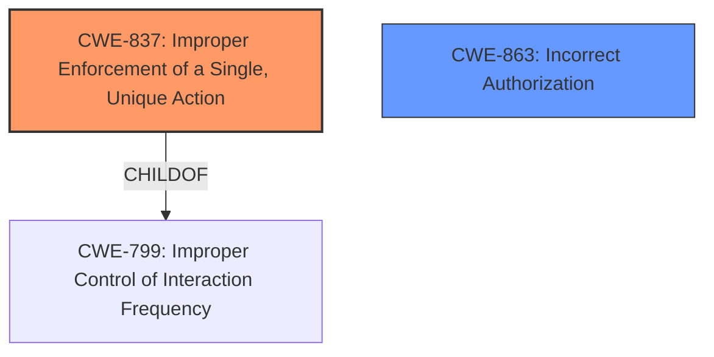

# Analysis for CVE-2021-43793

# Summary
| CWE ID | CWE Name | Confidence | CWE Abstraction Level | CWE Vulnerability Mapping Label | CWE-Vulnerability Mapping Notes |
|---|---|---|---|---|---|
| CWE-837 | Improper Enforcement of a Single, Unique Action | 1.0 | Base | Allowed | Primary CWE. The product allows a user to perform an action (voting) more than once when it should be restricted to a single instance. |
| CWE-863 | Incorrect Authorization | 0.7 | Class | Allowed-with-Review | Secondary CWE. The authorization check to limit voting to once per user is not correctly implemented. |

## Evidence and Confidence

*   **Confidence Score:** 1.0
*   **Evidence Strength:** HIGH

## Relationship Analysis
The primary CWE is CWE-837, which is a Base level CWE. CWE-837 is related to CWE-799 (Improper Control of Interaction Frequency) via a ChildOf relationship. CWE-863 is a Class level CWE, and it has child CWEs, which may be a better fit.

## Vulnerability Chain
The chain of events is as follows:
1.  **Root Cause:** **Improper Enforcement of a Single, Unique Action** (CWE-837) due to a flaw in the poll feature's handling of voting limits.
2.  **Weakness:** **Insufficient input validation** allows users to bypass the intended one-vote-per-user restriction.
3.  **Impact:** Users are able to **vote multiple times**, leading to **manipulation of poll results**.

## Summary of Analysis
The initial analysis identified CWE-837 as the primary weakness, which aligns with the description of the vulnerability that allows users to vote multiple times in a single-option poll. The evidence from the "CVE Reference Links Content Summary" supports this, stating that the system "failed to properly enforce the restriction that a user could only cast one vote on such polls."

The retriever results also highlighted CWE-863, Incorrect Authorization, as a relevant CWE. The authorization mechanism intended to prevent multiple votes was **incorrectly implemented**, which aligns with the description of CWE-863.

I am confident in this assessment because the vulnerability description and CVE details directly support the selected CWEs. CWE-837 is at the optimal level of specificity (Base) as it clearly describes the core issue.

Relevant CWE Information:

# Enhanced Context (25 CWEs)

## CWE-80: Improper Neutralization of Script-Related HTML Tags in a Web Page (Basic XSS)
**Abstraction Level**: Variant
**Similarity Score**: 0.79

This CWE is not applicable as the vulnerability is related to voting limits and not related to neutralization of script-related HTML tags.

## CWE-74: Improper Neutralization of Special Elements in Output Used by a Downstream Component ('Injection')
**Abstraction Level**: Class
**Similarity Score**: 0.78

This CWE is not applicable as the vulnerability is related to voting limits and not related to injection vulnerabilities.

## CWE-184: Incomplete List of Disallowed Inputs
**Abstraction Level**: Base
**Similarity Score**: 0.77

This CWE is not applicable as the vulnerability is related to logic error and not an incomplete list of disallowed inputs.

## CWE-116: Improper Encoding or Escaping of Output
**Abstraction Level**: Class
**Similarity Score**: 0.77

This CWE is not applicable as the vulnerability is related to voting limits and not encoding/escaping issues.

## CWE-799: Improper Control of Interaction Frequency
**Abstraction Level**: Class
**Similarity Score**: 0.77

While related to CWE-837 as a parent, it is a higher-level abstraction and not as specific as CWE-837.

## CWE-472: External Control of Assumed-Immutable Web Parameter
**Abstraction Level**: Base
**Similarity Score**: 0.77

This CWE is not applicable as the vulnerability is related to voting limits and not external control of web parameters.

## CWE-639: Authorization Bypass Through User-Controlled Key
**Abstraction Level**: Base
**Similarity Score**: 0.77

This CWE is not applicable as the vulnerability is related to voting limits and not authorization bypass through user-controlled key.

## CWE-1289: Improper Validation of Unsafe Equivalence in Input
**Abstraction Level**: Base
**Similarity Score**: 0.77

This CWE is not applicable as the vulnerability is related to voting limits and not improper validation of unsafe equivalence in input.

## CWE-538: Insertion of Sensitive Information into Externally-Accessible File or Directory
**Abstraction Level**: Base
**Similarity Score**: 0.77

This CWE is not applicable as the vulnerability is related to voting limits and not insertion of sensitive information.

## CWE-451: User Interface (UI) Misrepresentation of Critical Information
**Abstraction Level**: Class
**Similarity Score**: 0.77

This CWE is not applicable as the vulnerability is related to voting limits and not UI misrepresentation.

## CWE-79: Improper Neutralization of Input During Web Page Generation ('Cross-site Scripting')
**Abstraction Level**: Base
**Similarity Score**: 6457.05

This CWE is not applicable as the vulnerability is related to voting limits and not related to cross-site scripting.

## CWE-863: Incorrect Authorization
**Abstraction Level**: Class
**Similarity Score**: 6136.41

This CWE is considered a secondary candidate as the authorization check to limit voting to once per user is not correctly implemented, but CWE-837 is a more specific fit.

## CWE-116: Improper Encoding or Escaping of Output
**Abstraction Level**: Class
**Similarity Score**: 6068.99

This CWE is not applicable as the vulnerability is related to voting limits and not encoding/escaping issues.

## CWE-1390: Weak Authentication
**Abstraction Level**: Class
**Similarity Score**: 6049.53

This CWE is not applicable as the vulnerability is related to voting limits and not weak authentication.

## CWE-799: Improper Control of Interaction Frequency
**Abstraction Level**: Class
**Similarity Score**: 5991.34

While related to CWE-837 as a parent, it is a higher-level abstraction and not as specific as CWE-837.

## CWE-226: Sensitive Information in Resource Not Removed Before Reuse
**Abstraction Level**: base
**Similarity Score**: 4.33

This CWE is not applicable as the vulnerability is related to voting limits and not sensitive information not removed before reuse.

## CWE-494: Download of Code Without Integrity Check
**Abstraction Level**: base
**Similarity Score**: 4.33

This CWE is not applicable as the vulnerability is related to voting limits and not downloading of code without integrity check.

## CWE-178: Improper Handling of Case Sensitivity
**Abstraction Level**: base
**Similarity Score**: 3.76

This CWE is not applicable as the vulnerability is related to voting limits and not handling of case sensitivity.

## CWE-209: Generation of Error Message Containing Sensitive Information
**Abstraction Level**: base
**Similarity Score**: 3.64

This CWE is not applicable as the vulnerability is related to voting limits and not generation of error messages containing sensitive information.

## CWE-202: Exposure of Sensitive Information Through Data Queries
**Abstraction Level**: base
**Similarity Score**: 3.64

This CWE is not applicable as the vulnerability is related to voting limits and not exposure of sensitive information.

## CWE-193: Off-by-one Error
**Abstraction Level**: base
**Similarity Score**: 3.42

This CWE is not applicable as the vulnerability is related to voting limits and not off-by-one errors.

## CWE-201: Insertion of Sensitive Information Into Sent Data
**Abstraction Level**: Base
**Similarity Score**: 3.33

This CWE is not applicable as the vulnerability is related to voting limits and not insertion of sensitive information.

## CWE-79: Improper Neutralization of Input During Web Page Generation ('Cross-site Scripting')
**Abstraction Level**: Base
**Similarity Score**: 3.32

This CWE is not applicable as the vulnerability is related to voting limits and not cross-site scripting.

## CWE-184: Incomplete List of Disallowed Inputs
**Abstraction Level**: Base
**Similarity Score**: 2.91

This CWE is not applicable as the vulnerability is related to logic error and not an incomplete list of disallowed inputs.

## CWE-212: Improper Removal of Sensitive Information Before Storage or Transfer