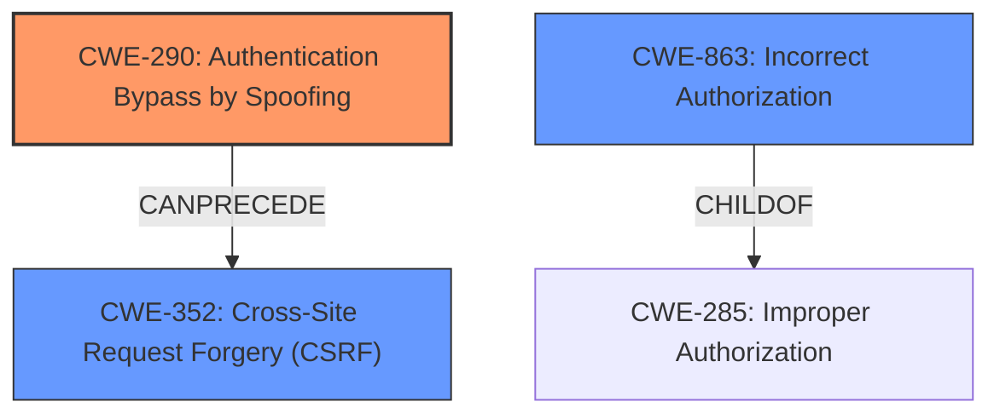

# Raw Analyzer Response for CVE-2021-43807

# Summary
| CWE ID | CWE Name | Confidence | CWE Abstraction Level | CWE Vulnerability Mapping Label | CWE-Vulnerability Mapping Notes |
|---|---|---|---|---|---|
| CWE-290 | Authentication Bypass by Spoofing | 0.9 | Base | Allowed | Primary CWE. The application trusts the spoofed HTTP method, leading to a bypass of intended restrictions. |
| CWE-352 | Cross-Site Request Forgery (CSRF) | 0.7 | Compound | Allowed | Secondary CWE. The **HTTP method spoofing** aids in CSRF attacks, which would otherwise not be possible. |
| CWE-863 | Incorrect Authorization | 0.6 | Class | Allowed-with-Review | Secondary CWE. The **incorrect authorization** occurs because the system **fails to properly** validate the HTTP method, allowing unauthorized actions. |

## Evidence and Confidence

*   **Confidence Score:** 0.8
*   **Evidence Strength:** HIGH

## Relationship Analysis
The primary CWE is CWE-290 Authentication Bypass by Spoofing, which is a base-level CWE. This weakness directly enables other issues, such as CWE-352 Cross-Site Request Forgery. CWE-863 (Incorrect Authorization) is a class-level CWE that represents a broader category of authorization failures, and while applicable, it is less specific than CWE-290.

## Vulnerability Chain
The vulnerability chain starts with the **HTTP method spoofing** (**weakness**). The server **fails to properly** validate the HTTP method, leading to an **incorrect authorization**. This, in turn, enables Cross-Site Request Forgery (CSRF) attacks, ultimately allowing attackers to change the server state.
  - **Root Cause:** **HTTP method spoofing** (**weakness:** **HTTP method spoofing**)
  - **Weakness:** **Incorrect Authorization** (The system **fails to properly** validate the HTTP method)
  - **Impact:** Cross-Site Request Forgery (CSRF) and ability to change the server state.

## Summary of Analysis
The initial analysis focused on the **HTTP method spoofing** vulnerability, considering its impact on authorization and potential for CSRF attacks. The final selection prioritizes CWE-290 because it directly addresses the **root cause** of the vulnerability - the **failure to properly** validate the HTTP method, leading to **authentication bypass**. CWE-352 is included because the **HTTP method spoofing** aids in CSRF attacks. The assessment relies on the evidence provided in the vulnerability description and CVE reference links, particularly the emphasis on how **HTTP method spoofing** bypasses intended restrictions and aids CSRF attacks.

Relevant excerpts:
- "allows **HTTP method spoofing**, allowing to change the assumed HTTP method via URL parameter."
- "This bypasses restrictions otherwise put on these types of requests and aids in cross-site request forgery (CSRF) attacks, which would otherwise not be possible."

The CWEs are selected at the optimal level of specificity because CWE-290 is a base-level CWE that directly describes the **authentication bypass** due to **HTTP method spoofing**.
The Retriever Results and graph relationships support this decision.

Relevant CWE Information:

# Enhanced Context (25 CWEs)
The following CWEs were identified as potentially relevant to this vulnerability:

## CWE-807: Reliance on Untrusted Inputs in a Security Decision
**Abstraction Level**: Base
**Similarity Score**: 0.77
**Source**: dense

**Description**:
The product uses a protection mechanism that relies on the existence or values of an input, but the input can be modified by an untrusted actor in a way that bypasses the protection mechanism.

**Mapping Guidance**:
- Usage: Allowed
- Rationale: This CWE entry is at the Base level of abstraction, which is a preferred level of abstraction for mapping to the root causes of vulnerabilities.

Analysis: This CWE is related because the application relies on the HTTP method (an input) for security decisions, but it can be modified by an attacker.

## CWE-639: Authorization Bypass Through User-Controlled Key
**Abstraction Level**: Base
**Similarity Score**: 0.77
**Source**: dense

**Description**:
The system's authorization functionality does not prevent one user from gaining access to another user's data or record by modifying the key value identifying the data.

**Mapping Guidance**:
- Usage: Allowed
- Rationale: This CWE entry is at the Base level of abstraction, which is a preferred level of abstraction for mapping to the root causes of vulnerabilities.

Analysis: This CWE is less relevant because it focuses on modifying a key value to access another user's data, while this vulnerability allows changing the HTTP method to bypass restrictions.

## CWE-303: Incorrect Implementation of Authentication Algorithm
**Abstraction Level**: Base
**Similarity Score**: 0.76
**Source**: dense

**Description**:
The requirements for the product dictate the use of an established authentication algorithm, but the implementation of the algorithm is incorrect.

**Mapping Guidance**:
- Usage: Allowed
- Rationale: This CWE entry is at the Base level of abstraction, which is a preferred level of abstraction for mapping to the root causes of vulnerabilities.

Analysis: This CWE is not directly applicable because the vulnerability is not related to incorrect implementation of a specific authentication algorithm, but rather to the **failure to validate** the HTTP method.

## CWE-472: External Control of Assumed-Immutable Web Parameter
**Abstraction Level**: Base
**Similarity Score**: 0.76
**Source**: dense

**Description**:
The web application does not sufficiently verify inputs that are assumed to be immutable but are actually externally controllable, such as hidden form fields.

**Mapping Guidance**:
- Usage: Allowed
- Rationale: This CWE entry is at the Base level of abstraction, which is a preferred level of abstraction for mapping to the root causes of vulnerabilities.

Analysis: This CWE is related because the HTTP method is assumed to be immutable, but it can be externally controlled via a URL parameter.

## CWE-668: Exposure of Resource to Wrong Sphere
**Abstraction Level**: Class
**Similarity Score**: 0.76
**Source**: dense

**Description**:
The product exposes a resource to the wrong control sphere, providing unintended actors with inappropriate access to the resource.

**Mapping Guidance**:
- Usage: Discouraged
- Rationale: CWE-668 is high-level and is often misused as a catch-all when lower-level CWE IDs might be applicable. It is sometimes used for low-information vulnerability reports [REF-1287]. It is a level-1 Class (i.e., a child of a Pillar). It is not useful for trend analysis.

Analysis: This CWE is too broad and discouraged for use when more specific CWEs are available.

## CWE-212: Improper Removal of Sensitive Information Before Storage or Transfer
**Abstraction Level**: Base
**Similarity Score**: 0.76
**Source**: dense

**Description**:
The product stores, transfers, or shares a resource that contains sensitive information, but it does not properly remove that information before the product makes the resource available to unauthorized actors.

**Mapping Guidance**:
- Usage: Allowed
- Rationale: This CWE entry is at the Base level of abstraction, which is a preferred level of abstraction for mapping to the root causes of vulnerabilities.

Analysis: This CWE is not applicable as the vulnerability does not involve sensitive information being stored or transferred.

## CWE-74: Improper Neutralization of Special Elements in Output Used by a Downstream Component ('Injection')
**Abstraction Level**: Class
**Similarity Score**: 0.76
**Source**: dense

**Description**:
The product constructs all or part of a command, data structure, or record using externally-influenced input from an upstream component, but it does not neutralize or incorrectly neutralizes special elements that could modify how it is parsed or interpreted when it is sent to a downstream component.

**Mapping Guidance**:
- Usage: Discouraged
- Rationale: CWE-74 is high-level and often misused when lower-level weaknesses are more appropriate.

Analysis: This CWE is not applicable because the vulnerability is not related to improper neutralization of special elements.

## CWE-1390: Weak Authentication
**Abstraction Level**: Class
**Similarity Score**: 0.75
**Source**: dense

**Description**:
The product uses an authentication mechanism to restrict access to specific users or identities, but the mechanism does not sufficiently prove that the claimed identity is correct.

**Mapping Guidance**:
- Usage: