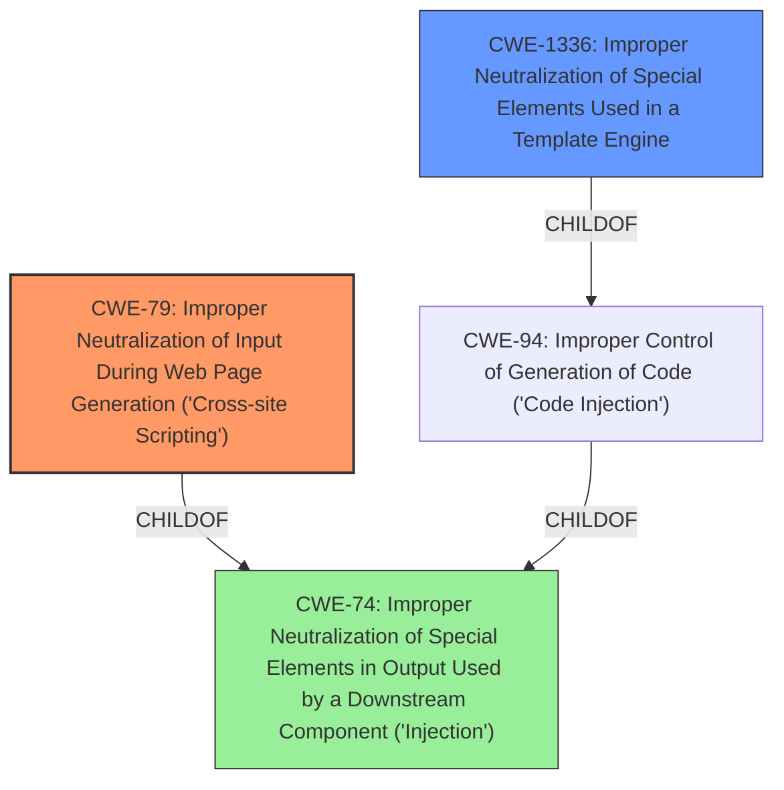

# Analysis for CVE-2021-43808

# Summary
| CWE ID | CWE Name | Confidence | CWE Abstraction Level | CWE Vulnerability Mapping Label | CWE-Vulnerability Mapping Notes |
|---|---|---|---|---|---|
| CWE-79 | Improper Neutralization of Input During Web Page Generation ('Cross-site Scripting') | 1.0 | Base | Allowed | Primary CWE |
| CWE-1336 | Improper Neutralization of Special Elements Used in a Template Engine | 0.7 | Base | Allowed | Secondary Candidate |

## Evidence and Confidence

*   **Confidence Score:** 0.9
*   **Evidence Strength:** HIGH

## Relationship Analysis
The primary relationship is that CWE-79 is a base class of injection issues. CWE-1336 is a more specific type of injection related to template engines, which is relevant here. The vulnerability involves a **cross-site scripting** issue (CWE-79) arising from **improper input sanitization** within the Blade templating engine, suggesting a potential connection to template injection (CWE-1336). However, the core problem is that the templating engine is not properly neutralizing user-controllable input before it is placed in output, which is classic XSS.

## Vulnerability Chain
The vulnerability chain starts with user-controllable input flowing into the Blade templating engine. The **improper input sanitization** leads to the potential injection of malicious code, resulting in a **cross-site scripting** vulnerability. The impact is information disclosure or other malicious actions executed in the user's browser.

## Summary of Analysis
The initial assessment pointed to CWE-79 as the primary weakness, given the clear **cross-site scripting** impact and the **improper input sanitization**. The CVE description also mentions a predictable SHA-1 hash, but this is more of a contributing factor than the root cause.

The description states: "Laravel prior to versions 8.75.0, 7.30.6, and 6.20.42 contain a possible **cross-site scripting** (XSS) vulnerability in the Blade templating engine... This is due to the user being able to guess the parent placeholder SHA-1 hash by trying common names of sections. If the parent template contains an exploitable HTML structure an XSS vulnerability can be exposed." This evidence directly supports CWE-79.

CWE-1336 was considered as a secondary candidate because the vulnerability occurs within the Blade templating engine. However, the core issue remains the **improper neutralization** of input leading to XSS, making CWE-79 the more direct and appropriate classification. While the template engine is the context, the fundamental weakness is the XSS.

The selected CWEs are at the optimal level of specificity. CWE-79 is a base-level CWE that accurately describes the XSS vulnerability. CWE-1336 is a more specific base-level CWE that could be considered because the XSS occurs within a template engine.

Relevant CWE Information:

# Enhanced Context (25 CWEs)
The following CWEs were identified as potentially relevant to this vulnerability:

## CWE-113: Improper Neutralization of CRLF Sequences in HTTP Headers ('HTTP Request/Response Splitting')
**Abstraction Level**: Variant
**Similarity Score**: 0.81
**Source**: dense

**Description**:
The product receives data from an HTTP agent/component (e.g., web server, proxy, browser, etc.), but it does not neutralize or incorrectly neutralizes CR and LF characters before the data is included in outgoing HTTP headers.

**Mapping Guidance**:
- Usage: Allowed
- Rationale: This CWE entry is at the Variant level of abstraction, which is a preferred level of abstraction for mapping to the root causes of vulnerabilities.

*This CWE is not relevant because it deals with HTTP headers, whereas the vulnerability is in the Blade templating engine.*

## CWE-444: Inconsistent Interpretation of HTTP Requests ('HTTP Request/Response Smuggling')
**Abstraction Level**: Base
**Similarity Score**: 0.75
**Source**: dense

**Description**:
The product acts as an intermediary HTTP agent
         (such as a proxy or firewall) in the data flow between two
         entities such as a client and server, but it does not
         interpret malformed HTTP requests or responses in ways that
         are consistent with how the messages will be processed by
         those entities that are at the ultimate destination.

**Mapping Guidance**:
- Usage: Allowed
- Rationale: This CWE entry is at the Base level of abstraction, which is a preferred level of abstraction for mapping to the root causes of vulnerabilities.

*This CWE is not relevant because it deals with HTTP request/response inconsistencies, whereas the vulnerability is in the Blade templating engine.*

## CWE-74: Improper Neutralization of Special Elements in Output Used by a Downstream Component ('Injection')
**Abstraction Level**: Class
**Similarity Score**: 0.74
**Source**: dense

**Description**:
The product constructs all or part of a command, data structure, or record using externally-influenced input from an upstream component, but it does not neutralize or incorrectly neutralizes special elements that could modify how it is parsed or interpreted when it is sent to a downstream component.

**Mapping Guidance**:
- Usage: Discouraged
- Rationale: CWE-74 is high-level and often misused when lower-level weaknesses are more appropriate.

*This CWE is too high-level. CWE-79 and CWE-1336 are more specific.*

## CWE-41: Improper Resolution of Path Equivalence
**Abstraction Level**: Base
**Similarity Score**: 0.74
**Source**: dense

**Description**:
The product is vulnerable to file system contents disclosure through path equivalence. Path equivalence involves the use of special characters in file and directory names. The associated manipulations are intended to generate multiple names for the same object.

**Mapping Guidance**:
- Usage: Allowed
- Rationale: This CWE entry is at the Base level of abstraction, which is a preferred level of abstraction for mapping to the root causes of vulnerabilities.

*This CWE is not relevant as it deals with path equivalence issues.*

## CWE-184: Incomplete List of Disallowed Inputs
**Abstraction Level**: Base
**Similarity Score**: 0.72
**Source**: dense

**Description**:
The product implements a protection mechanism that relies on a list of inputs (or properties of inputs) that are not allowed by policy or otherwise require other action to neutralize before additional processing takes place, but the list is incomplete.

**Mapping Guidance**:
- Usage: Allowed
- Rationale: This CWE entry is at the Base level of abstraction, which is a preferred level of abstraction for mapping to the root causes of vulnerabilities.

*This CWE is not the most accurate. While an incomplete list of disallowed inputs could contribute to the XSS, the core issue is improper or missing neutralization.*

## CWE-23: Relative Path Traversal
**Abstraction Level**: Base
**Similarity Score**: 0.72
**Source**: dense

**Description**:
The product uses external input to construct a pathname that should be within a restricted directory, but it does not properly neutralize sequences such as ".." that can resolve to a location that is outside of that directory.

**Mapping Guidance**:
- Usage: Allowed
- Rationale: This CWE entry is at the Base level of abstraction, which is a preferred level of abstraction for mapping to the root causes of vulnerabilities.

*This CWE is not relevant as it deals with path traversal issues.*

## CWE-162: Improper Neutralization of Trailing Special Elements
**Abstraction Level**: Variant
**Similarity Score**: 0.72
**Source**: dense

**Description**:
The product receives input from an upstream component, but it does not neutralize or incorrectly neutralizes trailing special elements that could be interpreted in unexpected ways when they are sent to a downstream component.

**Mapping Guidance**:
- Usage: Allowed
- Rationale: This CWE entry is at the Variant level of abstraction, which is a preferred level of abstraction for mapping to the root causes of vulnerabilities.

*This is not the most accurate. The issue isn't specifically trailing special elements.*

## CWE-80: Improper Neutralization of Script-Related HTML Tags in a Web Page (Basic XSS)
**Abstraction Level**: Variant
**Similarity Score**: 0.