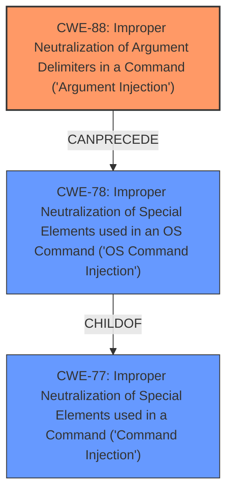

# Analysis for CVE-2021-43809

# Summary
| CWE ID | CWE Name | Confidence | CWE Abstraction Level | CWE Vulnerability Mapping Label | CWE-Vulnerability Mapping Notes |
|---|---|---|---|---|---|
| CWE-88 | Improper Neutralization of Argument Delimiters in a Command ('Argument Injection') | 1.0 | Base | Allowed | Primary CWE |
| CWE-78 | Improper Neutralization of Special Elements used in an OS Command ('OS Command Injection') | 0.7 | Base | Allowed | Secondary Candidate |
| CWE-77 | Improper Neutralization of Special Elements used in a Command ('Command Injection') | 0.6 | Class | Allowed-with-Review | Secondary Candidate |

## Evidence and Confidence

*   **Confidence Score:** 0.8
*   **Evidence Strength:** HIGH

## Relationship Analysis
The primary weakness is CWE-88, **Improper Neutralization of Argument Delimiters in a Command ('Argument Injection')**. This is because the core issue is that user-supplied input (the Git URL) is being treated as an optional argument due to a leading dash, rather than a positional argument.

CWE-78, **Improper Neutralization of Special Elements used in an OS Command ('OS Command Injection')**, is a child of CWE-77 and a potential consequence of CWE-88. If the argument injection leads to the execution of arbitrary OS commands, then CWE-78 would also be applicable. However, CWE-88 is the more direct cause.

CWE-77, **Improper Neutralization of Special Elements used in a Command ('Command Injection')**, is a higher-level class of weakness that could be applicable, but CWE-78 is more specific since it relates to OS commands.

The abstraction levels influenced the selection. CWE-88 and CWE-78 are at the Base level, which is preferred, while CWE-77 is a Class. The relationships support the choice of CWE-88 as the primary weakness, potentially leading to CWE-78.

## Vulnerability Chain
The vulnerability chain starts with **improper input validation** in the `Gemfile` (not explicitly a CWE, but the precursor), leading to CWE-88, **improper neutralization** of argument delimiters, potentially leading to CWE-78, **OS command injection**, and ultimately resulting in code execution.

## Summary of Analysis
The initial assessment identified **improper input validation** as a key phrase. The CVE description and reference links confirm that the root cause is due to the `bundler` gem not properly handling Git URLs that start with a dash. This can cause the URL to be interpreted as an optional argument instead of a positional one, leading to command injection.

The choice of CWE-88 is based on the evidence: "However, there is the possibility that a user input starts with a dash (`-`) and is therefore treated as an optional argument instead of a positional one." The CVE Reference Links Content Summary states: "However, a user input starting with a dash ('-') would be treated as an optional argument instead of a positional one."

The relationships between CWEs influenced the final selection. CWE-88 is more specific to the argument injection, whereas CWE-78 is a potential consequence. This is based on the description "The product constructs a string for a command to be executed by a separate component in another control sphere, but it does not properly delimit the intended arguments, options, or switches within that command string."

The selected CWEs are at the optimal level of specificity. CWE-88 is a Base-level CWE that directly addresses the argument injection issue.
CWE-77 is too generic and CWE-78 describes the potential consequence, but the primary weakness is the **improper handling** of the argument delimiters.

Relevant CWE Information:

# Enhanced Context (25 CWEs)
The following CWEs were identified as potentially relevant to this vulnerability:

## CWE-59: Improper Link Resolution Before File Access ('Link Following')
**Abstraction Level**: Base
**Similarity Score**: 0.81

## CWE-61: UNIX Symbolic Link (Symlink) Following
**Abstraction Level**: Compound
**Similarity Score**: 0.80

## CWE-41: Improper Resolution of Path Equivalence
**Abstraction Level**: Base
**Similarity Score**: 0.77

## CWE-74: Improper Neutralization of Special Elements in Output Used by a Downstream Component ('Injection')
**Abstraction Level**: Class
**Similarity Score**: 0.76

## CWE-427: Uncontrolled Search Path Element
**Abstraction Level**: Base
**Similarity Score**: 0.76

## CWE-23: Relative Path Traversal
**Abstraction Level**: Base
**Similarity Score**: 0.76

## CWE-73: External Control of File Name or Path
**Abstraction Level**: Base
**Similarity Score**: 0.75

## CWE-88: Improper Neutralization of Argument Delimiters in a Command ('Argument Injection')
**Abstraction Level**: Base
**Similarity Score**: 0.75

## CWE-184: Incomplete List of Disallowed Inputs
**Abstraction Level**: Base
**Similarity Score**: 0.75

## CWE-138: Improper Neutralization of Special Elements
**Abstraction Level**: Class
**Similarity Score**: 0.74

## CWE-88: Improper Neutralization of Argument Delimiters in a Command ('Argument Injection')
**Abstraction Level**: Base
**Similarity Score**: 10178.18

## CWE-427: Uncontrolled Search Path Element
**Abstraction Level**: Base
**Similarity Score**: 9974.27

## CWE-116: Improper Encoding or Escaping of Output
**Abstraction Level**: Class
**Similarity Score**: 9124.55

## CWE-22: Improper Limitation of a Pathname to a Restricted Directory ('Path Traversal')
**Abstraction Level**: Base
**Similarity Score**: 8975.83

## CWE-95: Improper Neutralization of Directives in Dynamically Evaluated Code ('Eval Injection')
**Abstraction Level**: Variant
**Similarity Score**: 8938.95

## CWE-386: Symbolic Name not Mapping to Correct Object
**Abstraction Level**: base
**Similarity Score**: 4.91

## CWE-98: Improper Control of Filename for Include/Require Statement in PHP Program ('PHP Remote File Inclusion')
**Abstraction Level**: variant
**Similarity Score**: 4.53

## CWE-78: Improper Neutralization of Special Elements used in an OS Command ('OS Command Injection')
**Abstraction Level**: base
**Similarity Score**: 4.47

## CWE-94: Improper Control of Generation of Code ('Code Injection')
**Abstraction Level**: base
**Similarity Score**: 4.33

## CWE-22: Improper Limitation of a Pathname to a Restricted Directory ('Path Traversal')
**Abstraction Level**: base
**Similarity Score**: 4.33

## CWE-426: Untrusted Search Path
**Abstraction Level**: base
**Similarity Score**: 3.64

## CWE-41: Improper Resolution of Path Equivalence
**Abstraction Level**: Base
**Similarity Score**: 2.90

## CWE-625: Permissive Regular Expression
**Abstraction Level**: base
**Similarity Score**: 2.77

## CWE-363: Race Condition Enabling Link Following
**Abstraction Level**: base
**Similarity Score**: 2.73

## CWE-59: Improper Link Resolution Before File Access ('Link Following')
**Abstraction Level**: Base
**Similarity Score**: 2.65

**CWE Exclusion Rationale:**

*   CWE-59, CWE-61, CWE-41, CWE-23, CWE-73, CWE-427, CWE-386, CWE-22, CWE-426: These CWEs relate to file path manipulation and are not relevant to the core weakness of argument injection.
*   CWE-74, CWE-138, CWE-116, CWE-95, CWE-94: These CWEs relate to injection in general, but they are not as specific as CWE-88 or CWE-78.
*   CWE-184: This CWE relates to incomplete lists of disallowed inputs, which is not the primary issue here. The main problem is the interpretation of the input, not the lack of