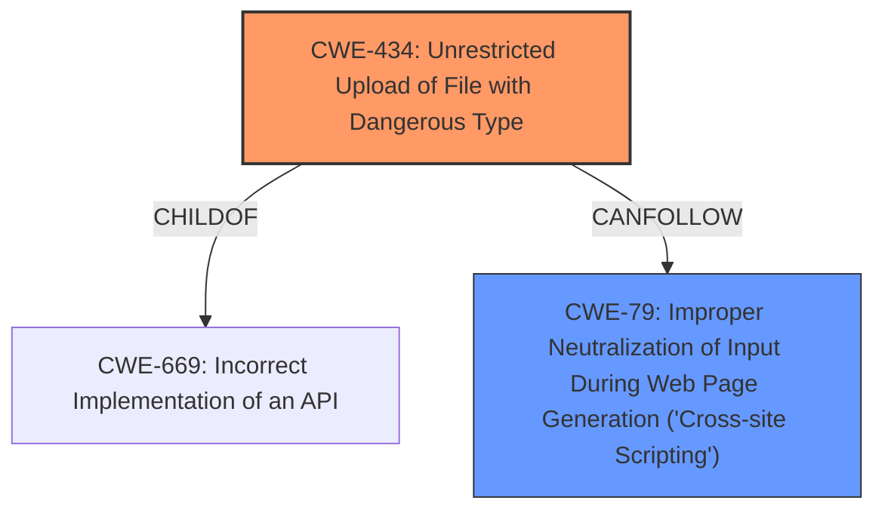

# Enhanced Analysis for CVE-2021-43829

# Summary
| CWE ID  | CWE Name                                                                  | Confidence | CWE Abstraction Level | CWE Vulnerability Mapping Label | CWE-Vulnerability Mapping Notes |
| :-------- | :------------------------------------------------------------------------ | :--------- | :---------------------- | :------------------------------ | :------------------------------ |
| CWE-434 | Unrestricted Upload of File with Dangerous Type                           | 1.0        | Base                    | Primary CWE                     | Allowed                       |
| CWE-79  | Improper Neutralization of Input During Web Page Generation ('Cross-site Scripting') | 0.7        | Base                    | Secondary Candidate             | Allowed                       |

## Evidence and Confidence

*   **Confidence Score:** 0.85
*   **Evidence Strength:** HIGH

## Relationship Analysis
The primary relationship is that CWE-434 [ChildOf] CWE-669 (Incorrect Implementation of an API). CWE-434 also has peer relationships with CWE-351 (Insufficient Following of Specification) and CWE-436 (Interpretation Conflict).

The vulnerability description clearly indicates that the **unrestricted file upload** leads to potential **XSS attacks and potentially other forms of code injection**, so these are the primary candidates. The relationship between CWE-434 and other CWEs like CWE-79 supports the selection of CWE-434.



## Vulnerability Chain
The vulnerability chain starts with the **unrestricted file upload** (CWE-434), which allows an attacker to upload a malicious file. If this file contains script-related HTML tags and is not properly neutralized, it can lead to **Cross-Site Scripting (XSS)** (CWE-79).

## Summary of Analysis
The initial analysis, supported by the CVE Reference Links Content Summary, highlighted the **unrestricted file upload** functionality as the root cause. This directly aligns with CWE-434 (Unrestricted Upload of File with Dangerous Type). The vulnerability description mentions the potential for XSS attacks, which are a common consequence of unrestricted file uploads, especially when the uploaded files are later served by the application. This led to the consideration of CWE-79.

The retriever results also listed CWE-434 as the top candidate, further reinforcing this choice. The evidence from the vulnerability description states, "This vulnerability is capable of uploading dangerous type of file to server leading to XSS attacks and potentially other forms of code injection." This statement clearly indicates the primary weakness is the **unrestricted file upload**.

CWE-434 is the optimal level of specificity because it directly addresses the **root cause** of the vulnerability: the lack of restrictions on the type of files that can be uploaded. While XSS (CWE-79) is a potential consequence, it is not the direct cause but a result of the **improper** file handling.

Relevant CWE Information:

# Enhanced Context (25 CWEs)
The following CWEs were identified as potentially relevant to this vulnerability:

## CWE-434: Unrestricted Upload of File with Dangerous Type
**Abstraction:** Base
**Similarity Score**: 8202.99
**Source**: sparse

**Description**:
The product allows the upload or transfer of dangerous file types that are automatically processed within its environment.

**Mapping Guidance**:
- Usage: Allowed
- Rationale: This CWE entry is at the Base level of abstraction, which is a preferred level of abstraction for mapping to the root causes of vulnerabilities.

## CWE-79: Improper Neutralization of Input During Web Page Generation ('Cross-site Scripting')
**Abstraction:** Base
**Similarity Score**: 8658.48
**Source**: sparse

**Description**:
The product does not neutralize or incorrectly neutralizes user-controllable input before it is placed in output that is used as a web page that is served to other users.

**Mapping Guidance**:
- Usage: Allowed
- Rationale: This CWE entry is at the Base level of abstraction, which is a preferred level of abstraction for mapping to the root causes of vulnerabilities.


## CWE Relationship Analysis

Current CWEs represent these abstraction levels: .


### Vulnerability Chain Analysis

**Chain starting from CWE-79:**
- 79 (Improper Neutralization of Input During Web Page Generation ('Cross-site Scripting')) - ROOT


**Chain starting from CWE-434:**
- 434 (Unrestricted Upload of File with Dangerous Type) - ROOT


### CWE Relationship Diagram

```mermaid
graph TD
    classDef primary fill:#f96,stroke:#333,stroke-width:2px
    classDef secondary fill:#69f,stroke:#333
    classDef tertiary fill:#9e9,stroke:#333
```