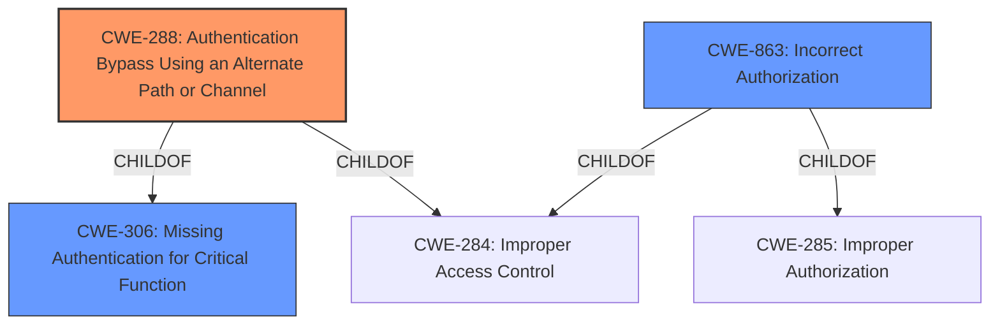

# Enhanced Analysis for CVE-2021-43833

# Summary
| CWE ID | CWE Name | Confidence | CWE Abstraction Level | CWE Vulnerability Mapping Label | CWE-Vulnerability Mapping Notes |
|---|---|---|---|---|---|
| CWE-288 | Authentication Bypass Using an Alternate Path or Channel | 0.9 | Base | Allowed | Primary CWE |
| CWE-863 | Incorrect Authorization | 0.6 | Class | Allowed-with-Review | Secondary Candidate |
| CWE-306 | Missing Authentication for Critical Function | 0.5 | Base | Allowed | Secondary Candidate |

## Evidence and Confidence

*   **Confidence Score:** 0.9
*   **Evidence Strength:** HIGH

## Relationship Analysis
The primary CWE is CWE-288, which is a Base level CWE and a child of both CWE-306 (Missing Authentication for Critical Function) and CWE-284 (Improper Access Control). This hierarchical relationship indicates that CWE-288 is a specific type of access control issue where authentication is bypassed. The Retriever Results and the vulnerability description support this specific classification. CWE-863 (Incorrect Authorization) is a Class level CWE and a child of CWE-285 and CWE-284, it is broader but potentially related because the bypass could be due to an incorrect authorization check.



## Vulnerability Chain
The vulnerability chain starts with the **lack of proper email address validation**, specifically the absence of an enforced email domain allowlist. This **weakness** allows an attacker to set a specially crafted email address, leading to an **authentication bypass** (CWE-288) and ultimately resulting in **unauthorized access to arbitrary accounts**.

## Summary of Analysis
The initial assessment, supported by the vulnerability description and CVE reference, points to an **authentication bypass** vulnerability. The key phrase "gain access to arbitrary accounts" and the root cause of "**lack of proper validation of email addresses**" strongly suggest that an attacker can bypass normal authentication mechanisms to gain access to other accounts.

The analysis is based on the provided evidence, specifically:

*   **Vulnerability Description Key Phrases:** "**weakness:** **cross-account vulnerability**", "**impact:** gain access to arbitrary accounts", "**vector:** setting a specially crafted email address"
*   **CVE Reference Links Content Summary:** "The vulnerability stems from a **lack of proper validation of email addresses**, specifically the **absence of an enforced email domain allowlist**. This allows an attacker to set a specially crafted email address that is not within the allowed domain, which results in account takeover."

The relationship graph and Retriever Results influenced the selection by highlighting CWE-288 as the most specific and relevant CWE. While CWE-863 (Incorrect Authorization) and CWE-306 (Missing Authentication for Critical Function) were considered, CWE-288 provides a more precise representation of the vulnerability, as it specifically addresses the authentication bypass through an alternate channel (crafted email address).

The selected CWEs are at the optimal level of specificity because CWE-288 directly addresses the **authentication bypass** mechanism, which is the core of the vulnerability. The vulnerability description explicitly states that an attacker can "gain access to arbitrary accounts by setting a specially crafted email address," indicating a clear bypass of the intended authentication process.

Relevant CWE Information:

# Enhanced Context (25 CWEs)
The following CWEs were identified as potentially relevant to this vulnerability:

## CWE-80: Improper Neutralization of Script-Related HTML Tags in a Web Page (Basic XSS)
**Abstraction Level**: Variant
**Similarity Score**: 0.78
**Source**: dense

**Description**:
The product receives input from an upstream component, but it does not neutralize or incorrectly neutralizes special characters such as "<", ">", and "&" that could be interpreted as web-scripting elements when they are sent to a downstream component that processes web pages.

**Mapping Guidance**:
- Usage: Allowed
- Rationale: This CWE entry is at the Variant level of abstraction, which is a preferred level of abstraction for mapping to the root causes of vulnerabilities.

**Why Not Used**: This CWE is not relevant because the vulnerability does not involve cross-site scripting.

## CWE-1336: Improper Neutralization of Special Elements Used in a Template Engine
**Abstraction Level**: Base
**Similarity Score**: 0.77
**Source**: dense

**Description**:
The product uses a template engine to insert or process externally-influenced input, but it does not neutralize or incorrectly neutralizes special elements or syntax that can be interpreted as template expressions or other code directives when processed by the engine.

**Mapping Guidance**:
- Usage: Allowed
- Rationale: This CWE entry is at the Base level of abstraction, which is a preferred level of abstraction for mapping to the root causes of vulnerabilities.

**Why Not Used**: This CWE is not relevant because the vulnerability does not involve template injection.

## CWE-74: Improper Neutralization of Special Elements in Output Used by a Downstream Component ('Injection')
**Abstraction Level**: Class
**Similarity Score**: 0.77
**Source**: dense

**Description**:
The product constructs all or part of a command, data structure, or record using externally-influenced input from an upstream component, but it does not neutralize or incorrectly neutralizes special elements that could modify how it is parsed or interpreted when it is sent to a downstream component.

**Mapping Guidance**:
- Usage: Discouraged
- Rationale: CWE-74 is high-level and often misused when lower-level weaknesses are more appropriate.

**Why Not Used**: This CWE is too generic. The vulnerability is more specifically related to authentication bypass, not a general injection issue.

## CWE-472: External Control of Assumed-Immutable Web Parameter
**Abstraction Level**: Base
**Similarity Score**: 0.76
**Source**: dense

**Description**:
The web application does not sufficiently verify inputs that are assumed to be immutable but are actually externally controllable, such as hidden form fields.

**Mapping Guidance**:
- Usage: Allowed
- Rationale: This CWE entry is at the Base level of abstraction, which is a preferred level of abstraction for mapping to the root causes of vulnerabilities.

**Why Not Used**: While the email address can be seen as an external parameter, the core issue is not about assuming immutability, but about failing to validate the input against allowed domains.

## CWE-1289: Improper Validation of Unsafe Equivalence in Input
**Abstraction Level**: Base
**Similarity Score**: 0.75
**Source**: dense

**Description**:
The product receives an input value that is used as a resource identifier or other type of reference, but it does not validate or incorrectly validates that the input is equivalent to a potentially-unsafe value.

**Mapping Guidance**:
- Usage: Allowed
- Rationale: This CWE entry is at the Base level of abstraction, which is a preferred level of abstraction for mapping to the root causes of vulnerabilities.

**Why Not Used**: This CWE is not directly applicable as the vulnerability is not about equivalence checks but rather about the lack of validation against an allowlist.

## CWE-917: Improper Neutralization of Special Elements used in an Expression Language Statement ('Expression Language Injection')
**Abstraction Level**: Base
**Similarity Score**: 0.75
**Source**: dense

**Description**:
The product constructs all or part of an expression language (EL) statement in a framework such as a Java Server Page (JSP) using externally-influenced input from an upstream component, but it does not neutralize or incorrectly neutralizes special elements that could modify the intended EL statement before it is executed.

**Mapping Guidance**:
- Usage: Allowed
- Rationale: This CWE entry is at the Base level of abstraction, which is a preferred level of abstraction for mapping to the root causes of vulnerabilities.

**Why Not Used**: This CWE is not relevant because the vulnerability does not involve expression language injection.

## CWE-184: Incomplete List of Disallowed Inputs
**Abstraction Level**: Base
**Similarity Score**: 0.75
**Source**: dense

**Description**:
The product implements a protection mechanism that relies on a list of inputs (or properties of inputs) that are not allowed by policy or otherwise require other action to neutralize before additional processing takes place, but the list is incomplete.

**Mapping Guidance**:
- Usage: Allowed
- Rationale: This CWE entry is at


## CWE Relationship Analysis

Current CWEs represent these abstraction levels: .


### Vulnerability Chain Analysis

**Chain starting from CWE-288:**
- 288 (Authentication Bypass Using an Alternate Path or Channel) - ROOT


**Chain starting from CWE-306:**
- 306 (Missing Authentication for Critical Function) - ROOT


### CWE Relationship Diagram

```mermaid
graph TD
    classDef primary fill:#f96,stroke:#333,stroke-width:2px
    classDef secondary fill:#69f,stroke:#333
    classDef tertiary fill:#9e9,stroke:#333
```