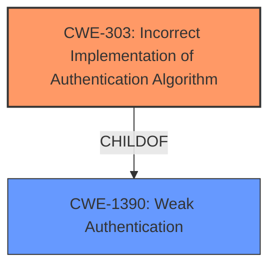

# Analysis for CVE-2021-43834

# Summary
| CWE ID | CWE Name | Confidence | CWE Abstraction Level | CWE Vulnerability Mapping Label | CWE-Vulnerability Mapping Notes |
|---|---|---|---|---|---|
| CWE-303 | Incorrect Implementation of Authentication Algorithm | 1.0 | Base | Primary | Allowed |
| CWE-1390 | Weak Authentication | 0.7 | Class | Secondary | Allowed-with-Review |

## Evidence and Confidence

*   **Confidence Score:** 0.9
*   **Evidence Strength:** HIGH

## Relationship Analysis
The primary CWE, CWE-303, is a child of CWE-1390, indicating a hierarchical relationship where CWE-303 is a more specific type of weak authentication. The vulnerability description clearly points to an incorrect implementation of an authentication algorithm (CWE-303), rather than a general weakness in authentication (CWE-1390). Thus, CWE-303 is preferred due to its higher specificity.

## Vulnerability Chain
The vulnerability chain starts with an **incorrect implementation of the authentication algorithm** (CWE-303) when using SSO. This leads to **improper authentication**, allowing an attacker to **bypass authentication** and gain unauthorized access to an existing user's account.

## Summary of Analysis
The initial analysis focused on identifying the root cause of the vulnerability, which the description identifies as an **incorrect implementation of the authentication algorithm** when using SSO.

The "CVE Reference Links Content Summary" section explicitly states: "The vulnerability stems from an **incorrect implementation of the authentication algorithm** within elabftw when using single sign-on (SSO) options like LDAP or SAML." This is strong evidence supporting CWE-303.

CWE-1390, "Weak Authentication," was considered but is too general. The vulnerability is not simply that the authentication is weak, but that a specific authentication algorithm is implemented incorrectly. CWE-303 is a child of CWE-1390 and is more specific, therefore more appropriate.

The retriever results also list CWE-303 as the top match, with a similarity score of 0.542.

The decision to map CWE-303 is based on the explicit description of the **incorrect implementation** within the vulnerability details. This aligns perfectly with the definition of CWE-303. CWE-303 is the optimal level of specificity.

Relevant CWE Information:

# Enhanced Context (25 CWEs)
The following CWEs were identified as potentially relevant to this vulnerability:

## CWE-303: Incorrect Implementation of Authentication Algorithm
**Abstraction Level**: Base
**Similarity Score**: 0.79
**Source**: dense

**Description**:
The requirements for the product dictate the use of an established authentication algorithm, but the implementation of the algorithm is incorrect.

**Mapping Guidance**:
- Usage: Allowed
- Rationale: This CWE entry is at the Base level of abstraction, which is a preferred level of abstraction for mapping to the root causes of vulnerabilities.

## CWE-1390: Weak Authentication
**Abstraction Level**: Class
**Similarity Score**: 4887.74
**Source**: sparse

**Description**:
The product uses an authentication mechanism to restrict access to specific users or identities, but the mechanism does not sufficiently prove that the claimed identity is correct.

**Mapping Guidance**:
- Usage: Allowed-with-Review
- Rationale: This CWE entry is a Class and might have Base-level children that would be more appropriate