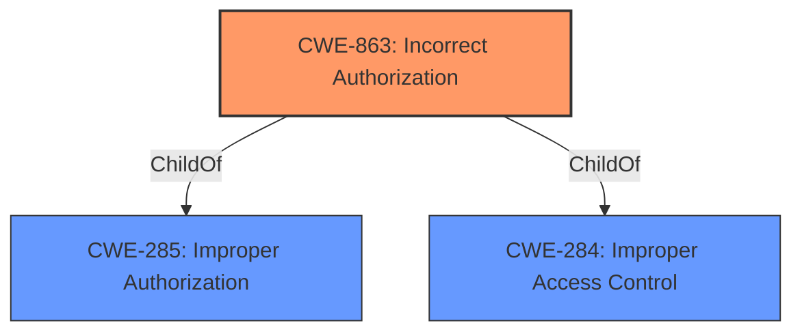

# Enhanced Analysis for CVE-2021-43847

# Summary
| CWE ID | CWE Name | Confidence | CWE Abstraction Level | CWE Vulnerability Mapping Label | CWE-Vulnerability Mapping Notes |
|---|---|---|---|---|---|
| CWE-863 | Incorrect Authorization | 0.9 | Class | Allowed-with-Review | Primary CWE |
| CWE-200 | Exposure of Sensitive Information to an Unauthorized Actor | 0.4 | Class | Discouraged | Secondary Candidate |

## Evidence and Confidence

*   **Confidence Score:** 0.9
*   **Evidence Strength:** HIGH

## Relationship Analysis
The primary relationship influencing my decision is the ChildOf relationship between CWE-863 (Incorrect Authorization) and its parent CWE-285 (Improper Authorization), and CWE-284 (Improper Access Control). While CWE-285 and CWE-284 are broader, the specific issue here involves an authorization check that is performed *incorrectly*, making CWE-863 the more suitable choice. The abstraction levels were also considered. While a more specific Base CWE would be ideal, the evidence points strongly to CWE-863 as the most accurate representation despite it being a Class.



## Vulnerability Chain
The vulnerability chain starts with an **insufficient member invite check** during space creation, leading to an **authorization bypass**, and finally resulting in **unauthorized access** to private spaces.

## Summary of Analysis
Initially, the **impact** of unauthorized access pointed towards a general information exposure issue. However, the **root cause** is clearly an **incorrect authorization** mechanism during space creation. The vulnerability description explicitly mentions "**insufficient member invite check**," indicating that an authorization check was attempted but was **incorrect**. The "CVE Reference Links Content Summary" reinforces this, stating "**The primary weakness is the ability for registered users to bypass authorization checks and become unauthorized members of private spaces**". This bypass, caused by the incorrect check, allows users to gain unauthorized access.

The retriever results also support this conclusion, with CWE-863 (Incorrect Authorization) being the top match. While it's a Class-level CWE, the evidence doesn't point to a more specific Base-level CWE. The mapping guidance for CWE-863 suggests reviewing its children for a better fit, but none of them are as accurate as CWE-863 itself.

CWE-200 (Exposure of Sensitive Information to an Unauthorized Actor) was considered because the **impact** involves unauthorized access to private spaces, which could lead to exposure of sensitive information. However, CWE-200 is discouraged as it represents the *impact* rather than the *root cause*. The root cause here is the **incorrect authorization**, not the exposure itself. Therefore, CWE-863 is the primary weakness, and CWE-200 is a potential secondary impact.

Relevant CWE Information:

# Enhanced Context (25 CWEs)

## CWE-863: Incorrect Authorization
**Abstraction:** Class
**Status:** Incomplete

### Description
The product performs an authorization check when an actor attempts to access a resource or perform an action, but it does not correctly perform the check.

### Extended Description
Not provided

### Alternative Terms
AuthZ: "AuthZ" is typically used as an abbreviation of "authorization" within the web application security community. It is distinct from "AuthN" (or, sometimes, "AuthC") which is an abbreviation of "authentication." The use of "Auth" as an abbreviation is discouraged, since it could be used for either authentication or authorization.

### Relationships
ChildOf -> CWE-285
ChildOf -> CWE-284

### Mapping Guidance
**Usage:** Allowed-with-Review
**Rationale:** This CWE entry is a Class and might have Base-level children that would be more appropriate
**Comments:** Examine children of this entry to see if there is a better fit
**Reasons:**
- Abstraction

### Additional Notes
**[Terminology]**

Assuming a user with a given identity, authorization is the process of determining whether that user can access a given resource, based on the user's privileges and any permissions or other access-control specifications that apply to the resource.

### Observed Examples
- **CVE-2021-39155:** Chain: A microservice integration and management platform compares the hostname in the HTTP Host header in a case-sensitive way (CWE-178, CWE-1289), allowing bypass of the authorization policy (CWE-863) using a hostname with mixed case or other variations.
- **CVE-2019-15900:** Chain: sscanf() call is used to check if a username and group exists, but the return value of sscanf() call is not checked (CWE-252), causing an uninitialized variable to be checked (CWE-457), returning success to allow authorization bypass for executing a privileged (CWE-863).
- **CVE-2009-2213:** Gateway uses default "Allow" configuration for its authorization settings.


## CWE Relationship Analysis

Current CWEs represent these abstraction levels: .


### Vulnerability Chain Analysis

**Chain starting from CWE-284:**
- 284 (Improper Access Control) - ROOT


**Chain starting from CWE-285:**
- 285 (Improper Authorization) - ROOT


### CWE Relationship Diagram

```mermaid
graph TD
    classDef primary fill:#f96,stroke:#333,stroke-width:2px
    classDef secondary fill:#69f,stroke:#333
    classDef tertiary fill:#9e9,stroke:#333
```