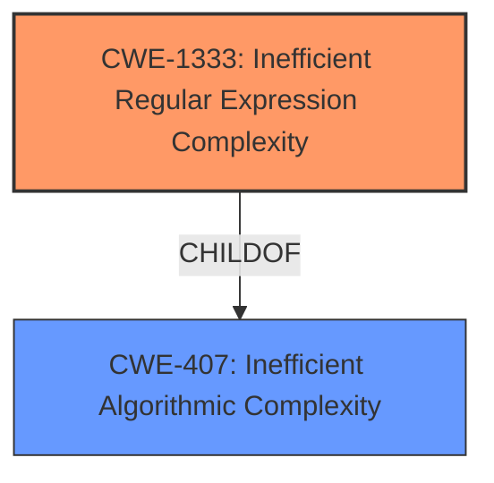

# Enhanced Analysis for CVE-2021-43854

# Summary
| CWE ID  | CWE Name                                       | Confidence | CWE Abstraction Level | CWE Vulnerability Mapping Label | CWE-Vulnerability Mapping Notes |
|---------|------------------------------------------------|------------|-----------------------|---------------------------------|-----------------------------------|
| CWE-1333 | Inefficient Regular Expression Complexity      | 1          | Base                  | Allowed                         | Primary CWE                       |
| CWE-407  | Inefficient Algorithmic Complexity             | 0.75       | Class                 | Allowed-with-Review             | Secondary Candidate              |

## Evidence and Confidence

*   **Confidence Score:** 0.9
*   **Evidence Strength:** HIGH

## Relationship Analysis
The primary relationship is that CWE-1333 is a child of CWE-407, representing a more specific type of algorithmic inefficiency. I chose CWE-1333 because the vulnerability is explicitly caused by an inefficient regular expression.



## Vulnerability Chain
The vulnerability chain starts with the use of an **inefficient regular expression** (CWE-1333). This leads to excessive CPU consumption, resulting in a denial-of-service condition.

## Summary of Analysis
The initial analysis and final conclusion are based on the provided evidence, which clearly points to the use of an **inefficient regular expression** as the root cause of the vulnerability. The vulnerability description explicitly mentions "regular expression denial of service (ReDoS) attacks" and that the vulnerability is present in specific functions due to a crafted long input causing significant execution time. The CVE Reference Links Content Summary further confirms this, stating that the vulnerability is due to an **inefficient regular expression** used in `PunktSentenceTokenizer`, leading to catastrophic backtracking.

The relationship analysis highlights that CWE-1333 is a more specific type of algorithmic inefficiency (CWE-407). Given the explicit mention of a regular expression as the cause, CWE-1333 is the optimal choice.

The selected CWE is at the optimal level of specificity because it directly addresses the root cause of the vulnerability, which is the use of an **inefficient regular expression**.

Relevant CWE Information:

# Enhanced Context (25 CWEs)
The following CWEs were identified as potentially relevant to this vulnerability:

## CWE-407: Inefficient Algorithmic Complexity
**Abstraction Level**: Class
**Similarity Score**: 0.77
**Source**: dense

**Description**:
An algorithm in a product has an inefficient worst-case computational complexity that may be detrimental to system performance and can be triggered by an attacker, typically using crafted manipulations that ensure that the worst case is being reached.

**Mapping Guidance**:
- Usage: Allowed-with-Review
- Rationale: This CWE entry is a Class and might have Base-level children that would be more appropriate

## CWE-1333: Inefficient Regular Expression Complexity
**Abstraction Level:** Base
**Similarity Score**: 6268.53
**Source**: sparse

**Description**:
The product uses a regular expression with an inefficient, possibly exponential worst-case computational complexity that consumes excessive CPU cycles.

### Detailed Analysis and Justification of CWE Selection:

**CWE-1333: Inefficient Regular Expression Complexity**
*   **Match:** The vulnerability description explicitly states that the vulnerability is a "regular expression denial of service (ReDoS)" and the CVE reference links content summary confirms this stating the root cause is due to an inefficient regular expression. This aligns perfectly with the description of CWE-1333.
*   **Abstraction Level:** Base, which is a preferred level of abstraction.
*   **Usage:** Allowed.
*   **Relationship:** ChildOf CWE-407: Inefficient Algorithmic Complexity.
*   **Justification:** The primary weakness is the inefficient regular expression.
*   **Confidence:** 1

**CWE-407: Inefficient Algorithmic Complexity**
*   **Match:** This CWE is a more general class of weakness that includes inefficient regular expressions. While relevant, it's not as specific as CWE-1333.
*   **Abstraction Level:** Class.
*   **Usage:** Allowed-with-Review, recommending a more specific child.
*   **Relationship:** ParentOf CWE-1333.
*   **Justification:** While this is a more general weakness, CWE-1333 captures the specific type of algorithmic inefficiency.
*   **Confidence:** 0.75

**Other Considered CWEs (and why they were not selected):**

*   **CWE-770: Allocation of Resources Without Limits or Throttling:** This CWE relates to resource allocation without limits. While the ReDoS leads to resource exhaustion, the root cause is the inefficient regular expression, not the lack of resource limits.
*   **CWE-1284: Improper Validation of Specified Quantity in Input:** This CWE relates to improper validation of input quantities. While a long input triggers the ReDoS, the core issue isn't the validation of the input length but the inefficient regular expression processing that input.
*   **CWE-674: Uncontrolled Recursion:** This relates to uncontrolled recursion, which is not explicitly mentioned. The ReDoS issue is with the regex, not recursion.
*   **CWE-789: Memory Allocation with Excessive Size Value:** While a large input is required to trigger the denial of service, this is not about memory allocation itself. The primary issue is the ReDoS.

I am choosing CWE-1333 as the primary CWE because the vulnerability description explicitly mentions it.


## CWE Relationship Analysis

Current CWEs represent these abstraction levels: .


### Vulnerability Chain Analysis

**Chain starting from CWE-674:**
- 674 (Uncontrolled Recursion) - ROOT


**Chain starting from CWE-1333:**
- 1333 (Inefficient Regular Expression Complexity) - ROOT


### CWE Relationship Diagram

```mermaid
graph TD
    classDef primary fill:#f96,stroke:#333,stroke-width:2px
    classDef secondary fill:#69f,stroke:#333
    classDef tertiary fill:#9e9,stroke:#333
```