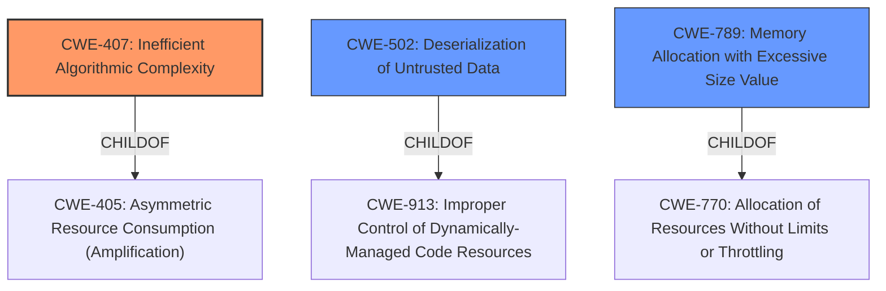

# Enhanced Analysis for CVE-2021-43859

# Summary
| CWE ID | CWE Name | Confidence | CWE Abstraction Level | CWE Vulnerability Mapping Label | CWE-Vulnerability Mapping Notes |
|---|---|---|---|---|---|
| CWE-407 | Inefficient Algorithmic Complexity | 0.8 | Class | Allowed-with-Review | Primary CWE |
| CWE-502 | Deserialization of Untrusted Data | 0.7 | Base | Allowed | Secondary Candidate |
| CWE-789 | Memory Allocation with Excessive Size Value | 0.6 | Variant | Allowed | Secondary Candidate |

## Evidence and Confidence

*   **Confidence Score:** 0.7
*   **Evidence Strength:** MEDIUM

## Relationship Analysis
The primary CWE selected is CWE-407, "Inefficient Algorithmic Complexity," because the core issue revolves around the inefficient computation within Java collections when processing recursive data structures. CWE-407 is a class-level CWE. While more specific CWEs exist (e.g., CWE-1333), they don't fully capture the algorithmic inefficiency caused by excessive recursion in collection processing.

CWE-502 and CWE-789 are considered as secondary candidates. CWE-502, Deserialization of Untrusted Data, is relevant because the vulnerability involves processing untrusted XML input. CWE-789, Memory Allocation with Excessive Size Value, is also relevant because the inefficient algorithm can lead to excessive memory allocation.



## Vulnerability Chain
The vulnerability chain starts with the processing of a manipulated input stream, leading to inefficient algorithmic complexity within Java collections, and ultimately resulting in a denial of service.

1.  **Manipulated Input Stream:** A remote attacker crafts a malicious XML input stream.
2.  **Inefficient Algorithmic Complexity:** The crafted input causes hashcode calculation or element position calculation times in some Java collections/maps to increase exponentially. (CWE-407)
3.  **Resource Consumption:** The exponential increase in computation leads to excessive CPU usage.
4.  **Denial of Service:** The resource exhaustion causes the application to become unresponsive.

## Summary of Analysis
The analysis is primarily based on the provided vulnerability description and the CVE Reference Links Content Summary. The evidence clearly points to an algorithmic inefficiency triggered by manipulated input, leading to resource exhaustion and denial of service.

The CVE Reference Links Content Summary states: "The vulnerability is due to the fact that hashcode calculation or element position calculation times in some Java collections/maps increase exponentially as the depth of recursive data structure increases. This can lead to a denial-of-service."

The graph relationships influenced the selection by showing the hierarchical connections between different CWEs. While CWE-502 (Deserialization of Untrusted Data) and CWE-789 (Memory Allocation with Excessive Size Value) are relevant, the core issue is the inefficient algorithm (CWE-407) that causes the resource exhaustion.

The selected CWEs are at the optimal level of specificity because they accurately represent the root cause and contributing factors of the vulnerability. CWE-407 captures the algorithmic inefficiency, while CWE-502 and CWE-789 highlight the deserialization aspect and the potential for excessive memory allocation.

Relevant CWE Information:

**CWE-407: Inefficient Algorithmic Complexity**

*   **How the Vulnerability's Details Match the CWE's Characteristics:** The vulnerability description indicates that a remote attacker can manipulate the processed input stream to trigger an inefficient algorithm within the XStream library, leading to excessive CPU consumption. Specifically, the hashcode calculation or element position calculation times in some Java collections/maps increase exponentially as the depth of the recursive data structure increases.
*   **The Security Implications and Potential Impact:** The security implication is a denial of service due to excessive CPU consumption. The potential impact is application unresponsiveness.
*   **Any Parent-Child Relationships or Chain Patterns That Influenced Your Mapping:** CWE-407 is a child of CWE-405 (Asymmetric Resource Consumption (Amplification)). This relationship highlights the amplification aspect of the vulnerability, where a small input manipulation can lead to a significant resource consumption.
*   **Whether the Weakness is Primary or Secondary in the Vulnerability:** The weakness is considered primary because the algorithmic inefficiency is the direct cause of the resource exhaustion.
*   **How the Official MITRE Mapping Guidance Influenced Your Decision:** The mapping guidance for CWE-407 suggests that it is a Class and might have Base-level children that would be more appropriate. However, none of the children seem to be as good a fit as CWE-407.

**CWE-502: Deserialization of Untrusted Data**

*   **How the Vulnerability's Details Match the CWE's Characteristics:** The vulnerability involves deserializing XML input, which can be manipulated by an attacker to inject malicious data structures.
*   **The Security Implications and Potential Impact:** The security implication is the potential for remote code execution or denial of service. The potential impact is application compromise.
*   **Any Parent-Child Relationships or Chain Patterns That Influenced Your Mapping:** CWE-502 is a child of CWE-913 (Improper Control of Dynamically-Managed Code Resources). This relationship highlights the dynamic nature of the vulnerability, where the attacker can control the code resources used during deserialization.
*   **Whether the Weakness is Primary or Secondary in the Vulnerability:** The weakness is considered secondary because the core issue is the algorithmic inefficiency, not the deserialization itself.
*   **How the Official MITRE Mapping Guidance Influenced Your Decision:** The mapping guidance for CWE-502 suggests that it is a Base level CWE and Allowed for use.

**CWE-789: Memory Allocation with Excessive Size Value**

*   **How the Vulnerability's Details Match the CWE's Characteristics:** The vulnerability involves processing recursive data structures, which can lead to excessive memory allocation.
*   **The Security Implications and Potential Impact:** The security implication is the potential for denial of service due to memory exhaustion.
*   **Any Parent-Child Relationships or Chain Patterns That Influenced Your Mapping:** CWE-789 is a child of CWE-770 (Allocation of Resources Without Limits or Throttling).
*   **Whether the Weakness is Primary or Secondary in the Vulnerability:** The weakness is considered secondary because the core issue is the algorithmic inefficiency, not the memory allocation itself, although excessive memory allocation may result as a consequence.
*   **How the Official MITRE Mapping Guidance Influenced Your Decision:** The mapping guidance for CWE-789 suggests that it is a Variant level CWE and Allowed for use.

**CWEs Considered but Not Used:**

*   **CWE-674: Uncontrolled Recursion:** While the vulnerability involves recursion, CWE-674 is too general. The specific issue is the inefficient algorithm within the recursive data structures, which is better captured by CWE-407.
*   **CWE-776: Improper Restriction of Recursive Entity References in DTDs ('XML Entity Expansion'):** This CWE is specific to XML entity expansion, which is not the primary issue in this vulnerability. The vulnerability can occur with any format that supports references.


## CWE Relationship Analysis

Current CWEs represent these abstraction levels: .


### Vulnerability Chain Analysis

**Chain starting from CWE-502:**
- 502 (Deserialization of Untrusted Data) - ROOT


**Chain starting from CWE-674:**
- 674 (Uncontrolled Recursion) - ROOT


### CWE Relationship Diagram

```mermaid
graph TD
    classDef primary fill:#f96,stroke:#333,stroke-width:2px
    classDef secondary fill:#69f,stroke:#333
    classDef tertiary fill:#9e9,stroke:#333
```