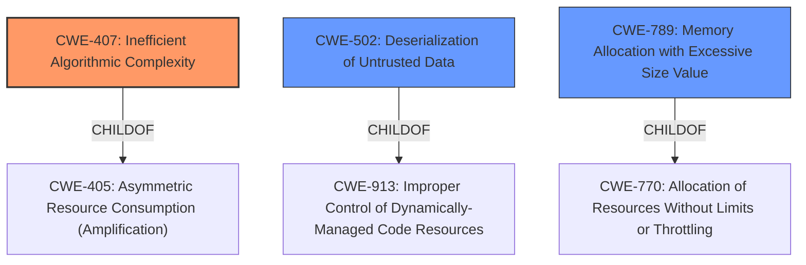

# Analysis for CVE-2021-43859

# Summary
| CWE ID | CWE Name | Confidence | CWE Abstraction Level | CWE Vulnerability Mapping Label | CWE-Vulnerability Mapping Notes |
|---|---|---|---|---|---|
| CWE-407 | Inefficient Algorithmic Complexity | 0.8 | Class | Allowed-with-Review | Primary CWE |
| CWE-502 | Deserialization of Untrusted Data | 0.7 | Base | Allowed | Secondary Candidate |
| CWE-789 | Memory Allocation with Excessive Size Value | 0.6 | Variant | Allowed | Secondary Candidate |

## Evidence and Confidence

*   **Confidence Score:** 0.7
*   **Evidence Strength:** MEDIUM

## Relationship Analysis
The primary CWE selected is CWE-407, "Inefficient Algorithmic Complexity," because the core issue revolves around the inefficient computation within Java collections when processing recursive data structures. CWE-407 is a class-level CWE. While more specific CWEs exist (e.g., CWE-1333), they don't fully capture the algorithmic inefficiency caused by excessive recursion in collection processing.

CWE-502 and CWE-789 are considered as secondary candidates. CWE-502, Deserialization of Untrusted Data, is relevant because the vulnerability involves processing untrusted XML input. CWE-789, Memory Allocation with Excessive Size Value, is also relevant because the inefficient algorithm can lead to excessive memory allocation.

## Vulnerability Chain
The vulnerability chain starts with the processing of a manipulated input stream, leading to inefficient algorithmic complexity within Java collections, and ultimately resulting in a denial of service.

1.  **Manipulated Input Stream:** A remote attacker crafts a malicious XML input stream.
2.  **Inefficient Algorithmic Complexity:** The crafted input causes hashcode calculation or element position calculation times in some Java collections/maps to increase exponentially. (CWE-407)
3.  **Resource Consumption:** The exponential increase in computation leads to excessive CPU usage.
4.  **Denial of Service:** The resource exhaustion causes the application to become unresponsive.

## Summary of Analysis
The analysis is primarily based on the provided vulnerability description and the CVE Reference Links Content Summary. The evidence clearly points to an algorithmic inefficiency triggered by manipulated input, leading to resource exhaustion and denial of service.

The CVE Reference Links Content Summary states: "The vulnerability is due to the fact that hashcode calculation or element position calculation times in some Java collections/maps increase exponentially as the depth of recursive data structure increases. This can lead to a denial-of-service."

The graph relationships influenced the selection by showing the hierarchical connections between different CWEs. While CWE-502 (Deserialization of Untrusted Data) and CWE-789 (Memory Allocation with Excessive Size Value) are relevant, the core issue is the inefficient algorithm (CWE-407) that causes the resource exhaustion.

The selected CWEs are at the optimal level of specificity because they accurately represent the root cause and contributing factors of the vulnerability. CWE-407 captures the algorithmic inefficiency, while CWE-502 and CWE-789 highlight the deserialization aspect and the potential for excessive memory allocation.

Relevant CWE Information:

**CWE-407: Inefficient Algorithmic Complexity**

*   **How the Vulnerability's Details Match the CWE's Characteristics:** The vulnerability description indicates that a remote attacker can manipulate the processed input stream to trigger an inefficient algorithm within the XStream library, leading to excessive CPU consumption. Specifically, the hashcode calculation or element position calculation times in some Java collections/maps increase exponentially as the depth of the recursive data structure increases.
*   **The Security Implications and Potential Impact:** The security implication is a denial of service due to excessive CPU consumption. The potential impact is application unresponsiveness.
*   **Any Parent-Child Relationships or Chain Patterns That Influenced Your Mapping:** CWE-407 is a child of CWE-405 (Asymmetric Resource Consumption (Amplification)). This relationship highlights the amplification aspect of the vulnerability, where a small input manipulation can lead to a significant resource consumption.
*   **Whether the Weakness is Primary or Secondary in the Vulnerability:** The weakness is considered primary because the algorithmic inefficiency is the direct cause of the resource exhaustion.
*   **How the Official MITRE Mapping Guidance Influenced Your Decision:** The mapping guidance for CWE-407 suggests that it is a Class and might have Base-level children that would be more appropriate. However, none of the children seem to be as good a fit as CWE-407.

**CWE-502: Deserialization of Untrusted Data**

*   **How the Vulnerability's Details Match the CWE's Characteristics:** The vulnerability involves deserializing XML input, which can be manipulated by an attacker to inject malicious data structures.
*   **The Security Implications and Potential Impact:** The security implication is the potential for remote code execution or denial of service. The potential impact is application compromise.
*   **Any Parent-Child Relationships or Chain Patterns That Influenced Your Mapping:** CWE-502 is a child of CWE-913 (Improper Control of Dynamically-Managed Code Resources). This relationship highlights the dynamic nature of the vulnerability, where the attacker can control the code resources used during deserialization.
*   **Whether the Weakness is Primary or Secondary in the Vulnerability:** The weakness is considered secondary because the core issue is the algorithmic inefficiency, not the deserialization itself.
*   **How the Official MITRE Mapping Guidance Influenced Your Decision:** The mapping guidance for CWE-502 suggests that it is a Base level CWE and Allowed for use.

**CWE-789: Memory Allocation with Excessive Size Value**

*   **How the Vulnerability's Details Match the CWE's Characteristics:** The vulnerability involves processing recursive data structures, which can lead to excessive memory allocation.
*   **The Security Implications and Potential Impact:** The security implication is the potential for denial of service due to memory exhaustion.
*   **Any Parent-Child Relationships or Chain Patterns That Influenced Your Mapping:** CWE-789 is a child of CWE-770 (Allocation of Resources Without Limits or Throttling).
*   **Whether the Weakness is Primary or Secondary in the Vulnerability:** The weakness is considered secondary because the core issue is the algorithmic inefficiency, not the memory allocation itself, although excessive memory allocation may result as a consequence.
*   **How the Official MITRE Mapping Guidance Influenced Your Decision:** The mapping guidance for CWE-789 suggests that it is a Variant level CWE and Allowed for use.

**CWEs Considered but Not Used:**

*   **CWE-674: Uncontrolled Recursion:** While the vulnerability involves recursion, CWE-674 is too general. The specific issue is the inefficient algorithm within the recursive data structures, which is better captured by CWE-407.
*   **CWE-776: Improper Restriction of Recursive Entity References in DTDs ('XML Entity Expansion'):** This CWE is specific to XML entity expansion, which is not the primary issue in this vulnerability. The vulnerability can occur with any format that supports references.

# Enhanced Query for CVE-2021-43859

## Vulnerability Description
XStream is an open source java library to serialize objects to XML and back again. Versions prior to 1.4.19 may allow a remote attacker to allocate 100% CPU time on the target system depending on CPU type or parallel execution of such a payload resulting in a denial of service only by manipulating the processed input stream. XStream 1.4.19 monitors and accumulates the time it takes to add elements to collections and throws an exception if a set threshold is exceeded. Users are advised to upgrade as soon as possible. Users unable to upgrade may set the NO_REFERENCE mode to prevent recursion. See GHSA-rmr5-cpv2-vgjf for further details on a workaround if an upgrade is not possible.

### Vulnerability Description Key Phrases
- **impact:** denial of service
- **vector:** manipulating the processed input stream
- **attacker:** remote attacker
- **product:** XStream
- **version:** prior to 1.4.19

## CVE Reference Links Content Summary
Based on the provided content, here's an analysis of the CVE-2021-43859 vulnerability:

**1. Verification:**

*   The content consistently refers to CVE-2021-43859 and its description matches the official CVE description. The vulnerability is about a Denial of Service (DoS) via injection of highly recursive collections/maps in the XStream library.

**2. Root Cause of the Vulnerability:**

*   The vulnerability stems from the way XStream processes XML input during unmarshalling. Specifically, it recreates Java objects based on type information within the XML.
*   Attackers can manipulate the XML input stream to inject malicious, highly recursive data structures (collections or maps).
*   The vulnerability is due to the fact that hashcode calculation or element position calculation times in some Java collections/maps increase exponentially as the depth of recursive data structure increases. This can lead to a denial-of-service.

**3. Weaknesses/Vulnerabilities Present:**

*   **Denial of Service (DoS):** The primary vulnerability is the potential for a DoS attack by consuming excessive CPU resources due to recursively generated data structures.
*   **Uncontrolled Resource Consumption:** The vulnerability exists because XStream does not initially limit the computational resources used when processing a crafted XML input stream, allowing the exponential increase of computational workload.
*   **Type Injection:**  An attacker can inject and replace objects that are used in the processing. The library does not validate or sanitize the type information in XML before recreating the objects.

**4. Impact of Exploitation:**

*   A successful exploit can lead to **100% CPU usage** on the target system.
*   This resource exhaustion can cause the application to become unresponsive, leading to a **denial of service**.
*   The impact is dependent on the CPU type, and the number of attack payloads processed in parallel may amplify the impact of the denial of service.

**5. Attack Vectors:**

*   **Manipulated XML Input:** The attacker needs to craft a malicious XML payload. This XML payload injects data structures that lead to exponentially increased CPU usage when XStream attempts to calculate hash codes or perform sorting.
*   **Any format that supports references:** The vulnerability is not limited to XML. Any format that supports object references can be used to exploit the vulnerability. This excludes JSON format, because it does not support references.
*   **Remote Attacker:** An attacker can send the malicious input to a system using a vulnerable version of XStream.

**6. Required Attacker Capabilities/Position:**

*   **Remote Code Injection (Implicit):** Although not direct code execution, the attacker can manipulate the unmarshalling process by replacing type information.
*   **Ability to submit data to a service using XStream:** The attacker needs a way to submit the crafted XML (or other suitable format) to a service that uses a vulnerable version of XStream for processing.
*   **Understanding of XStream and Java Collections:** The attacker needs to understand how XStream works and how certain collections/maps in Java behave in terms of hashcode calculation or insertion/sorting time.

**7. Additional details:**

*   The vulnerability affects versions of XStream up to and including 1.4.18.
*   The issue can be triggered through specially crafted `HashMap`, `HashSet`, `Hashtable`, `LinkedHashMap`, `LinkedHashSet`, `Stack`, `Vector`, or other third party collections.
*   The issue is resolved in version 1.4.19, where XStream monitors the time it takes to add an element to a collection and throws an exception if a specified threshold is exceeded.
*   Workarounds include setting XStream to `NO_REFERENCES` mode, or denying specific collection types with `denyTypes`, or using `TreeMap`/`TreeSet` instead of `HashMap`/`HashSet`.
*   The vulnerability was discovered by r00t4dm at Cloud-Penetrating Arrow Lab.
*   The vulnerability is referenced by multiple vendors, including Oracle, Fedora and Debian.

## Retriever Results

### Top Combined Results

| Rank | CWE ID | Name | Abstraction | Usage  | Retrievers | Individual Scores |
|------|--------|------|-------------|-------|------------|-------------------|
| 1 | 407 | Inefficient Algorithmic Complexity | Class | Allowed-with-Review | sparse | 0.369 |
| 2 | 502 | Deserialization of Untrusted Data | Base | Allowed | sparse | 0.263 |
| 3 | 674 | Uncontrolled Recursion | Class | Allowed-with-Review | sparse | 0.240 |
| 4 | 1333 | Inefficient Regular Expression Complexity | Base | Allowed | sparse | 0.237 |
| 5 | 789 | Memory Allocation with Excessive Size Value | Variant | Allowed | sparse | 0.223 |
| 6 | 776 | Improper Restriction of Recursive Entity References in DTDs ('XML Entity Expansion') | Base | Allowed | dense | 0.494 |
| 7 | 1284 | Improper Validation of Specified Quantity in Input | Base | Allowed | graph | 0.002 |
| 8 | 201 | Insertion of Sensitive Information Into Sent Data | Base | Allowed | sparse | 0.220 |
| 9 | 1336 | Improper Neutralization of Special Elements Used in a Template Engine | Base | Allowed | sparse | 0.219 |
| 10 | 770 | Allocation of Resources Without Limits or Throttling | Base | Allowed | sparse | 0.219 |

# Complete CWE Specifications

## CWE-407: Inefficient Algorithmic Complexity
**Abstraction:** Class
**Status:** Incomplete

### Description
An algorithm in a product has an inefficient worst-case computational complexity that may be detrimental to system performance and can be triggered by an attacker, typically using crafted manipulations that ensure that the worst case is being reached.

### Extended Description
Not provided

### Alternative Terms
Quadratic Complexity: Used when the algorithmic complexity is related to the square of the number of inputs (N^2)

### Relationships
ChildOf -> CWE-405

### Mapping Guidance
**Usage:** Allowed-with-Review
**Rationale:** This CWE entry is a Class and might have Base-level children that would be more appropriate
**Comments:** Examine children of this entry to see if there is a better fit
**Reasons:**
- Abstraction

### Observed Examples
- **CVE-2021-32617:** C++ library for image metadata has "quadratic complexity" issue with unnecessarily repetitive parsing each time an invalid character is encountered
- **CVE-2020-10735:** Python has "quadratic complexity" issue when converting string to int with many digits in unexpected bases
- **CVE-2020-5243:** server allows ReDOS with crafted User-Agent strings, due to overlapping capture groups that cause excessive backtracking.

## CWE-502: Deserialization of Untrusted Data
**Abstraction:** Base
**Status:** Draft

### Description
The product deserializes untrusted data without sufficiently ensuring that the resulting data will be valid.

### Extended Description
Not provided

### Alternative Terms
Marshaling, Unmarshaling: Marshaling and unmarshaling are effectively synonyms for serialization and deserialization, respectively.
Pickling, Unpickling: In Python, the "pickle" functionality is used to perform serialization and deserialization.
PHP Object Injection: Some PHP application researchers use this term when attacking unsafe use of the unserialize() function; but it is also used for CWE-915.

### Relationships
ChildOf -> CWE-913
ChildOf -> CWE-913
PeerOf -> CWE-915

### Mapping Guidance
**Usage:** Allowed
**Rationale:** This CWE entry is at the Base level of abstraction, which is a preferred level of abstraction for mapping to the root causes of vulnerabilities.
**Comments:** Carefully read both the name and description to ensure that this mapping is an appropriate fit. Do not try to 'force' a mapping to a lower-level Base/Variant simply to comply with this preferred level of abstraction.
**Reasons:**
- Acceptable-Use

### Additional Notes
**[Maintenance]** The relationships between CWE-502 and CWE-915 need further exploration. CWE-915 is more narrowly scoped to object modification, and is not necessarily used for deserialization.

### Observed Examples
- **CVE-2019-12799:** chain: bypass of untrusted deserialization issue (CWE-502) by using an assumed-trusted class (CWE-183)
- **CVE-2015-8103:** Deserialization issue in commonly-used Java library allows remote execution.
- **CVE-2015-4852:** Deserialization issue in commonly-used Java library allows remote execution.

## CWE-674: Uncontrolled Recursion
**Abstraction:** Class
**Status:** Draft

### Description
The product does not properly control the amount of recursion that takes place,  consuming excessive resources, such as allocated memory or the program stack.

### Extended Description
Not provided

### Alternative Terms
Stack Exhaustion

### Relationships
ChildOf -> CWE-834

### Mapping Guidance
**Usage:** Allowed-with-Review
**Rationale:** This CWE entry is a Class and might have Base-level children that would be more appropriate
**Comments:** Examine children of this entry to see if there is a better fit
**Reasons:**
- Abstraction

### Observed Examples
- **CVE-2007-1285:** Deeply nested arrays trigger stack exhaustion.
- **CVE-2007-3409:** Self-referencing pointers create infinite loop and resultant stack exhaustion.
- **CVE-2016-10707:** Javascript application accidentally changes input in a way that prevents a recursive call from detecting an exit condition.

## CWE-1333: Inefficient Regular Expression Complexity
**Abstraction:** Base
**Status:** Draft

### Description
The product uses a regular expression with an inefficient, possibly exponential worst-case computational complexity that consumes excessive CPU cycles.

### Extended Description
Some regular expression engines have a feature called "backtracking". If the token cannot match, the engine "backtracks" to a position that may result in a different token that can match.
 Backtracking becomes a weakness if all of these conditions are met:

  - The number of possible backtracking attempts are exponential relative to the length of the input.

  - The input can fail to match the regular expression.

  - The input can be long enough.

 Attackers can create crafted inputs that intentionally cause the regular expression to use excessive backtracking in a way that causes the CPU consumption to spike. 

### Alternative Terms
ReDoS: ReDoS is an abbreviation of "Regular expression Denial of Service".
Regular Expression Denial of Service: While this term is attack-focused, this is commonly used to describe the weakness.
Catastrophic backtracking: This term is used to describe the behavior of the regular expression as a negative technical impact.

### Relationships
ChildOf -> CWE-407
ChildOf -> CWE-407

### Mapping Guidance
**Usage:** Allowed
**Rationale:** This CWE entry is at the Base level of abstraction, which is a preferred level of abstraction for mapping to the root causes of vulnerabilities.
**Comments:** Carefully read both the name and description to ensure that this mapping is an appropriate fit. Do not try to 'force' a mapping to a lower-level Base/Variant simply to comply with this preferred level of abstraction.
**Reasons:**
- Acceptable-Use

### Observed Examples
- **CVE-2020-5243:** server allows ReDOS with crafted User-Agent strings, due to overlapping capture groups that cause excessive backtracking.
- **CVE-2021-21317:** npm package for user-agent parser prone to ReDoS due to overlapping capture groups
- **CVE-2019-16215:** Markdown parser uses inefficient regex when processing a message, allowing users to cause CPU consumption and delay preventing processing of other messages.

## CWE-789: Memory Allocation with Excessive Size Value
**Abstraction:** Variant
**Status:** Draft

### Description
The product allocates memory based on an untrusted, large size value, but it does not ensure that the size is within expected limits, allowing arbitrary amounts of memory to be allocated.

### Extended Description
Not provided

### Alternative Terms
Stack Exhaustion: When a weakness allocates excessive memory on the stack, it is often described as "stack exhaustion," which is a technical impact of the weakness. This technical impact is often encountered as a consequence of CWE-789 and/or CWE-1325.

### Relationships
ChildOf -> CWE-770
CanPrecede -> CWE-476

### Mapping Guidance
**Usage:** Allowed
**Rationale:** This CWE entry is at the Variant level of abstraction, which is a preferred level of abstraction for mapping to the root causes of vulnerabilities.
**Comments:** Carefully read both the name and description to ensure that this mapping is an appropriate fit. Do not try to 'force' a mapping to a lower-level Base/Variant simply to comply with this preferred level of abstraction.
**Reasons:**
- Acceptable-Use

### Additional Notes
**[Relationship]** This weakness can be closely associated with integer overflows (CWE-190). Integer overflow attacks would concentrate on providing an extremely large number that triggers an overflow that causes less memory to be allocated than expected. By providing a large value that does not trigger an integer overflow, the attacker could still cause excessive amounts of memory to be allocated.

**[Applicable Platform]** 

Uncontrolled memory allocation is possible in many languages, such as dynamic array allocation in perl or initial size parameters in Collections in Java. However, languages like C and C++ where programmers have the power to more directly control memory management will be more susceptible.

### Observed Examples
- **CVE-2022-21668:** Chain: Python library does not limit the resources used to process images that specify a very large number of bands (CWE-1284), leading to excessive memory consumption (CWE-789) or an integer overflow (CWE-190).
- **CVE-2010-3701:** program uses ::alloca() for encoding messages, but large messages trigger segfault
- **CVE-2008-1708:** memory consumption and daemon exit by specifying a large value in a length field

## CWE-776: Improper Restriction of Recursive Entity References in DTDs ('XML Entity Expansion')
**Abstraction:** Base
**Status:** Draft

### Description
The product uses XML documents and allows their structure to be defined with a Document Type Definition (DTD), but it does not properly control the number of recursive definitions of entities.

### Extended Description
If the DTD contains a large number of nested or recursive entities, this can lead to explosive growth of data when parsed, causing a denial of service.

### Alternative Terms
XEE: XEE is the acronym commonly used for XML Entity Expansion.
Billion Laughs Attack
XML Bomb: While the "XML Bomb" term was used in the early years of knowledge of this issue, the XEE term seems to be more commonly used.

### Relationships
ChildOf -> CWE-674
ChildOf -> CWE-674
ChildOf -> CWE-405

### Mapping Guidance
**Usage:** Allowed
**Rationale:** This CWE entry is at the Base level of abstraction, which is a preferred level of abstraction for mapping to the root causes of vulnerabilities.
**Comments:** Carefully read both the name and description to ensure that this mapping is an appropriate fit. Do not try to 'force' a mapping to a lower-level Base/Variant simply to comply with this preferred level of abstraction.
**Reasons:**
- Acceptable-Use

### Observed Examples
- **CVE-2008-3281:** XEE in XML-parsing library.
- **CVE-2011-3288:** XML bomb / XEE in enterprise communication product.
- **CVE-2011-1755:** "Billion laughs" attack in XMPP server daemon.

## CWE-1284: Improper Validation of Specified Quantity in Input
**Abstraction:** Base
**Status:** Incomplete

### Description
The product receives input that is expected to specify a quantity (such as size or length), but it does not validate or incorrectly validates that the quantity has the required properties.

### Extended Description

Specified quantities include size, length, frequency, price, rate, number of operations, time, and others. Code may rely on specified quantities to allocate resources, perform calculations, control iteration, etc. When the quantity is not properly validated, then attackers can specify malicious quantities to cause excessive resource allocation, trigger unexpected failures, enable buffer overflows, etc.

### Alternative Terms
None

### Relationships
ChildOf -> CWE-20
ChildOf -> CWE-20
CanPrecede -> CWE-789

### Mapping Guidance
**Usage:** Allowed
**Rationale:** This CWE entry is at the Base level of abstraction, which is a preferred level of abstraction for mapping to the root causes of vulnerabilities.
**Comments:** Carefully read both the name and description to ensure that this mapping is an appropriate fit. Do not try to 'force' a mapping to a lower-level Base/Variant simply to comply with this preferred level of abstraction.
**Reasons:**
- Acceptable-Use

### Additional Notes
**[Maintenance]** This entry is still under development and will continue to see updates and content improvements.

### Observed Examples
- **CVE-2022-21668:** Chain: Python library does not limit the resources used to process images that specify a very large number of bands (CWE-1284), leading to excessive memory consumption (CWE-789) or an integer overflow (CWE-190).
- **CVE-2008-1440:** lack of validation of length field leads to infinite loop
- **CVE-2008-2374:** lack of validation of string length fields allows memory consumption or buffer over-read

## CWE-201: Insertion of Sensitive Information Into Sent Data
**Abstraction:** Base
**Status:** Draft

### Description
The code transmits data to another actor, but a portion of the data includes sensitive information that should not be accessible to that actor.

### Extended Description
Not provided

### Alternative Terms
None

### Relationships
ChildOf -> CWE-200
CanAlsoBe -> CWE-209
CanAlsoBe -> CWE-202

### Mapping Guidance
**Usage:** Allowed
**Rationale:** This CWE entry is at the Base level of abstraction, which is a preferred level of abstraction for mapping to the root causes of vulnerabilities.
**Comments:** Carefully read both the name and description to ensure that this mapping is an appropriate fit. Do not try to 'force' a mapping to a lower-level Base/Variant simply to comply with this preferred level of abstraction.
**Reasons:**
- Acceptable-Use

### Additional Notes
**[Other]** Sensitive information could include data that is sensitive in and of itself (such as credentials or private messages), or otherwise useful in the further exploitation of the system (such as internal file system structure).

### Observed Examples
- **CVE-2022-0708:** Collaboration platform does not clear team emails in a response, allowing leak of email addresses

## CWE-1336: Improper Neutralization of Special Elements Used in a Template Engine
**Abstraction:** Base
**Status:** Incomplete

### Description
The product uses a template engine to insert or process externally-influenced input, but it does not neutralize or incorrectly neutralizes special elements or syntax that can be interpreted as template expressions or other code directives when processed by the engine.

### Extended Description

Many web applications use template engines that allow developers to insert externally-influenced values into free text or messages in order to generate a full web page, document, message, etc. Such engines include Twig, Jinja2, Pug, Java Server Pages, FreeMarker, Velocity, ColdFusion, Smarty, and many others - including PHP itself. Some CMS (Content Management Systems) also use templates.

Template engines often have their own custom command or expression language. If an attacker can influence input into a template before it is processed, then the attacker can invoke arbitrary expressions, i.e. perform injection attacks. For example, in some template languages, an attacker could inject the expression "{{7*7}}" and determine if the output returns "49" instead. The syntax varies depending on the language.

In some cases, XSS-style attacks can work, which can obscure the root cause if the developer does not closely investigate the root cause of the error.

Template engines can be used on the server or client, so both "sides" could be affected by injection. The mechanisms of attack or the affected technologies might be different, but the mistake is fundamentally the same.

### Alternative Terms
Server-Side Template Injection / SSTI: This term is used for injection into template engines being used by a server.
Client-Side Template Injection / CSTI: This term is used for injection into template engines being used by a client.

### Relationships
ChildOf -> CWE-94

### Mapping Guidance
**Usage:** Allowed
**Rationale:** This CWE entry is at the Base level of abstraction, which is a preferred level of abstraction for mapping to the root causes of vulnerabilities.
**Comments:** Carefully read both the name and description to ensure that this mapping is an appropriate fit. Do not try to 'force' a mapping to a lower-level Base/Variant simply to comply with this preferred level of abstraction.
**Reasons:**
- Acceptable-Use

### Additional Notes
**[Relationship]** Since expression languages are often used in templating languages, there may be some overlap with CWE-917 (Expression Language Injection). XSS (CWE-79) is also co-located with template injection.

**[Maintenance]** The interrelationships and differences between CWE-917 and CWE-1336 need to be further clarified.

### Observed Examples
- **CVE-2024-34359:** Chain: Python bindings for LLM library do not use a sandboxed environment when parsing a template and constructing a prompt, allowing jinja2 Server Side Template Injection and code execution - one variant of a "prompt injection" attack.
- **CVE-2017-16783:** server-side template injection in content management server
- **CVE-2020-9437:** authentication / identity management product has client-side template injection

## CWE-770: Allocation of Resources Without Limits or Throttling
**Abstraction:** Base
**Status:** Incomplete

### Description
The product allocates a reusable resource or group of resources on behalf of an actor without imposing any restrictions on the size or number of resources that can be allocated, in violation of the intended security policy for that actor.

### Extended Description

Code frequently has to work with limited resources, so programmers must be careful to ensure that resources are not consumed too quickly, or too easily. Without use of quotas, resource limits, or other protection mechanisms, it can be easy for an attacker to consume many resources by rapidly making many requests, or causing larger resources to be used than is needed. When too many resources are allocated, or if a single resource is too large, then it can prevent the code from working correctly, possibly leading to a denial of service.

### Alternative Terms
None

### Relationships
ChildOf -> CWE-400
ChildOf -> CWE-665
ChildOf -> CWE-400

### Mapping Guidance
**Usage:** Allowed
**Rationale:** This CWE entry is at the Base level of abstraction, which is a preferred level of abstraction for mapping to the root causes of vulnerabilities.
**Comments:** Carefully read both the name and description to ensure that this mapping is an appropriate fit. Do not try to 'force' a mapping to a lower-level Base/Variant simply to comply with this preferred level of abstraction.
**Reasons:**
- Acceptable-Use

### Additional Notes
**[Relationship]** This entry is different from uncontrolled resource consumption (CWE-400) in that there are other weaknesses that are related to inability to control resource consumption, such as holding on to a resource too long after use, or not correctly keeping track of active resources so that they can be managed and released when they are finished (CWE-771).

**[Theoretical]** Vulnerability theory is largely about how behaviors and resources interact. "Resource exhaustion" can be regarded as either a consequence or an attack, depending on the perspective. This entry is an attempt to reflect one of the underlying weaknesses that enable these attacks (or consequences) to take place.

### Observed Examples
- **CVE-2022-21668:** Chain: Python library does not limit the resources used to process images that specify a very large number of bands (CWE-1284), leading to excessive memory consumption (CWE-789) or an integer overflow (CWE-190).
- **CVE-2009-4017:** Language interpreter does not restrict the number of temporary files being created when handling a MIME request with a large number of parts..
- **CVE-2009-2726:** Driver does not use a maximum width when invoking sscanf style functions, causing stack consumption.

