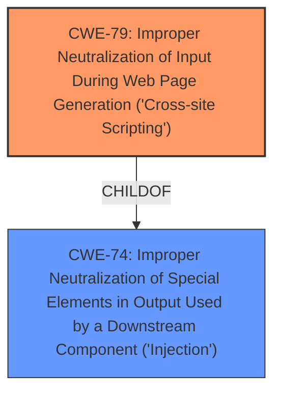

# Enhanced Analysis for CVE-2021-43862

# Summary
| CWE ID | CWE Name | Confidence | CWE Abstraction Level | CWE Vulnerability Mapping Label | CWE-Vulnerability Mapping Notes |
|---|---|---|---|---|---|
| CWE-79 | Improper Neutralization of Input During Web Page Generation ('Cross-site Scripting') | 1.0 | Base | Allowed | Primary CWE |

## Evidence and Confidence

*   **Confidence Score:** 1.0
*   **Evidence Strength:** HIGH

## Relationship Analysis
The primary relationship considered was that of the ChildOf relationship where CWE-79 is a child of CWE-74. The weakness here is directly related to the **improper neutralization** of user input which results in XSS. The `Retriever Results` confirm that CWE-79 is the best fit for this vulnerability. CWE-79 is a base level CWE, which is the preferred level of abstraction.



## Vulnerability Chain
The vulnerability chain starts with **improper input sanitization**, leading to the **cross-site scripting** vulnerability, and ultimately allowing an attacker to execute arbitrary JavaScript code.

## Summary of Analysis
Based on the provided vulnerability description and supporting evidence, the primary weakness is **CWE-79** Improper Neutralization of Input During Web Page Generation ('Cross-site Scripting'). This is because the root cause of the vulnerability is **improper input sanitization** which allows for the injection of malicious code into the web page. The `Vulnerability Description Key Phrases` identifies **cross-site scripting** as a weakness, and the `CVE Reference Links Content Summary` clearly states that the library failed to sanitize or encode special characters within the input.

The `Retriever Results` also indicate that **CWE-79** is the best match with a score of 0.991. The description of **CWE-79** aligns perfectly with the vulnerability where user-controllable input is not neutralized before being placed in the output used as a web page. This allows attackers to inject malicious scripts that can be executed by other users.

Other CWEs were considered but not selected because they were either too high-level or did not accurately represent the root cause of the vulnerability. For example, **CWE-116** Improper Encoding or Escaping of Output is a Class-level CWE, and while it is related to output handling, it is not as specific as **CWE-79**. Similarly, **CWE-352** Cross-Site Request Forgery (CSRF) is a Compound CWE that describes a different type of vulnerability.

The selection of **CWE-79** is at the optimal level of specificity as it directly addresses the XSS vulnerability caused by **improper input sanitization**. The evidence from the vulnerability description, `CVE Reference Links Content Summary`, and `Retriever Results` all support this classification.


## CWE Relationship Analysis

Current CWEs represent these abstraction levels: .


### Vulnerability Chain Analysis

**Chain starting from CWE-352:**
- 352 (Cross-Site Request Forgery (CSRF)) - ROOT


**Chain starting from CWE-116:**
- 116 (Improper Encoding or Escaping of Output) - ROOT


### CWE Relationship Diagram

```mermaid
graph TD
    classDef primary fill:#f96,stroke:#333,stroke-width:2px
    classDef secondary fill:#69f,stroke:#333
    classDef tertiary fill:#9e9,stroke:#333
```