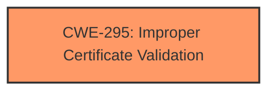

# Analysis Report for CVE-2021-43882

# Vulnerability Analysis Report: CVE-2021-43882

## Description


## Analysis (with Relationship Data)

# Summary

| CWE ID | CWE Name | Confidence | CWE Abstraction Level | CWE Vulnerability Mapping Label | CWE-Vulnerability Mapping Notes |
|---|---|---|---|---|---|
| CWE-295 | Improper Certificate Validation | 1.0 | Base | Allowed | Primary CWE |

## Evidence and Confidence

*   **Confidence Score:** 1.0
*   **Evidence Strength:** HIGH

## Relationship Analysis

The primary relationship that influenced the decision was the direct match of the vulnerability description to the definition of CWE-295. There are no complex chain or peer relationships in this case; the root cause directly leads to the impact. CWE-295 is a base level CWE, which is the preferred level of abstraction.



## Vulnerability Chain

The vulnerability chain consists of:

1.  **Root Cause:** **Lack of proper validation of a certificate chain** (CWE-295).
2.  **Impact:** An attacker can bypass authentication on the system, leading to potential Remote Code Execution.

## Summary of Analysis

The initial analysis strongly suggests CWE-295 due to the explicit mention of "**improper certificate validation**" as the root cause in the "CVE Reference Links Content Summary": "The vulnerability exists within the password reset mechanism due to the **lack of proper validation of a certificate chain**." This statement directly aligns with the description of CWE-295, "The product does not validate, or incorrectly validates, a certificate."

The primary CWE match from the "CWE for similar CVE Descriptions" section is CWE-NVD-noinfo, which is not useful. However, the retriever results list CWE-295 as a potential match and after review, the vulnerability description aligns perfectly with the definition of CWE-295. The confidence is high (1.0) because the root cause is explicitly stated and directly corresponds to the CWE definition.

Relevant CWE Information:

# Enhanced Context (25 CWEs)

## CWE-295: Improper Certificate Validation
**Abstraction Level**: Base

**Description**:
The product does not validate, or incorrectly validates, a certificate.

The provided evidence and relationship analysis strongly support the selection of CWE-295 as the primary CWE for this vulnerability.


## CWE Relationship Analysis

Current CWEs represent these abstraction levels: .


### Vulnerability Chain Analysis

**Chain starting from CWE-295:**
- 295 (Improper Certificate Validation) - ROOT


### CWE Relationship Diagram

```mermaid
graph TD
    classDef primary fill:#f96,stroke:#333,stroke-width:2px
    classDef secondary fill:#69f,stroke:#333
    classDef tertiary fill:#9e9,stroke:#333
```


*Report generated on 2025-04-02 15:24:57*
