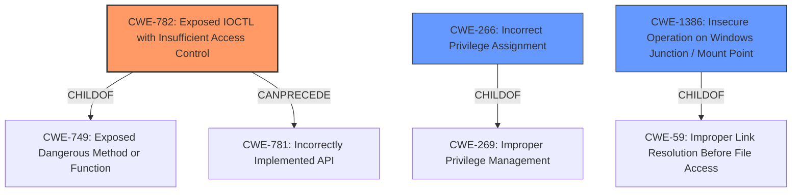

# Enhanced Analysis for CVE-2021-43893

# Summary
| CWE ID | CWE Name | Confidence | CWE Abstraction Level | CWE Vulnerability Mapping Label | CWE-Vulnerability Mapping Notes |
|---|---|---|---|---|---|
| CWE-782 | Exposed IOCTL with Insufficient Access Control | 0.6 | Variant | Allowed | Primary CWE |
| CWE-266 | Incorrect Privilege Assignment | 0.5 | Base | Allowed | Secondary Candidate |
| CWE-1386 | Insecure Operation on Windows Junction / Mount Point | 0.3 | Base | Allowed | Secondary Candidate |

## Evidence and Confidence

*   **Confidence Score:** 0.6
*   **Evidence Strength:** LOW

## Relationship Analysis
The primary CWE selected, CWE-782 (Exposed IOCTL with Insufficient Access Control), is a Variant of CWE-749 (Exposed Dangerous Method or Function). It also has a CanPrecede relationship with CWE-781. The secondary CWE candidate, CWE-266 (Incorrect Privilege Assignment), is a base level CWE and a child of CWE-269 (Improper Privilege Management). The other candidate CWE-1386 (Insecure Operation on Windows Junction / Mount Point) is a child of CWE-59 (Improper Link Resolution Before File Access ('Link Following')).



## Vulnerability Chain
The vulnerability chain is not clear based on the provided information. However, a potential chain could involve an exposed IOCTL (CWE-782) leading to incorrect privilege assignment (CWE-266) and potentially insecure file operations (CWE-1386), ultimately resulting in elevation of privilege.

## Summary of Analysis
The initial assessment was challenging due to the lack of detailed information in the provided vulnerability description and the absence of CVE Reference Links Content Summary.

The primary CWE selected is CWE-782, "Exposed IOCTL with Insufficient Access Control." This is based on the vulnerability description indicating an **Elevation of Privilege** vulnerability in the Windows Encrypting File System (EFS). IOCTLs (Input/Output Control codes) are often used in device drivers and system-level components to perform privileged operations. If an IOCTL is exposed without proper access control, it could allow an attacker to elevate their privileges. The retriever results identified this as a strong candidate.

CWE-266, "Incorrect Privilege Assignment," was considered as a secondary CWE. This could be a consequence of the exposed IOCTL, where the system incorrectly assigns privileges to an attacker due to the insufficient access control on the IOCTL.

CWE-1386, "Insecure Operation on Windows Junction / Mount Point," was also considered because EFS involves file system operations, and junctions/mount points can be exploited to redirect file access to unintended locations. However, the evidence is insufficient to confirm this.

The selection of CWE-782 is at the Variant level, which is preferred when the evidence supports it. The other CWEs are at the base level. The confidence level is 0.6 due to the limited evidence.

Relevant CWE Information:

# Enhanced Context (25 CWEs)
The following CWEs were identified as potentially relevant to this vulnerability:

## CWE-59: Improper Link Resolution Before File Access ('Link Following')
**Abstraction Level**: Base
**Similarity Score**: 0.82
**Source**: dense

**Description**:
The product attempts to access a file based on the filename, but it does not properly prevent that filename from identifying a link or shortcut that resolves to an unintended resource.

**Mapping Guidance**:
- Usage: Allowed
- Rationale: This CWE entry is at the Base level of abstraction, which is a preferred level of abstraction for mapping to the root causes of vulnerabilities.


## CWE-73: External Control of File Name or Path
**Abstraction Level**: Base
**Similarity Score**: 0.81
**Source**: dense

**Description**:
The product allows user input to control or influence paths or file names that are used in filesystem operations.

**Mapping Guidance**:
- Usage: Allowed
- Rationale: This CWE entry is at the Base level of abstraction, which is a preferred level of abstraction for mapping to the root causes of vulnerabilities.


## CWE-41: Improper Resolution of Path Equivalence
**Abstraction Level**: Base
**Similarity Score**: 0.79
**Source**: dense

**Description**:
The product is vulnerable to file system contents disclosure through path equivalence. Path equivalence involves the use of special characters in file and directory names. The associated manipulations are intended to generate multiple names for the same object.

**Mapping Guidance**:
- Usage: Allowed
- Rationale: This CWE entry is at the Base level of abstraction, which is a preferred level of abstraction for mapping to the root causes of vulnerabilities.


## CWE-23: Relative Path Traversal
**Abstraction Level**: Base
**Similarity Score**: 0.78
**Source**: dense

**Description**:
The product uses external input to construct a pathname that should be within a restricted directory, but it does not properly neutralize sequences such as ".." that can resolve to a location that is outside of that directory.

**Mapping Guidance**:
- Usage: Allowed
- Rationale: This CWE entry is at the Base level of abstraction, which is a preferred level of abstraction for mapping to the root causes of vulnerabilities.


## CWE-552: Files or Directories Accessible to External Parties
**Abstraction Level**: Base
**Similarity Score**: 0.77
**Source**: dense

**Description**:
The product makes files or directories accessible to unauthorized actors, even though they should not be.

**Mapping Guidance**:
- Usage: Allowed
- Rationale: This CWE entry is at the Base level of abstraction, which is a preferred level of abstraction for mapping to the root causes of vulnerabilities.


## CWE-427: Uncontrolled Search Path Element
**Abstraction Level**: Base
**Similarity Score**: 0.77
**Source**: dense

**Description**:
The product uses a fixed or controlled search path to find resources, but one or more locations in that path can be under the control of unintended actors.

**Mapping Guidance**:
- Usage: Allowed
- Rationale: This CWE entry is at the Base level of abstraction, which is a preferred level of abstraction for mapping to the root causes of vulnerabilities.


## CWE-668: Exposure of Resource to Wrong Sphere
**Abstraction Level**: Class
**Similarity Score**: 0.77
**Source**: dense

**Description**:
The product exposes a resource to the wrong control sphere, providing unintended actors with inappropriate access to the resource.

**Mapping Guidance**:
- Usage: Discouraged
- Rationale: CWE-668 is high-level and is often misused as a catch-all when lower-level CWE IDs might be applicable. It is sometimes used for low-information vulnerability reports [REF-1287]. It is a level-1 Class (i.e., a child of a Pillar). It is not useful for trend analysis.


## CWE-1386: Insecure Operation on Windows Junction / Mount Point
**Abstraction Level**: Base
**Similarity Score**: 0.77
**Source**: dense

**Description**:
The product opens a file or directory, but it does not properly prevent the name from being associated with a junction or mount point to a destination that is outside of the intended control sphere.

**Mapping Guidance**:
- Usage: Allowed
- Rationale: This CWE entry is at the Base level of abstraction, which is a preferred level of abstraction for mapping to the root causes of vulnerabilities.


## CWE-667: Improper Locking
**Abstraction Level**: Class
**Similarity Score**: 0.76
**Source**: dense

**Description**:
The product does not properly acquire or release a lock on a resource, leading to unexpected resource state changes and behaviors.

**Mapping Guidance**:
- Usage: Allowed-with-Review
- Rationale: This CWE entry is a Class and might have Base-level children that would be more appropriate


## CWE-378: Creation of Temporary File With Insecure Permissions
**Abstraction


## CWE Relationship Analysis

Current CWEs represent these abstraction levels: .


### Vulnerability Chain Analysis

**Chain starting from CWE-667:**
- 667 (Improper Locking) - ROOT


**Chain starting from CWE-782:**
- 782 (Exposed IOCTL with Insufficient Access Control) - ROOT


### CWE Relationship Diagram

```mermaid
graph TD
    classDef primary fill:#f96,stroke:#333,stroke-width:2px
    classDef secondary fill:#69f,stroke:#333
    classDef tertiary fill:#9e9,stroke:#333
```