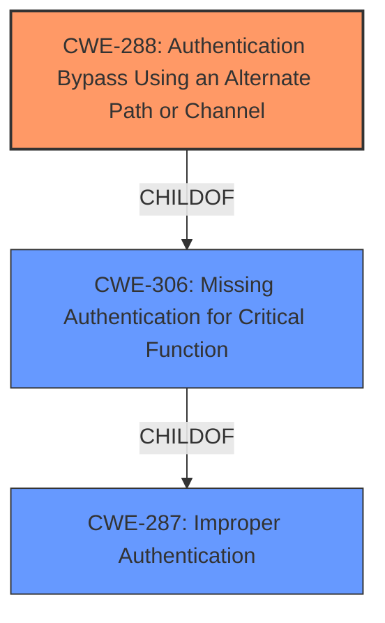

# Raw Analyzer Response for CVE-2021-43935

# Summary
| CWE ID  | CWE Name                                                       | Confidence | CWE Abstraction Level | CWE Vulnerability Mapping Label | CWE-Vulnerability Mapping Notes |
| :-------- | :------------------------------------------------------------- | :--------- | :---------------------- | :------------------------------ | :------------------------------ |
| CWE-288 | Authentication Bypass Using an Alternate Path or Channel | 0.95       | Base                    | Primary                       | Allowed                       |
| CWE-287 | Improper Authentication                                        | 0.75       | Class                   | Secondary                     | Discouraged                    |
| CWE-306 | Missing Authentication for Critical Function                   | 0.65       | Base                    | Secondary                     | Allowed                       |

## Evidence and Confidence

*   **Confidence Score:** 0.90
*   **Evidence Strength:** HIGH

## Relationship Analysis
The primary CWE selected is CWE-288, which describes an authentication bypass using an alternate path or channel. This selection is further reinforced by its relationship to CWE-306 (Missing Authentication for Critical Function), indicating that the alternate path lacks proper authentication. CWE-287 (Improper Authentication) is a parent Class of CWE-288 and CWE-306. This hierarchical relationship suggests a broader issue of authentication failure, but CWE-288 provides a more specific description of the bypass mechanism.

## Vulnerability Chain
The vulnerability chain starts with an **improper authentication vulnerability** when SSO is enabled. This allows manual entry of any Active Directory account without requiring a password, leading to authentication bypass and unauthorized access to the application with associated privileges. The root cause is the **improper authentication**, and the impact is unauthorized access and potential privilege escalation.
1.  Improper Authentication (Root Cause)
2.  Authentication Bypass (Alternate Path)
3.  Unauthorized Access (Impact)

## Summary of Analysis
The initial assessment focused on identifying the root cause of the vulnerability. The **improper authentication vulnerability** and subsequent ability to bypass authentication by manually entering an AD account without a password pointed towards CWE-288 as the most appropriate classification.

The vulnerability description states, "This vulnerability allows the application to accept manual entry of any active directory (AD) account provisioned in the application without supplying a password, resulting in access to the application as the supplied AD account, with all associated privileges." This statement directly supports the classification of CWE-288 as an Authentication Bypass Using an Alternate Path or Channel, where the manual entry of an AD account acts as the alternate path.

CWE-288 is at the Base level of abstraction, providing a more specific description than its parent class, CWE-287. While CWE-287 (Improper Authentication) could be considered, CWE-288 more accurately captures the bypass mechanism. CWE-306 (Missing Authentication for Critical Function) is also a possible candidate, as the alternate path lacks authentication, but CWE-288 encompasses both the bypass and the lack of authentication in the alternate path more completely.

The evidence and retriever results support the selection of CWE-288 as the primary CWE.

**CWEs Considered But Not Used:**

*   **CWE-287 Improper Authentication:** While relevant, it is a high-level class. The vulnerability details point to a specific type of improper authentication (bypass using an alternate path), making CWE-288 a better fit. The mapping guidance discourages using CWE-287 when lower-level CWEs are applicable.
*   **CWE-306 Missing Authentication for Critical Function:** This CWE is also relevant, as the alternate path lacks authentication. However, CWE-288 encompasses both the bypass and the missing authentication, making it a more comprehensive classification.
*   **CWE-1390 Weak Authentication:** Similar to CWE-287, this is a class-level CWE. The vulnerability is more specific than simply "weak" authentication.
*   **CWE-303 Incorrect Implementation of Authentication Algorithm:** This is not applicable because the vulnerability doesn't seem to stem from an incorrect implementation of a defined algorithm, but from a missing authentication check in an alternate path.
*   **CWE-613 Insufficient Session Expiration:** This CWE addresses session management issues, which are not the primary focus of this vulnerability.
*   **CWE-863 Incorrect Authorization:** This is not applicable because the vulnerability is about authentication (verifying identity) rather than authorization (verifying access rights).
*   **CWE-256 Plaintext Storage of a Password & CWE-522 Insufficiently Protected Credentials:** These CWEs are not applicable because the vulnerability is not about storing or transmitting credentials insecurely, but about bypassing the authentication process altogether.