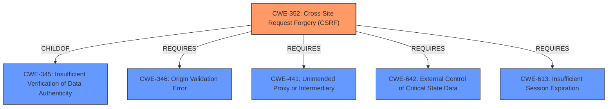

# Enhanced Analysis for CVE-2021-43937

# Summary
| CWE ID | CWE Name | Confidence | CWE Abstraction Level | CWE Vulnerability Mapping Label | CWE-Vulnerability Mapping Notes |
|---|---|---|---|---|---|
| CWE-352 | Cross-Site Request Forgery (CSRF) | 1.0 | Compound | Allowed | Primary CWE |

## Evidence and Confidence

*   **Confidence Score:** 1.0
*   **Evidence Strength:** HIGH

## Relationship Analysis
The primary relationship that influenced the decision was that CWE-352 is a compound weakness that perfectly describes the vulnerability. It is a combination of multiple weaknesses that must occur simultaneously. There are other ChildOf relationships to CWE-345 Improper Verification of Data Integrity, as well as Requires relationships to CWE-346, CWE-441, CWE-642, and CWE-613 which represent the components of a CSRF attack.



## Vulnerability Chain
The vulnerability chain for this vulnerability is as follows:
1.  The web application **does not sufficiently verify** whether a well-formed, valid, consistent request was intentionally provided by the user.
2.  An attacker tricks a logged-in user into sending a crafted request to the application.
3.  The attacker exploits the lack of verification to perform actions on behalf of the user without their knowledge or consent.
The root cause is the lack of sufficient verification, which leads to the CSRF vulnerability and the potential exposure of data or unintended code execution.

## Summary of Analysis
The initial analysis indicated that the web application does not sufficiently verify whether a well-formed, valid, consistent request was intentionally provided by the user who submitted the request. The retriever results showed that CWE-352 Cross-Site Request Forgery (CSRF) was the top combined result.

The CWE description for CWE-352 states: "The web application does not, or can not, sufficiently verify whether a well-formed, valid, consistent request was intentionally provided by the user who submitted the request." This matches the vulnerability description almost exactly.

The CVE Reference Links Content Summary states: "The web application **does not sufficiently verify** whether a well-formed, valid, consistent request was intentionally provided by the user who submitted the request. This lack of verification makes the application susceptible to Cross-Site Request Forgery (CSRF)."

The final decision was to select CWE-352 as the primary CWE because it is a well-known compound weakness that accurately describes the vulnerability and the supporting evidence from the vulnerability description and CVE reference links.

CWEs considered but not used:
* CWE-347: Improper Verification of Cryptographic Signature: This CWE relates to the incorrect verification of cryptographic signatures, but the vulnerability is not related to cryptographic signatures, so this was not selected.
* CWE-297: Improper Validation of Certificate with Host Mismatch: This CWE relates to the improper validation of certificates, but the vulnerability is not related to certificate validation, so this was not selected.
* CWE-287: Improper Authentication: This CWE relates to insufficient authentication, but the vulnerability is related to request verification rather than user authentication, so this was not selected.
* CWE-1390: Weak Authentication: Similar to CWE-287, this CWE relates to weak authentication mechanisms, but the vulnerability is not related to user authentication, so this was not selected.
* CWE-444: Inconsistent Interpretation of HTTP Requests ('HTTP Request/Response Smuggling'): This CWE relates to inconsistencies in how HTTP requests are interpreted, which is not the core issue in this vulnerability, so this was not selected.
* CWE-613: Insufficient Session Expiration: This CWE relates to session expiration issues, but the vulnerability is primarily about request verification, so this was not selected.
* CWE-346: Origin Validation Error: While related to verification, this is a more general class. CSRF is a specific type of origin validation issue, making CWE-352 a better fit.
* CWE-200: Exposure of Sensitive Information to an Unauthorized Actor: This CWE relates to information exposure, but the primary issue is the lack of request verification, so this was not selected.
* CWE-707: Improper Neutralization: This is a very high-level pillar, and CWE-352 is a much more specific description of the vulnerability.


## CWE Relationship Analysis

Current CWEs represent these abstraction levels: .


### Vulnerability Chain Analysis

**Chain starting from CWE-297:**
- 297 (Improper Validation of Certificate with Host Mismatch) - ROOT


**Chain starting from CWE-287:**
- 287 (Improper Authentication) - ROOT


### CWE Relationship Diagram

```mermaid
graph TD
    classDef primary fill:#f96,stroke:#333,stroke-width:2px
    classDef secondary fill:#69f,stroke:#333
    classDef tertiary fill:#9e9,stroke:#333
```