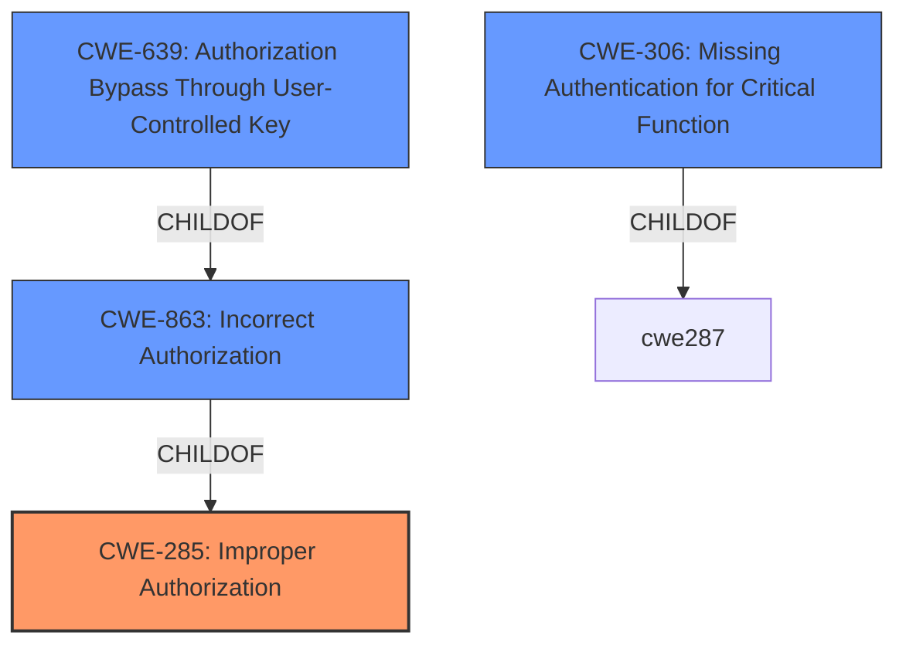

# Analysis for CVE-2021-43939

# Summary
| CWE ID | CWE Name | Confidence | CWE Abstraction Level | CWE Vulnerability Mapping Label | CWE-Vulnerability Mapping Notes |
|---|---|---|---|---|---|
| CWE-285 | Improper Authorization | 0.9 | Class | Primary | Allowed-with-Review |

## Evidence and Confidence

*   **Confidence Score:** 0.9
*   **Evidence Strength:** HIGH

## Relationship Analysis
The primary CWE selected is CWE-285, Improper Authorization. This is a class-level CWE. While other more specific base-level CWEs like CWE-639 (Authorization Bypass Through User-Controlled Key) and CWE-306 (Missing Authentication for Critical Function) were considered, the evidence points towards an **incorrect** authorization implementation rather than a complete miss or bypass using a key. Thus, CWE-285 is deemed more appropriate.

## Vulnerability Chain
The vulnerability chain is relatively simple: a low-authenticated user exploits **improper authorization** (CWE-285) to gain access to higher-level administration authorization.

## Summary of Analysis
The initial analysis identified several potential CWEs, primarily around authorization issues. After reviewing the details and evidence, CWE-285 (Improper Authorization) was selected as the primary CWE. This decision is based on the vulnerability description stating that a "low-authenticated user can access higher level administration authorization by issuing requests directly to the desired endpoints," which indicates the presence of some authorization mechanism, but that it is flawed, which is the rootcause.

The selection of CWE-285 aligns with the provided evidence: "Root cause of vulnerability: Improper authorization. A low-authenticated user can access higher level administration authorization by issuing requests directly to the desired endpoints." This statement confirms the presence of an authorization weakness, and that it is **improper**. The **Vulnerability Description Key Phrases** also indicates that the **impact** is "access higher level administration authorization".

The retriever results suggest CWE-285, CWE-863, CWE-639 and CWE-306.
- CWE-285 is Improper Authorization which is the primary.
- CWE-863 is Incorrect Authorization.
- CWE-639 is Authorization Bypass Through User-Controlled Key.
- CWE-306 is Missing Authentication for Critical Function.
CWE-285 is more appropriate than CWE-863 because the evidence indicates the authorization mechanism is present but flawed, not necessarily implemented **incorrectly**. CWE-639 is not appropriate because there is no evidence of bypassing the authorization using a key. CWE-306 is not appropriate because authentication is present, albeit at a "low" level.

The decision to use CWE-285 at the Class level is supported by the MITRE mapping guidance, which discourages its use but suggests evaluating its children, such as CWE-862 (Missing Authorization) and CWE-863 (Incorrect Authorization). However, neither of these are accurate. The vulnerability description clearly states that a "low-authenticated user" can access higher-level functions, implying authorization is present, but flawed.

Relevant CWE Information:

# Enhanced Context (25 CWEs)
## CWE-668: Exposure of Resource to Wrong Sphere
**Abstraction Level**: Class
**Similarity Score**: 0.76
**Source**: dense

**Description**:
The product exposes a resource to the wrong control sphere, providing unintended actors with inappropriate access to the resource.

**Mapping Guidance**:
- Usage: Discouraged
- Rationale: CWE-668 is high-level and is often misused as a catch-all when lower-level CWE IDs might be applicable. It is sometimes used for low-information vulnerability reports [REF-1287]. It is a level-1 Class (i.e., a child of a Pillar). It is not useful for trend analysis.

*Reason for not selecting:* This is too high level and doesn't accurately describe the root cause of the vulnerability.

## CWE-664: Improper Control of a Resource Through its Lifetime
**Abstraction Level**: Pillar
**Similarity Score**: 0.75
**Source**: dense

**Description**:
The product does not maintain or incorrectly maintains control over a resource throughout its lifetime of creation, use, and release.

**Mapping Guidance**:
- Usage: Discouraged
- Rationale: This CWE entry is high-level when lower-level children are available.

*Reason for not selecting:* This is a pillar-level CWE and too general. It does not accurately describe the specific authorization flaw.

## CWE-653: Improper Isolation or Compartmentalization
**Abstraction Level**: Class
**Similarity Score**: 0.75
**Source**: dense

**Description**:
The product does not properly compartmentalize or isolate functionality, processes, or resources that require different privilege levels, rights, or permissions.

**Mapping Guidance**:
- Usage: Allowed
- Rationale: This CWE entry is at the Base level of abstraction, which is a preferred level of abstraction for mapping to the root causes of vulnerabilities.

*Reason for not selecting:* While there is some overlap, the core issue is about authorization, not isolation. The vulnerability description focuses on a low-authenticated user accessing higher-level functions, not on a lack of isolation.

## CWE-807: Reliance on Untrusted Inputs in a Security Decision
**Abstraction Level**: Base
**Similarity Score**: 0.74
**Source**: dense

**Description**:
The product uses a protection mechanism that relies on the existence or values of an input, but the input can be modified by an untrusted actor in a way that bypasses the protection mechanism.

**Mapping Guidance**:
- Usage: Allowed
- Rationale: This CWE entry is at the Base level of abstraction, which is a preferred level of abstraction for mapping to the root causes of vulnerabilities.

*Reason for not selecting:* There's no evidence that the vulnerability involves reliance on untrusted input in a security decision. The issue is that low-authenticated users are able to access higher-level functionalities, suggesting a flaw in the access control mechanisms themselves.

## CWE-1220: Insufficient Granularity of Access Control
**Abstraction Level**: Base
**Similarity Score**: 0.74
**Source**: dense

**Description**:
The product implements access controls via a policy or other feature with the intention to disable or restrict accesses (reads and/or writes) to assets in a system from untrusted agents. However, implemented access controls lack required granularity, which renders the control policy too broad because it allows accesses from unauthorized agents to the security-sensitive assets.

**Mapping Guidance**:
- Usage: Allowed
- Rationale: This CWE entry is at the Base level of abstraction, which is a preferred level of abstraction for mapping to the root causes of vulnerabilities.

*Reason for not selecting:* The description doesn't indicate insufficient granularity. It's about authorization being bypassed, not about too broad policies.

## CWE-552: Files or Directories Accessible to External Parties
**Abstraction Level**: Base
**Similarity Score**: 0.74
**Source**: dense

**Description**:
The product makes files or directories accessible to unauthorized actors, even though they should not be.

**Mapping Guidance**:
- Usage: Allowed
- Rationale: This CWE entry is at the Base level of abstraction, which is a preferred level of abstraction for mapping to the root causes of vulnerabilities.

*Reason for not selecting:* Not related to file or directory access. It's about higher-level functions.

## CWE-610: Externally Controlled Reference to a Resource in Another Sphere
**Abstraction Level**: Class
**Similarity Score**: 0.74
**Source**: dense

**Description**:
The product uses an externally controlled name or reference that resolves to a resource that is outside of the intended control sphere.

**Mapping Guidance**:
- Usage: Discouraged
- Rationale: This CWE entry is a level-1 Class (i.e., a child of a Pillar). It might have lower-level children that would be more appropriate

*Reason for not selecting:* Not applicable. It is about external references to resources, not authorization flaws.

## CWE-274: Improper Handling of Insufficient Privileges
**Abstraction Level**: Base
**Similarity Score**: 0.74
**Source**: dense

**Description**:
The product does not handle or incorrectly handles when it has insufficient privileges to perform an operation, leading to resultant weaknesses.

**Mapping Guidance**:
- Usage: Discouraged
- Rationale: This CWE entry could