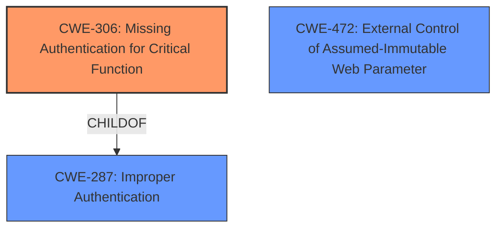

# Analysis for CVE-2021-43974

# Summary
| CWE ID | CWE Name | Confidence | CWE Abstraction Level | CWE Vulnerability Mapping Label | CWE-Vulnerability Mapping Notes |
|---|---|---|---|---|---|
| CWE-306 | Missing Authentication for Critical Function | 1.0 | Base | Primary | Allowed |
| CWE-472 | External Control of Assumed-Immutable Web Parameter | 0.7 | Base | Secondary | Allowed |
| CWE-287 | Improper Authentication | 0.5 | Class | Secondary | Discouraged |

## Evidence and Confidence

*   **Confidence Score:** 0.8
*   **Evidence Strength:** HIGH

## Relationship Analysis
The primary CWE is CWE-306, which indicates a **missing authentication** for a critical function. The secondary CWEs, CWE-472 and CWE-287, represent related aspects: **external control of assumed-immutable web parameters** and **improper authentication**, respectively. CWE-306 is a child of CWE-287. The vulnerability chain starts with a **missing authentication** check (CWE-306) which allows the attacker to proceed with the registration process, leveraging external parameters (CWE-472) which ultimately leads to account creation. CWE-287 is a class-level CWE that encompasses the broader issue of **improper authentication**, while CWE-306 is a more specific **base** CWE.

## Vulnerability Chain
The vulnerability chain starts with the **missing authentication** for the `/enduserreg` endpoint (CWE-306). Because of this, an attacker can post registration data by controlling external parameters (CWE-472). This **missing authentication** leads to the impact of creating new accounts without prior authentication.

## Summary of Analysis
The analysis is based on the provided vulnerability description and the CVE reference links content summary. The vulnerability description states that the `/enduserreg` endpoint **does not respect the server-side setting** that determines if anonymous users are allowed to register new accounts. The CVE reference links content summary confirms this by stating, "The `/enduserreg` endpoint allows for user registration even if the registration feature is disabled on the server." This **lack of authentication** for a critical function directly maps to CWE-306.

The fact that the attacker can post registration data points to the possibility of **external control** of assumed-immutable parameters like user names and passwords, suggesting CWE-472. The ultimate impact of creating new accounts highlights the broader problem of **improper authentication** (CWE-287), but the root cause is the **missing authentication** check on the endpoint itself (CWE-306).

CWE-306 is the most specific and accurate representation of the vulnerability, as it directly addresses the **missing authentication** for a critical function. While CWE-287 (Improper Authentication) is a parent, it's a broader category. CWE-306 provides a more precise description of the actual weakness. CWE-472 describes the mechanism by which registration occurs.

I have chosen to map CWE-306 as the primary CWE, because the **missing authentication** is the direct cause of the vulnerability. I am also including CWE-472 and CWE-287 as a secondary CWE to give more context to the vulnerability.

Relevant CWE Information:

# Enhanced Context (25 CWEs)
The following CWEs were identified as potentially relevant to this vulnerability:

## CWE-303: Incorrect Implementation of Authentication Algorithm
**Abstraction Level**: Base
**Similarity Score**: 0.78
**Source**: dense
This CWE was not selected because the problem is **missing authentication**, not an incorrect implementation.

## CWE-74: Improper Neutralization of Special Elements in Output Used by a Downstream Component ('Injection')
**Abstraction Level**: Class
**Similarity Score**: 0.78
**Source**: dense
This CWE was not selected because it's too generic. The vulnerability is not directly related to injection.

## CWE-90: Improper Neutralization of Special Elements used in an LDAP Query ('LDAP Injection')
**Abstraction Level**: Base
**Similarity Score**: 0.77
**Source**: dense
This CWE was not selected because the vulnerability is not related to LDAP.

## CWE-1390: Weak Authentication
**Abstraction Level**: Class
**Similarity Score**: 0.77
**Source**: dense
This CWE was not selected as the primary CWE because while relevant, the issue is **missing authentication** rather than weak authentication.

## CWE-807: Reliance on Untrusted Inputs in a Security Decision
**Abstraction Level**: Base
**Similarity Score**: 0.76
**Source**: dense
This CWE was not selected because it is not the main issue, although the vulnerability does involve the product relying on untrusted inputs to create an account.

## CWE-639: Authorization Bypass Through User-Controlled Key
**Abstraction Level**: Base
**Similarity Score**: 0.76
**Source**: dense
This CWE was not selected because it's more about authorization bypass, not authentication bypass.

## CWE-41: Improper Resolution of Path Equivalence
**Abstraction Level**: Base
**Similarity Score**: 0.76
**Source**: dense
This CWE was not selected because it's not related to path equivalence.

## CWE-204: Observable Response Discrepancy
**Abstraction Level**: Base
**Similarity Score**: 0.76
**Source**: dense
This CWE was not selected because it's not about observable response discrepancy.

## CWE-23: Relative Path Traversal
**Abstraction Level**: Base
**Similarity Score**: 0.76
**Source**: dense
This CWE was not selected because it's not about path traversal.

## CWE-472: External Control of Assumed-Immutable Web Parameter
**Abstraction Level**: Base
**Similarity Score**: 0.76
**Source**: dense
This CWE was considered as a secondary CWE because attacker provides registration information to create the account.

## CWE-1336: Improper Neutralization of Special Elements Used in a Template Engine
**Abstraction Level**: Base
**Similarity Score**: 5563.45
**Source**: sparse
This CWE was not selected because it's not about template engine injection.

## CWE-863: Incorrect Authorization
**Abstraction Level**: Class
**Similarity Score**: 5377.40
**Source**: sparse
This CWE was not selected because the issue is with authentication, not authorization.

## CWE-287: Improper Authentication
**Abstraction Level**: Class
**Similarity Score**: 5336.10
**Source**: sparse
This CWE was considered as a secondary CWE since the result of the attack is improper authentication.

## CWE-471: Modification of Assumed-Immutable Data (MAID)
**Abstraction Level**: base
**Similarity Score**: 4.33
**Source**: graph
This CWE was not selected. Although the user input is being used to create an account, this is more directly a **missing authentication** issue.

## CWE-290: Authentication Bypass by Spoofing
**Abstraction Level**: base
**Similarity Score**: 3.64
**Source**: graph
This CWE was not selected because the attacker is not spoofing an identity, but rather creating a new one.

## CWE-603: Use of Client-Side Authentication
**Abstraction Level**: base
**Similarity Score**: 3.64
**Source**: graph
This CWE was not selected because the described vulnerability is not about client-side authentication. There is a **missing authentication** on the server-side.

## CWE-178: Improper Handling of Case Sensitivity
**Abstraction Level**: base
**Similarity Score**: 3.64
**Source**: graph
This CWE was not selected because it's not about case sensitivity.

## CWE-611: Improper Restriction of XML External Entity Reference
**Abstraction Level**: base
**Similarity Score**: 3.64
**Source**: graph
This CWE was not selected because it's not about XML External Entity Reference.

## CWE-1289: Improper Validation of Unsafe Equivalence in Input
**Abstraction Level**: base
**Similarity Score**: 3.64
**Source**: graph
This CWE was not selected because it's not about validation of unsafe equivalence in input.

## CWE-1336: Improper Neutralization of Special Elements Used in a Template Engine
**Abstraction Level**: base
**Similarity Score**: 3.64
**Source**: graph
This CWE was not selected because it's not