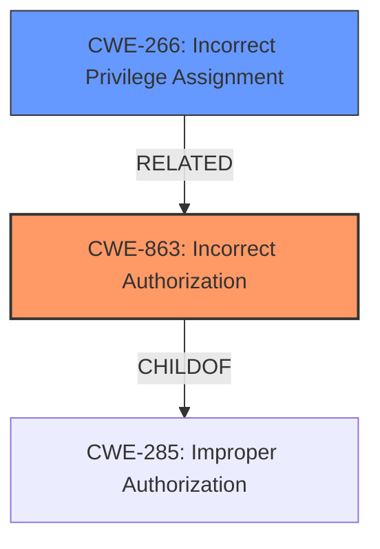

# Raw Analyzer Response for CVE-2021-43998

# Summary
| CWE ID | CWE Name | Confidence | CWE Abstraction Level | CWE Vulnerability Mapping Label | CWE-Vulnerability Mapping Notes |
|---|---|---|---|---|---|
| CWE-863 | Incorrect Authorization | 0.8 | Class | Primary | Allowed-with-Review |
| CWE-266 | Incorrect Privilege Assignment | 0.6 | Base | Secondary | Allowed |

## Evidence and Confidence

*   **Confidence Score:** 0.7
*   **Evidence Strength:** MEDIUM

## Relationship Analysis
The primary relationship influencing the decision is the hierarchical structure between CWE-285 (Improper Authorization), CWE-863 (Incorrect Authorization), and CWE-266 (Incorrect Privilege Assignment). CWE-863 is a child of CWE-285, indicating a more specific type of authorization issue. The selection of CWE-863 is further refined by considering CWE-266, which represents an incorrect privilege assignment, reflecting the **templated ACL policies would always match the first-created entity alias**.

## Vulnerability Chain
The vulnerability chain starts with the **incorrect implementation of the templated ACL policies**, leading to an **incorrect match of entity aliases**, which finally results in **incorrect policy enforcement**. This is a root cause leading to an impact.

## Summary of Analysis
The initial assessment focused on the core weakness: "**templated ACL policies would always match the first-created entity alias** if multiple entity aliases exist," leading to "**incorrect policy enforcement**." This points to an authorization issue, making CWE-863 (Incorrect Authorization) a strong candidate. The retriever results also list CWE-863 as the top match. The content summary from CVE reference links highlights "Incorrect Policy Enforcement" and "Alias Matching Logic Flaw" which supports this.

CWE-863 is a Class-level CWE, and the mapping guidance suggests reviewing its children for a more specific fit. While no direct child CWE perfectly captures the issue, CWE-266 (Incorrect Privilege Assignment) provides a more granular perspective, representing how the first-created alias is incorrectly assigned privileges.

The selection of CWE-863 is justified by the "**incorrect policy enforcement**" outcome, which is a direct consequence of the flawed authorization logic. The choice of CWE-266 is further influenced by the analysis of the root cause, which is related to how the system **incorrectly assigns privileges based on the first-created alias**.

The evidence supports CWE-863 as the primary CWE, representing the incorrect authorization, and CWE-266 as a secondary CWE, highlighting the incorrect privilege assignment aspect. These CWEs are at the optimal level of specificity, providing a clear understanding of the vulnerability's root cause and impact.

Relevant CWE Information:

# Enhanced Context (25 CWEs)
The following CWEs were identified as potentially relevant to this vulnerability:

## CWE-266: Incorrect Privilege Assignment
**Abstraction Level**: Base
**Similarity Score**: 0.78
**Source**: dense

**Description**:
A product incorrectly assigns a privilege to a particular actor, creating an unintended sphere of control for that actor.

**Mapping Guidance**:
- Usage: Allowed
- Rationale: This CWE entry is at the Base level of abstraction, which is a preferred level of abstraction for mapping to the root causes of vulnerabilities.

CWE-863 (Incorrect Authorization): The product performs an authorization check when an actor attempts to access a resource or perform an action, but it does not correctly perform the check.

CWE-266 captures the nuance that the *first* alias is incorrectly assigned the privilege.

CWE-285 (Improper Authorization) was considered as a parent of CWE-863, but it is too general for this case. CWE-306 (Missing Authentication for Critical Function) was also considered, but the vulnerability isn't due to missing authentication, but incorrect authorization logic. CWE-1336 (Improper Neutralization of Special Elements Used in a Template Engine) was also considered, because the vulnerability concerns ACL Templates, but ultimately the issue is in the authorization logic and not in the template processing itself.