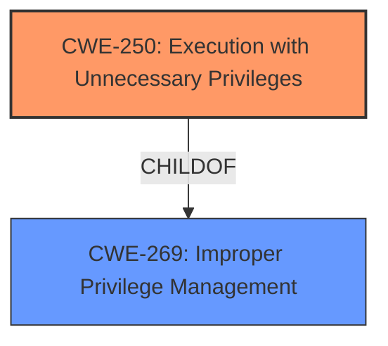

# Raw Analyzer Response for CVE-2021-44021

# Summary
| CWE ID  | CWE Name | Confidence | CWE Abstraction Level | CWE Vulnerability Mapping Label | CWE-Vulnerability Mapping Notes |
|-----------------|---------------------------------------------------|--------------------|--------------------------|------------------------------------|-----------------------------------|
| CWE-250 | Execution with Unnecessary Privileges | 0.8 | Base | Allowed | Primary CWE |
| CWE-269 | Improper Privilege Management | 0.6 | Class | Discouraged | Secondary Candidate |

## Evidence and Confidence

*   **Confidence Score:** 0.7
*   **Evidence Strength:** HIGH

## Relationship Analysis
The primary relationship influencing the CWE selection is the ChildOf relationship between CWE-250 and CWE-269. CWE-250 (Execution with Unnecessary Privileges) is a more specific Base CWE that accurately captures the root cause, while CWE-269 (Improper Privilege Management) is a broader Class. The analysis favors the more specific CWE-250 because the vulnerability involves the Trend Micro software running with privileges it doesn't need, allowing an attacker to escalate privileges.

## Vulnerability Chain
The vulnerability chain starts with the **unnecessary privilege** that the Trend Micro software possesses. This leads to a local attacker being able to escalate privileges.

Root Cause: **Unnecessary Privilege** (CWE-250) -> Impact: Privilege Escalation

## Summary of Analysis
The initial analysis correctly identifies the **unnecessary privilege** as a core aspect of the vulnerability. The **CWE for similar CVE Descriptions** list CWE-269 as the primary match and the retriever results list both CWE-250 and CWE-269. The retriever results show that CWE-250 (Execution with Unnecessary Privileges) is a more specific Base CWE, better describing the root cause than the Class CWE-269 (Improper Privilege Management).

The evidence from the **Vulnerability Description Key Phrases** indicates the **rootcause** is **unnecessary privilege** and the **impact** is escalate privileges. The **CVE Reference Links Content Summary** further clarifies that the Security Server grants **unnecessary privileges** to a process, enabling it to impersonate a client and escalate privileges.

The final selection of CWE-250 is justified because it directly addresses the **unnecessary privilege** issue, which is the root cause of the vulnerability. It's a Base CWE, providing more specificity than the Class CWE-269.

Relevant CWE Information:

# Enhanced Context (25 CWEs)
The following CWEs were identified as potentially relevant to this vulnerability:

## CWE-250: Execution with Unnecessary Privileges
**Abstraction Level**: Base
**Similarity Score**: 0.78
**Source**: dense

**Description**:
The product performs an operation at a privilege level that is higher than the minimum level required, which creates new weaknesses or amplifies the consequences of other weaknesses.

**Mapping Guidance**:
- Usage: Allowed
- Rationale: This CWE entry is at the Base level of abstraction, which is a preferred level of abstraction for mapping to the root causes of vulnerabilities.

## CWE-269: Improper Privilege Management
**Abstraction Level**: Class
**Similarity Score**: 0.75
**Source**: dense

**Description**:
The product does not properly assign, modify, track, or check privileges for an actor, creating an unintended sphere of control for that actor.

**Mapping Guidance**:
- Usage: Allowed-with-Review
- Rationale: This CWE entry is a Class and might have Base-level children that would be more appropriate

## CWE-250: Execution with Unnecessary Privileges
**Abstraction Level**: Base
**Similarity Score**: 0.652
**Source**: sparse

**Description**:
The product performs an operation at a privilege level that is higher than the minimum level required, which creates new weaknesses or amplifies the consequences of other weaknesses.

**Mapping Guidance**:
- Usage: Allowed
- Rationale: This CWE entry is at the Base level of abstraction, which is a preferred level of abstraction for mapping to the root causes of vulnerabilities.

## CWE-269: Improper Privilege Management
**Abstraction Level**: Class
**Similarity Score**: 0.641
**Source**: dense

**Description**:
The product does not properly assign, modify, track, or check privileges for an actor, creating an unintended sphere of control for that actor.

**Mapping Guidance**:
- Usage: Allowed-with-Review
- Rationale: This CWE entry is a Class and might have Base-level children that would be more appropriate

## CWE-250: Execution with Unnecessary Privileges
**Abstraction Level**: Base
**Technical Explanation**:

CWE-250 (Execution with Unnecessary Privileges): This vulnerability aligns with CWE-250 because the Trend Micro software is running with **unnecessary privileges**, which allows a local attacker to escalate their privileges. The software performs operations at a privilege level higher than required, creating a weakness.
Security Implications: An attacker with low-privileged code execution can escalate to SYSTEM level access, allowing arbitrary code execution.
Parent-Child Relationships: CWE-250 is a child of CWE-269 (Improper Privilege Management).
MITRE Mapping Guidance: The usage is ALLOWED, and it's a Base level CWE, which is preferred.

## CWE-269: Improper Privilege Management
**Abstraction Level**: Class
**Technical Explanation**:

CWE-269 (Improper Privilege Management): While applicable, this CWE is too broad. The vulnerability is more specifically related to the software running with privileges it doesn't need (CWE-250) rather than a general failure to manage privileges.
Security Implications: Could lead to unintended access or control over resources.
Parent-Child Relationships: CWE-269 is a parent of CWE-250.
MITRE Mapping Guidance: The usage is DISCOURAGED because it's commonly misused and can be conflated with privilege escalation. The guidance suggests examining children of CWE-269 for a better fit.

Other CWEs Considered but Not Used:

CWE-732 (Incorrect Permission Assignment for Critical Resource), CWE-59 (Improper Link Resolution Before File Access ('Link Following')), CWE-284 (Improper Access Control), CWE-1386 (Insecure Operation on Windows Junction / Mount Point), CWE-73 (External Control of File Name or Path), CWE-346 (Origin Validation Error), CWE-20 (Improper Input Validation), CWE-367 (Time-of-check Time-of-use (TOCTOU) Race Condition) were considered but not selected because they did not directly address the root cause of the vulnerability, which is the execution of the software with **unnecessary privileges**. These CWEs represent other types of weaknesses or are too high-level.