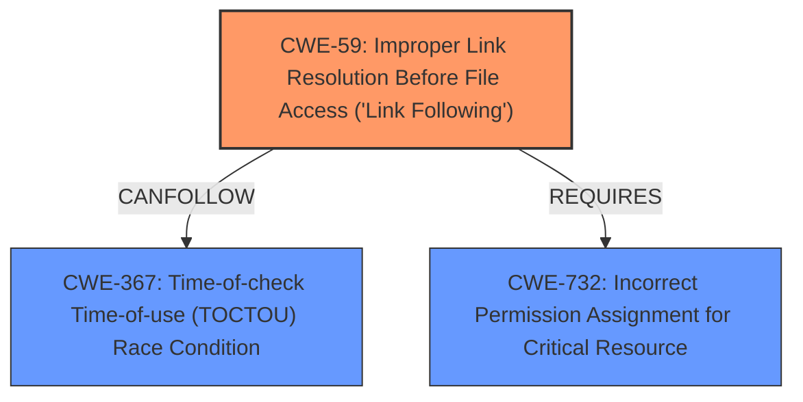

# Analysis Report for CVE-2021-44038

# Vulnerability Analysis Report: CVE-2021-44038

## Description


## Analysis (with Relationship Data)

# Summary
| CWE ID  | CWE Name                                                       | Confidence | CWE Abstraction Level | CWE Vulnerability Mapping Label | CWE-Vulnerability Mapping Notes |
| :-------- | :------------------------------------------------------------- | :---------- | :---------------------- | :------------------------------ | :------------------------------ |
| CWE-59  | Improper Link Resolution Before File Access ('Link Following') | 0.90      | Base                    | Primary                         | Allowed                       |
| CWE-367 | Time-of-check Time-of-use (TOCTOU) Race Condition             | 0.70      | Base                    | Secondary                       | Allowed                       |
| CWE-732 | Incorrect Permission Assignment for Critical Resource         | 0.60      | Class                   | Secondary                       | Allowed-with-Review           |

## Evidence and Confidence

*   **Confidence Score:** 0.80
*   **Evidence Strength:** HIGH

## Relationship Analysis
The primary weakness is **CWE-59** Improper Link Resolution Before File Access ('Link Following'), which is caused by **unsafe chown/chmod operations**. This can be exploited via a Time-of-Check Time-of-Use (TOCTOU) race condition (**CWE-367**). The root cause is related to assigning incorrect permissions (**CWE-732**) allowing unintended actors to access critical resources.



## Vulnerability Chain
The vulnerability chain starts with **incorrect permission assignments** for the `/etc/quagga` directory (CWE-732). This allows a local user to create a symbolic link. Because of **unsafe chown/chmod operations**, a **Time-of-Check Time-of-Use (TOCTOU) Race Condition** (CWE-367) can be exploited, where the state of the file changes between the permission check and the use of the file. This leads to **Improper Link Resolution Before File Access ('Link Following')** (CWE-59), enabling a malicious user to escalate privileges to root.

## Summary of Analysis
The initial assessment identified **CWE-59** as the primary weakness due to the **unsafe chown/chmod operations** that lead to improper link resolution. The supporting evidence clearly indicates that a malicious user can exploit this by creating symbolic links and manipulating file permissions.

The relationship graph further clarifies how the weaknesses interact. **CWE-59** can be followed by **CWE-367** due to the race condition, and it requires **CWE-732** because incorrect permissions are necessary for the exploit.

The selection of **CWE-59** as the primary weakness is based on the vulnerability description: " **Unsafe chown/chmod operations** in the suggested spec file allow users (with control of the non-root-owned directory /etc/quagga) to escalate their privileges to root upon package installation or update." The "CVE Reference Links Content Summary" states: "By creating a symbolic link within this directory, a malicious `quagga` user could potentially redirect these commands to operate on other files, including sensitive system files like `/etc/passwd`."

**CWE-59** is at the Base level of abstraction, which is preferred for mapping root causes. The evidence supports this choice because the vulnerability involves improper handling of symbolic links, which is precisely what **CWE-59** describes.

Other CWEs Considered but Not Used:

*   **CWE-61: UNIX Symbolic Link (Symlink) Following:** While related, **CWE-61** is a Compound weakness, and **CWE-59** is more specific to the immediate problem of improper link resolution.
*   **CWE-73: External Control of File Name or Path:** This CWE is less relevant because the attacker isn't directly controlling the filename or path, but rather exploiting the improper handling of symbolic links.
*   **CWE-250: Execution with Unnecessary Privileges:** This is a consequence of the vulnerability, but not the root cause. The core issue is the improper link resolution, not the execution with unnecessary privileges.
*   **CWE-427: Uncontrolled Search Path Element:** This CWE is about using a search path controlled by an attacker, which is not the case here.


## CWE Relationship Analysis

Current CWEs represent these abstraction levels: .


### Vulnerability Chain Analysis

**Chain starting from CWE-732:**
- 732 (Incorrect Permission Assignment for Critical Resource) - ROOT


**Chain starting from CWE-73:**
- 73 (External Control of File Name or Path) - ROOT


### CWE Relationship Diagram

```mermaid
graph TD
    classDef primary fill:#f96,stroke:#333,stroke-width:2px
    classDef secondary fill:#69f,stroke:#333
    classDef tertiary fill:#9e9,stroke:#333
```


*Report generated on 2025-04-02 08:56:49*
