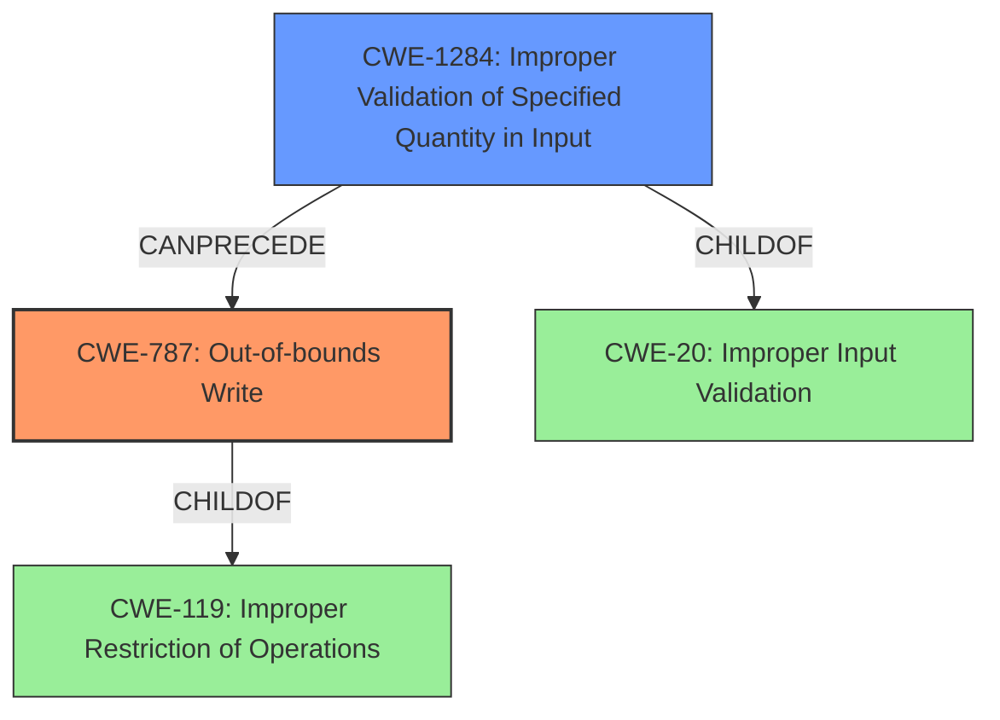

# Raw Analyzer Response for CVE-2021-44044

# Summary
| CWE ID  | CWE Name                                                    | Confidence | CWE Abstraction Level | CWE Vulnerability Mapping Label | CWE-Vulnerability Mapping Notes |
| :-------- | :---------------------------------------------------------- | :--------- | :---------------------- | :------------------------------ | :------------------------------ |
| CWE-787   | Out-of-bounds Write                                         | 1          | Base                    | Primary                         | Allowed                       |
| CWE-1284  | Improper Validation of Specified Quantity in Input        | 0.7        | Base                    | Secondary                       | Allowed                       |

## Evidence and Confidence

*   **Confidence Score:** 0.85
*   **Evidence Strength:** HIGH

## Relationship Analysis
The primary CWE selected is CWE-787 (**Out-of-bounds Write**), which is a Base level CWE. It is a child of CWE-119 (**Improper Restriction of Operations within the Bounds of a Memory Buffer**), a Class level CWE. A secondary CWE considered is CWE-1284 (**Improper Validation of Specified Quantity in Input**), which is also a Base level CWE and a child of CWE-20 (**Improper Input Validation**). The relationship analysis indicates that CWE-787 is a more specific representation of the vulnerability than its parent CWE-119. The selection of CWE-787 is based on the explicit mention of "out-of-bounds write" in the vulnerability description, making it the most fitting and specific classification. CWE-1284 is considered because the **crafted data** in the JPG file likely involves an improperly specified quantity that isn't validated, leading to the out-of-bounds write.

## Vulnerability Chain
The vulnerability chain starts with **crafted data** within the JPG file, specifically extraneous bytes before a marker. This **crafted data** leads to **improper validation of specified quantity in input** (CWE-1284). The **improper validation** then results in an **out-of-bounds write** (CWE-787), which allows an attacker to execute code.
- Crafted JPG Data --> **Improper Validation of Specified Quantity in Input** (CWE-1284) --> **Out-of-bounds Write** (CWE-787) --> Code Execution

## Summary of Analysis
The initial analysis, supported by vulnerability description key phrases, CVE reference links, and retriever results, strongly points to CWE-787 (**Out-of-bounds Write**) as the primary weakness. The vulnerability description explicitly mentions "out-of-bounds write vulnerability," which is a direct match for CWE-787. The CVE Reference Links Content Summary also highlights "Out-of-bounds Write" as a weakness.

The retriever results also list CWE-787 as the top candidate.

The supporting evidence is clear from the Vulnerability Description: "An **out-of-bounds write** vulnerability exists when reading a JPG file...Crafted data...can trigger a write operation past the end of an allocated buffer." The root cause is the **crafted data** leading to the **out-of-bounds write**, making CWE-787 the most accurate and specific classification.

The other CWEs considered, such as CWE-122 (**Heap-based Buffer Overflow**), CWE-125 (**Out-of-bounds Read**), and CWE-190 (**Integer Overflow or Wraparound**), are less directly supported by the provided evidence. While a buffer overflow might be related, the description explicitly mentions an "out-of-bounds write," making CWE-787 a more precise fit.

CWE-1284 (**Improper Validation of Specified Quantity in Input**) is considered a secondary weakness because the crafted data likely involves an improperly specified quantity (e.g., size or length) within the JPG file format that is not correctly validated, leading to the out-of-bounds write.

The final selection is based on the principle of choosing the most specific CWE that accurately represents the vulnerability, supported by direct evidence from the vulnerability description and related information.

Relevant CWE Information:
* CWE-787 (**Out-of-bounds Write**): The product writes data past the end, or before the beginning, of the intended buffer.
* CWE-1284 (**Improper Validation of Specified Quantity in Input**): The product receives input that is expected to specify a quantity (such as size or length), but it does not validate or incorrectly validates that the quantity has the required properties.