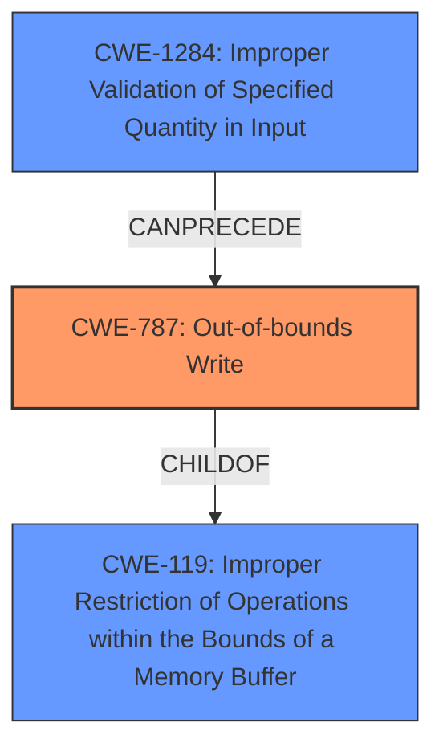

# Analysis Report for CVE-2021-44045

# Vulnerability Analysis Report: CVE-2021-44045

## Description


## Analysis (with Relationship Data)

# Summary
| CWE ID  | CWE Name                                                     | Confidence | CWE Abstraction Level | CWE Vulnerability Mapping Label | CWE-Vulnerability Mapping Notes |
| :-------- | :----------------------------------------------------------- | :--------- | :---------------------- | :------------------------------ | :------------------------------ |
| CWE-787 | Out-of-bounds Write                                          | 1          | Base                    | Primary CWE                     | Allowed                       |
| CWE-1284 | Improper Validation of Specified Quantity in Input         | 0.8        | Base                    | Secondary Candidate             | Allowed                       |
| CWE-119 | Improper Restriction of Operations within the Bounds of a Memory Buffer | 0.5        | Class                   | Secondary Candidate             | Discouraged                    |

## Evidence and Confidence

*   **Confidence Score:** 0.9
*   **Evidence Strength:** HIGH

## Relationship Analysis
The primary weakness is CWE-787 **Out-of-bounds Write**, which is a child of CWE-119 **Improper Restriction of Operations within the Bounds of a Memory Buffer**. The root cause is the **lack of proper validation**, which leads to CWE-1284 **Improper Validation of Specified Quantity in Input**. The vulnerability chain shows that improper input validation can lead to an out-of-bounds write. Selecting CWE-787 provides a more specific classification than its parent, CWE-119, due to the availability of detailed information about the **out-of-bounds write**.



## Vulnerability Chain
The vulnerability chain is as follows:
1.  **Root Cause:** **Lack of proper validation for the XFAT sectors count** (CWE-1284).
2.  **Weakness:** **Out-of-bounds Write** due to crafted data in a DGN file (CWE-787).
3.  **Impact:** An attacker can execute code in the context of the current process.

## Summary of Analysis
The initial assessment focused on identifying the root cause and the resulting weakness. The vulnerability description clearly states an **out-of-bounds write** due to the **lack of proper validation**. The retriever results and similar CVE descriptions highlighted CWE-787 and CWE-125 as potential matches. However, given the evidence of a write operation past the end of an allocated buffer, CWE-787 is a more appropriate fit. The relationship analysis also supports the choice of CWE-787 as a child of CWE-119, offering greater specificity. The inclusion of CWE-1284 highlights the root cause related to input validation.

The assessment is primarily based on the vulnerability description and CVE Reference Links Content Summary.

> Crafted data in a DGN file and **lack of proper validation for the XFAT sectors count** can trigger a write operation past the end of an allocated buffer.

This statement provides direct evidence for both the **out-of-bounds write** and the **lack of proper validation**.

The graph relationships influenced the selection by emphasizing the importance of choosing a specific CWE (CWE-787) over a more general one (CWE-119). The selected CWEs are at the optimal level of specificity, with CWE-787 accurately representing the **out-of-bounds write** and CWE-1284 identifying the root cause.

Relevant CWE Information:

# Enhanced Context (25 CWEs)

## CWE-787: Out-of-bounds Write
**Technical Explanation:** The vulnerability description explicitly mentions an **out-of-bounds write**. This occurs when the software writes data past the end of an allocated buffer due to crafted data and the **lack of proper validation**.
**Security Implications:** This can lead to memory corruption and potentially arbitrary code execution.
**Relationship:** CWE-787 is a child of CWE-119, indicating a more specific type of memory buffer issue.
**Mapping Guidance:** The MITRE mapping guidance allows the use of CWE-787 as it is at the Base level of abstraction.
**Confidence:** 1

## CWE-1284: Improper Validation of Specified Quantity in Input
**Technical Explanation:** The root cause of the vulnerability is the **lack of proper validation for the XFAT sectors count**. This falls under the category of improper validation of a specified quantity in input.
**Security Implications:** This allows an attacker to control the size or length of a buffer, leading to vulnerabilities like **out-of-bounds writes**.
**Relationship:** CWE-1284 can precede CWE-787, as improper validation can lead to an **out-of-bounds write**.
**Mapping Guidance:** The MITRE mapping guidance allows the use of CWE-1284 as it is at the Base level of abstraction.
**Confidence:** 0.8

## CWE-119: Improper Restriction of Operations within the Bounds of a Memory Buffer
**Technical Explanation:** While CWE-119 generally applies to operations outside the bounds of a memory buffer, it is less specific than CWE-787, which directly addresses the **out-of-bounds write**.
**Security Implications:** Memory corruption and potential code execution.
**Relationship:** CWE-119 is a parent of CWE-787.
**Mapping Guidance:** The MITRE mapping guidance discourages the use of CWE-119 when more specific CWEs are available.
**Confidence:** 0.5

**CWEs Considered But Not Used:**
*   CWE-125: **Out-of-bounds Read** was considered but not used because the vulnerability description explicitly mentions a *write* operation, not a read.
*   CWE-20: Improper Input Validation was considered, but CWE-1284 provides a more specific description of the input validation issue related to specified quantities.
*   CWE-190: Integer Overflow or Wraparound was considered but there was no evidence to suggest an integer overflow condition.
*   CWE-416: Use After Free was considered, but there was no evidence of memory being freed and then reused.
*   CWE-122: Heap-based Buffer Overflow and CWE-121: Stack-based Buffer Overflow were considered, but the description does not specify whether the buffer is heap-based or stack-based; therefore, a more general CWE is more appropriate.


## CWE Relationship Analysis

Current CWEs represent these abstraction levels: .


### Vulnerability Chain Analysis

**Chain starting from CWE-787:**
- 787 (Out-of-bounds Write) - ROOT


**Chain starting from CWE-121:**
- 121 (Stack-based Buffer Overflow) - ROOT


### CWE Relationship Diagram

```mermaid
graph TD
    classDef primary fill:#f96,stroke:#333,stroke-width:2px
    classDef secondary fill:#69f,stroke:#333
    classDef tertiary fill:#9e9,stroke:#333
```


*Report generated on 2025-04-02 11:56:28*
