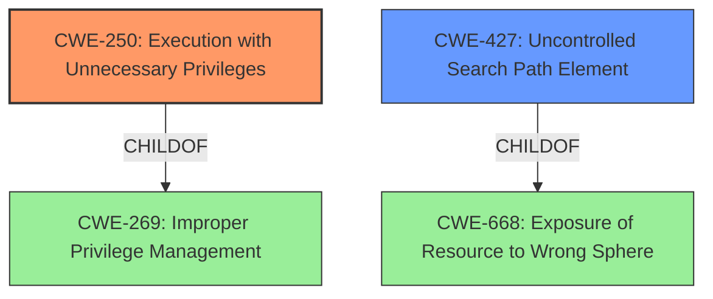

# Enhanced Analysis for CVE-2021-44049

# Summary
| CWE ID    | CWE Name                                                                           | Confidence | CWE Abstraction Level | CWE Vulnerability Mapping Label | CWE-Vulnerability Mapping Notes |
| :-------- | :--------------------------------------------------------------------------------- | :--------- | :---------------------- | :------------------------------ | :------------------------------ |
| CWE-250   | Execution with Unnecessary Privileges                                              | 0.9        | Base                    | Primary                         | Allowed                         |
| CWE-427   | Uncontrolled Search Path Element                                                   | 0.8        | Base                    | Secondary                       | Allowed                         |

## Evidence and Confidence

*   **Confidence Score:** 0.85
*   **Evidence Strength:** HIGH

## Relationship Analysis
The primary relationship impacting the decision is the parent-child relationship. CWE-250 is a child of CWE-269 (Improper Privilege Management), but CWE-250 is more specific to the vulnerability. CWE-427 is related to CWE-668 (Exposure of Resource to Wrong Sphere), indicating a broader context of resource control issues. The choice of CWE-250 and CWE-427 reflects the specific weaknesses exploited in this vulnerability.



## Vulnerability Chain
The chain of events is as follows:
1.  A user-writable temporary directory contains `Procmon64.exe`.
2.  `Procmon64.exe` is executed with elevated privileges (**CWE-250**).
3.  The system searches for `Procmon64.exe` in the user's temp directory, which is an **Uncontrolled Search Path Element (CWE-427)**, because the user can place a Trojan horse there.
4.  The malicious `Procmon64.exe` executes with elevated privileges, leading to a local privilege escalation.

## Summary of Analysis
Initially, multiple CWEs were considered based on the "Retriever Results." However, after a thorough analysis of the vulnerability description and the "CVE Reference Links Content Summary", CWE-250 and CWE-427 were chosen as the most appropriate.

The key evidence supporting CWE-250 is: "The EPM agent launches the 'Procmon' tool (Process Monitor) to monitor running processes...`Procmon64.exe` launches `Procmon64.exe` with elevated privileges from the user's temp directory". This clearly indicates that the process is running with elevated privileges that are not necessary.

The evidence for CWE-427 is: "The Procmon tool (specifically `Procmon64.exe`) is launched from the user's temporary directory, a location that is user-writable." This shows that the application uses a search path that includes a directory controlled by the user, making it an **Uncontrolled Search Path Element**.

CWE-732 was considered because it involves incorrect permission assignments. However, the vulnerability is not directly related to incorrect permission assignments on a resource, but rather to the execution of a program with unnecessary privileges and from an untrusted location. Therefore, CWE-732 was deemed less relevant.

CWE-250 and CWE-427 are at the optimal level of specificity because they directly address the **root causes** of the vulnerability. CWE-250 identifies the **unnecessary elevated privileges** granted to the process, while CWE-427 highlights the **insecure execution path** from the user's temp directory.

Relevant CWE Information:

# Enhanced Context (25 CWEs)
The following CWEs were identified as potentially relevant to this vulnerability:

## CWE-59: Improper Link Resolution Before File Access ('Link Following')
**Abstraction Level**: Base
**Similarity Score**: 0.78
**Source**: dense

**Description**:
The product attempts to access a file based on the filename, but it does not properly prevent that filename from identifying a link or shortcut that resolves to an unintended resource.

**Mapping Guidance**:
- Usage: Allowed
- Rationale: This CWE entry is at the Base level of abstraction, which is a preferred level of abstraction for mapping to the root causes of vulnerabilities.

**Analysis:** This is not the primary weakness, as the vulnerability doesn't explicitly involve symbolic links or shortcuts. However, the uncontrolled execution path does increase the risk of link-following attacks. Not selected as primary, but relevant in the broader context.

## CWE-668: Exposure of Resource to Wrong Sphere
**Abstraction Level**: Class
**Similarity Score**: 0.77
**Source**: dense

**Description**:
The product exposes a resource to the wrong control sphere, providing unintended actors with inappropriate access to the resource.

**Mapping Guidance**:
- Usage: Discouraged
- Rationale: CWE-668 is high-level and is often misused as a catch-all when lower-level CWE IDs might be applicable. It is sometimes used for low-information vulnerability reports [REF-1287]. It is a level-1 Class (i.e., a child of a Pillar). It is not useful for trend analysis.

**Analysis:** While applicable at a high level, CWE-668 is too general. CWE-427 provides a more specific description of the weakness, making it a better fit.

## CWE-274: Improper Handling of Insufficient Privileges
**Abstraction Level**: Base
**Similarity Score**: 0.77
**Source**: dense

**Description**:
The product does not handle or incorrectly handles when it has insufficient privileges to perform an operation, leading to resultant weaknesses.

**Mapping Guidance**:
- Usage: Discouraged
- Rationale: This CWE entry could be deprecated in a future version of CWE.

**Analysis:** This is not applicable, as the vulnerability involves excessive privileges, not insufficient ones.

## CWE-41: Improper Resolution of Path Equivalence
**Abstraction Level**: Base
**Similarity Score**: 0.76
**Source**: dense

**Description**:
The product is vulnerable to file system contents disclosure through path equivalence. Path equivalence involves the use of special characters in file and directory names. The associated manipulations are intended to generate multiple names for the same object.

**Mapping Guidance**:
- Usage: Allowed
- Rationale: This CWE entry is at the Base level of abstraction, which is a preferred level of abstraction for mapping to the root causes of vulnerabilities.

**Analysis:** This is not directly related to the vulnerability. The issue is not about manipulating path equivalences but about executing code from an untrusted path with elevated privileges.

## CWE-73: External Control of File Name or Path
**Abstraction Level**: Base
**Similarity Score**: 0.76
**Source**: dense

**Description**:
The product allows user input to control or influence paths or file names that are used in filesystem operations.

**Mapping Guidance**:
- Usage: Allowed
- Rationale: This CWE entry is at the Base level of abstraction, which is a preferred level of abstraction for mapping to the root causes of vulnerabilities.

**Analysis:** This is related to CWE-427. CWE-427 is more specific because it focuses on the search path aspect, whereas CWE-73 is broader.

## CWE-266: Incorrect Privilege Assignment
**Abstraction Level**: Base
**Similarity Score**: 0.76
**Source**: dense

**Description**:
A product incorrectly assigns a privilege to a particular actor, creating an unintended sphere of control for that actor.

**Mapping Guidance**:
- Usage: Allowed
- Rationale: This CWE entry is at the Base level of abstraction, which is a preferred level of abstraction for mapping to the root causes of vulnerabilities.

**Analysis:** CWE-250 is more specific. While there is an incorrect privilege assignment, the root cause is that the process is running with *unnecessary* privileges.

## CWE-267: Privilege Defined With Unsafe Actions
**Abstraction Level**: Base
**Similarity Score**: 0.76
**Source**: dense

**Description**:
A particular privilege, role, capability, or right can be used to perform unsafe actions that were not intended, even when it is assigned to the correct entity.

**Mapping Guidance**:
- Usage: Allowed
- Rationale: This CWE entry is at the Base level of abstraction, which is a preferred level of abstraction for mapping to the root causes of vulnerabilities.

**Analysis:** This is not the primary issue. The main problem is that the process is running with unnecessary elevated privileges and from a user-controlled location.

## CWE-639: Authorization Bypass Through User-


## CWE Relationship Analysis

Current CWEs represent these abstraction levels: .


### Vulnerability Chain Analysis

**Chain starting from CWE-732:**
- 732 (Incorrect Permission Assignment for Critical Resource) - ROOT


**Chain starting from CWE-41:**
- 41 (Improper Resolution of Path Equivalence) - ROOT


### CWE Relationship Diagram

```mermaid
graph TD
    classDef primary fill:#f96,stroke:#333,stroke-width:2px
    classDef secondary fill:#69f,stroke:#333
    classDef tertiary fill:#9e9,stroke:#333
```