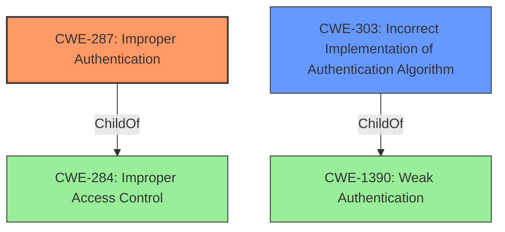

# Analysis for CVE-2021-44056

# Summary
| CWE ID | CWE Name | Confidence | CWE Abstraction Level | CWE Vulnerability Mapping Label | CWE-Vulnerability Mapping Notes |
|---|---|---|---|---|---|
| CWE-287 | Improper Authentication | 1.0 | Class | Primary | Allowed |
| CWE-303 | Incorrect Implementation of Authentication Algorithm | 0.75 | Base | Secondary | Allowed |

## Evidence and Confidence

*   **Confidence Score:** 0.88
*   **Evidence Strength:** HIGH

## Relationship Analysis
The primary CWE is CWE-287, a Class-level CWE, which is child of CWE-284. The secondary CWE is CWE-303, which is a Base-level CWE, and a child of CWE-1390. The relationship indicates that while the primary weakness is improper authentication, the underlying cause could be due to an incorrect implementation of a specific authentication algorithm.

## Vulnerability Chain
The chain of weaknesses starts with **improper authentication** (CWE-287), which may be caused by an **incorrect implementation of an authentication algorithm** (CWE-303), leading to attackers being able to compromise the security of the system.

## Summary of Analysis
The initial assessment identified **improper authentication** as the root cause. The retriever results suggested CWE-287 as a potential candidate. The vulnerability description key phrases also highlight **improper authentication**. The CVE Reference Links Content Summary confirms the **weakness** is related to the QNAP Video Station and that remote attackers can perform unauthorized actions that compromise the security of the system. The description specifically mentions an **improper authentication** vulnerability affecting QNAP devices running Video Station. This directly aligns with CWE-287: Improper Authentication.

CWE-287 is a Class-level CWE, and the mapping guidance discourages its use when lower-level CWE entries are likely to be applicable. The guidance suggests considering children or descendants, such as CWE-1390: Weak Authentication or CWE-306: Missing Authentication for Critical Function.

CWE-303: Incorrect Implementation of Authentication Algorithm is considered a secondary weakness because it can be a root cause of the authentication issues. This vulnerability could lead to unauthorized access and compromise the system's security.

The choice of CWE-287 and CWE-303 is based on the available evidence and the relationships between the CWEs. CWE-287 is at a higher level, representing the general authentication failure, while CWE-303 provides a more specific reason for the failure (incorrect algorithm implementation).

Relevant CWE Information:
# Enhanced Context (25 CWEs)
The following CWEs were identified as potentially relevant to this vulnerability:

## CWE-274: Improper Handling of Insufficient Privileges
**Abstraction Level**: Base
**Similarity Score**: 0.78
**Source**: dense

**Description**:
The product does not handle or incorrectly handles when it has insufficient privileges to perform an operation, leading to resultant weaknesses.

**Mapping Guidance**:
- Usage: Discouraged
- Rationale: This CWE entry could be deprecated in a future version of CWE.

*   **Why it was not selected:** This CWE focuses on handling insufficient privileges, whereas the vulnerability description focuses on **improper authentication**.

## CWE-653: Improper Isolation or Compartmentalization
**Abstraction Level**: Class
**Similarity Score**: 0.77
**Source**: dense

**Description**:
The product does not properly compartmentalize or isolate functionality, processes, or resources that require different privilege levels, rights, or permissions.

**Mapping Guidance**:
- Usage: Allowed
- Rationale: This CWE entry is at the Base level of abstraction, which is a preferred level of abstraction for mapping to the root causes of vulnerabilities.

*   **Why it was not selected:** This CWE focuses on isolation issues, while the vulnerability is specifically about authentication.

## CWE-266: Incorrect Privilege Assignment
**Abstraction Level**: Base
**Similarity Score**: 0.77
**Source**: dense

**Description**:
A product incorrectly assigns a privilege to a particular actor, creating an unintended sphere of control for that actor.

**Mapping Guidance**:
- Usage: Allowed
- Rationale: This CWE entry is at the Base level of abstraction, which is a preferred level of abstraction for mapping to the root causes of vulnerabilities.

*   **Why it was not selected:** The vulnerability description doesn't describe privilege assignment, but rather **improper authentication**.

## CWE-280: Improper Handling of Insufficient Permissions or Privileges
**Abstraction Level**: Base
**Similarity Score**: 0.76
**Source**: dense

**Description**:
The product does not handle or incorrectly handles when it has insufficient privileges to access resources or functionality as specified by their permissions. This may cause it to follow unexpected code paths that may leave the product in an invalid state.

**Mapping Guidance**:
- Usage: Allowed
- Rationale: This CWE entry is at the Base level of abstraction, which is a preferred level of abstraction for mapping to the root causes of vulnerabilities.

*   **Why it was not selected:** This CWE focuses on handling insufficient permissions or privileges, but the core issue is **improper authentication**.

## CWE-267: Privilege Defined With Unsafe Actions
**Abstraction Level**: Base
**Similarity Score**: 0.76
**Source**: dense

**Description**:
A particular privilege, role, capability, or right can be used to perform unsafe actions that were not intended, even when it is assigned to the correct entity.

**Mapping Guidance**:
- Usage: Allowed
- Rationale: This CWE entry is at the Base level of abstraction, which is a preferred level of abstraction for mapping to the root causes of vulnerabilities.

*   **Why it was not selected:** This CWE is about unsafe actions associated with privileges, which is not described in the vulnerability.

## CWE-668: Exposure of Resource to Wrong Sphere
**Abstraction Level**: Class
**Similarity Score**: 0.75
**Source**: dense

**Description**:
The product exposes a resource to the wrong control sphere, providing unintended actors with inappropriate access to the resource.

**Mapping Guidance**:
- Usage: Discouraged
- Rationale: CWE-668 is high-level and is often misused as a catch-all when lower-level CWE IDs might be applicable. It is sometimes used for low-information vulnerability reports [REF-1287]. It is a level-1 Class (i.e., a child of a Pillar). It is not useful for trend analysis.

*   **Why it was not selected:** This CWE is too general, and a more specific CWE related to authentication is more appropriate.

## CWE-41: Improper Resolution of Path Equivalence
**Abstraction Level**: Base
**Similarity Score**: 0.75
**Source**: dense

**Description**:
The product is vulnerable to file system contents disclosure through path equivalence. Path equivalence involves the use of special characters in file and directory names. The associated manipulations are intended to generate multiple names for the same object.

**Mapping Guidance**:
- Usage: Allowed
- Rationale: This CWE entry is at the Base level of abstraction, which is a preferred level of abstraction for mapping to the root causes of vulnerabilities.

*   **Why it was not selected:** This CWE is not related to **improper authentication**.

## CWE-667: Improper Locking
**Abstraction Level**: Class
**Similarity Score**: 0.75
**Source**: dense

**Description**:
The product does not properly acquire or release a lock on a resource, leading to unexpected resource state changes and behaviors.

**Mapping Guidance**:
- Usage: Allowed-with-Review
- Rationale: This CWE entry is a Class and might have Base-level children that would be more appropriate

*   **Why it was not selected:** This CWE is about locking issues and not related to authentication.

## CWE-23: Relative Path Traversal
**Abstraction Level**: Base
**Similarity Score**: 0.75
**Source**: dense

**Description**:
The product uses external input to construct a pathname that should be within a restricted directory, but it does not properly neutralize sequences such as ".." that can resolve to a location that is outside of that directory.

**Mapping Guidance**:
- Usage: Allowed
- Rationale: This CWE entry is at the Base level of abstraction, which is a preferred level of abstraction for mapping to the root causes of vulnerabilities.

*   **Why it was not selected:** This CWE is about