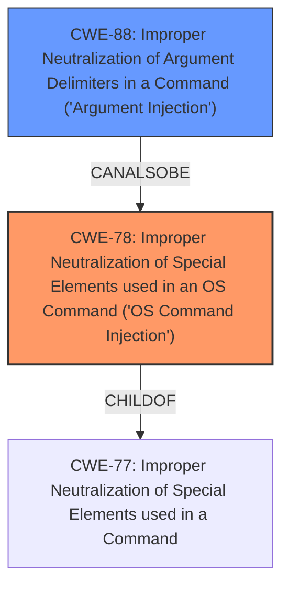

# Analysis for CVE-2021-44079

# Summary
| CWE ID | CWE Name | Confidence | CWE Abstraction Level | CWE Vulnerability Mapping Label | CWE-Vulnerability Mapping Notes |
|---|---|---|---|---|---|
| CWE-78 | Improper Neutralization of Special Elements used in an OS Command ('OS Command Injection') | 1.0 | Base | Allowed | Primary CWE |
| CWE-88 | Improper Neutralization of Argument Delimiters in a Command ('Argument Injection') | 0.7 | Base | Allowed | Secondary Candidate |

## Evidence and Confidence

*   **Confidence Score:** 0.9
*   **Evidence Strength:** HIGH

## Relationship Analysis
The primary relationship that influenced the CWE selection is the ChildOf relationship between CWE-78 and CWE-77. CWE-78 is a base level CWE that describes OS Command Injection. CWE-88 is a peer of CWE-78 that describes argument injection. The key factor in selecting CWE-78 as primary is the root cause of the vulnerability: the lack of proper neutralization of special elements in the log data directly leads to the ability to inject arbitrary OS commands. CWE-88 could be a secondary factor, but the primary issue is the command injection, not just argument manipulation.

## Vulnerability Chain
The vulnerability chain starts with the **untrusted user agents** in the Wazuh-slack active response script. The lack of proper escaping of single quotes within the JSON data allows an attacker to truncate the command and inject arbitrary shell code. This leads to **remote code execution**.

## Summary of Analysis
The initial analysis focused on the **command injection** flaw. The key evidence is from the "CVE Reference Links Content Summary" which states: "The vulnerability stems from a command injection flaw in the Wazuh active response script `wazuh-slack`. The script constructs a `curl` command by embedding alert JSON data, which includes raw log lines, into the shell command line as the POST body. The issue is that single quotes within the JSON data are not escaped, allowing an attacker to truncate the command and inject arbitrary shell code."

This evidence directly supports the selection of CWE-78, "Improper Neutralization of Special Elements used in an OS Command ('OS Command Injection')". The **lack of proper neutralization** (escaping single quotes) is the root cause, allowing **arbitrary shell code injection**, resulting in **remote code execution**.

The choice of CWE-78 is further supported by the Retriever Results, where it is ranked as the top CWE. It is a Base level CWE, which is the preferred level of abstraction.

CWE-88 "Improper Neutralization of Argument Delimiters in a Command ('Argument Injection')" was considered as a secondary CWE. While the single quote issue can be seen as manipulating arguments, the primary issue is the ability to inject a full OS command, making CWE-78 the more appropriate primary classification.

The final decision is based on the provided evidence and the relationships between the CWEs. CWE-78 is the most specific and accurate representation of the vulnerability's root cause.

Relevant CWE Information:

# Enhanced Context (25 CWEs)
The following CWEs were identified as potentially relevant to this vulnerability:

## CWE-74: Improper Neutralization of Special Elements in Output Used by a Downstream Component ('Injection')
**Abstraction Level**: Class
**Similarity Score**: 0.75
**Source**: dense

**Description**:
The product constructs all or part of a command, data structure, or record using externally-influenced input from an upstream component, but it does not neutralize or incorrectly neutralizes special elements that could modify how it is parsed or interpreted when it is sent to a downstream component.

**Mapping Guidance**:
- Usage: Discouraged
- Rationale: CWE-74 is high-level and often misused when lower-level weaknesses are more appropriate.

## CWE-78: Improper Neutralization of Special Elements used in an OS Command ('OS Command Injection')
**Abstraction Level**: Base
**Similarity Score**: 5.03
**Source**: graph

**Description**:
CWE-78: Improper Neutralization of Special Elements used in an OS Command ('OS Command Injection')

**Mapping Guidance**:
- Usage: Allowed
- Rationale: This CWE entry is at the Base level of abstraction, which is a preferred level of abstraction for mapping to the root causes of vulnerabilities.

**Relationships**:
- CANFOLLOW -> CWE-184
- CANALSOBE -> CWE-88
- CHILDOF -> CWE-77
- CHILDOF -> CWE-77
- CHILDOF -> CWE-74

**Technical Explanation for CWE-78:**

The vulnerability in the Wazuh-slack active response script directly aligns with the characteristics of CWE-78. The script constructs a `curl` command using external input (alert JSON data). The **improper neutralization** of special elements (single quotes) allows an attacker to inject arbitrary OS commands.

The security implication is **remote code execution**, allowing an attacker to gain control of the affected system.

CWE-78 is a base-level CWE, providing a specific description of OS command injection. It's a child of CWE-77 "Improper Neutralization of Special Elements used in a Command".

MITRE mapping guidance allows its usage, as it's a base-level CWE.

## CWE-88: Improper Neutralization of Argument Delimiters in a Command ('Argument Injection')
**Abstraction Level**: Base
**Similarity Score**: 9964.67
**Source**: sparse

**Description**:
The product constructs a string for a command to be executed by a separate component
in another control sphere, but it does not properly delimit the
intended arguments, options, or switches within that command string.

**Technical Explanation for CWE-88:**

CWE-88 is also relevant because the injection occurs within the arguments passed to the `curl` command. The **improper handling of single quotes**, which serve as argument delimiters, allows the attacker to inject additional arguments and commands.

The security implication is that the attacker can **modify the behavior of the `curl` command** or execute entirely new commands.

CWE-88 is a base-level CWE, providing a specific description of argument injection. It is a child of CWE-77.

MITRE mapping guidance allows its usage, as it's a base-level CWE. While relevant, it is not the primary weakness, as the goal is to inject arbitrary commands, not just modify arguments.

**CWEs Considered but Not Used:**

*   CWE-74: This is a class-level CWE and too general. CWE-78 is a more specific base-level CWE.
*   CWE-79: This is for Cross-Site Scripting, which is not applicable in this scenario.
*   CWE-22: This is for Path Traversal, which is not the vulnerability.
*   CWE-116: This is about Improper Encoding or Escaping of Output. While related to the escaping issue, CWE-78 more directly addresses the command injection.
*   CWE-1333: This is about Inefficient Regular Expression Complexity, which is not relevant.
*   CWE-644: This is about Improper Neutralization of HTTP Headers for Scripting Syntax, which is not applicable.
*   CWE-94: This is about Improper Control of Generation of Code ('Code Injection'). This is more general and less precise than CWE-78. The active response script *is* generating code, but the more direct issue is the OS Command Injection.