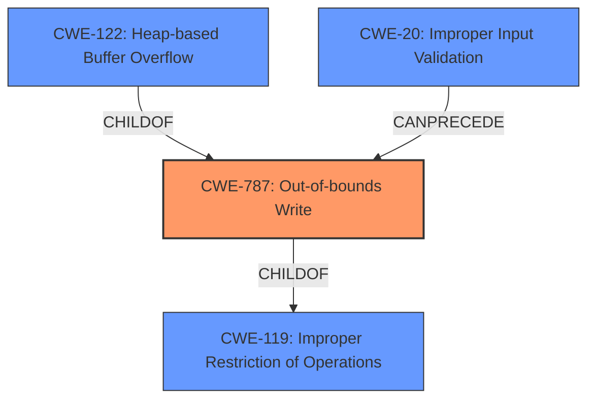

# Analysis Report for CVE-2021-44143

# Vulnerability Analysis Report: CVE-2021-44143

## Description


## Analysis (with Relationship Data)

# Summary
| CWE ID  | CWE Name                                                                                   | Confidence | CWE Abstraction Level | CWE Vulnerability Mapping Label | CWE-Vulnerability Mapping Notes |
| :-------- | :----------------------------------------------------------------------------------------- | :---------- | :---------------------- | :------------------------------ | :------------------------------ |
| CWE-787   | Out-of-bounds Write                                                                          | 0.9         | Base                    | Primary                         | Allowed                         |
| CWE-122   | Heap-based Buffer Overflow                                                                 | 0.7         | Variant                 | Secondary                       | Allowed                         |
| CWE-119   | Improper Restriction of Operations within the Bounds of a Memory Buffer                    | 0.5         | Class                   | Secondary                       | Discouraged                     |
| CWE-20    | Improper Input Validation                                                                    | 0.4         | Class                   | Secondary                       | Allowed-with-Review                     |

## Evidence and Confidence

*   **Confidence Score:** 0.8
*   **Evidence Strength:** HIGH

## Relationship Analysis
The primary relationship is that CWE-787 (Out-of-bounds Write) is a child of CWE-119 (Improper Restriction of Operations within the Bounds of a Memory Buffer). CWE-122 (Heap-based Buffer Overflow) is a variant of CWE-787 (Out-of-bounds Write) and also child of CWE-788. The vulnerability results from an **unchecked condition** leading to a **heap overflow**, which is a type of out-of-bounds write. While CWE-119 is a parent, it is too general, and the more specific CWE-787 is more appropriate.



## Vulnerability Chain
The vulnerability chain starts with an **unchecked condition** when processing a crafted mail message lacking headers. This leads to a **heap overflow**, resulting in an out-of-bounds write, which can then potentially lead to remote code execution.

## Summary of Analysis
The initial analysis focused on the **heap overflow** mentioned in the vulnerability description. The key phrases from the description "unchecked condition" and "heap overflow", combined with the CVE Reference Links Content Summary, pointed towards a memory corruption issue.

The vulnerability description states: "Due to an **unchecked condition**, a malicious or compromised IMAP server could use a crafted mail message that lacks headers (i.e., one that starts with an empty line) to provoke a **heap overflow**, which could conceivably be exploited for remote code execution."

The CVE Reference Links Content Summary states that the vulnerability stems from an **unchecked condition** and inadequate handling of IMAP literals leading to **heap overflows**.

The Retriever Results also showed CWE-122 (Heap-based Buffer Overflow) and CWE-787 (Out-of-bounds Write) as potential candidates.

While CWE-122 is a valid candidate, CWE-787 is more precise. Since the root cause involves writing data outside the intended buffer boundary, CWE-787 is selected as the primary CWE.

CWE-119 is a more general class of weakness. While the vulnerability does involve improper restriction of operations within memory bounds, the more specific CWE-787 captures the nature of the flaw more accurately. Therefore, CWE-119 is considered a secondary CWE.

CWE-20 is added as a secondary weakness because the **unchecked condition** implies a lack of proper input validation on the crafted mail message.

The selected CWEs are at the optimal level of specificity, with CWE-787 being a Base level CWE that precisely describes the vulnerability, and CWE-122 providing additional context as a Variant.

Relevant CWE Information:

# Enhanced Context (25 CWEs)

## CWE-787: Out-of-bounds Write
**CWE-787 (Out-of-bounds Write)**: This CWE is the primary classification because the vulnerability involves writing data past the end of the intended buffer due to an **unchecked condition** when processing crafted email messages. The vulnerability description explicitly mentions a **heap overflow**, which is a type of out-of-bounds write.
   - **How the vulnerability's details match the CWE's characteristics:** The crafted email message lacking headers triggers a **heap overflow**, meaning data is written beyond the allocated memory region.
   - **The security implications and potential impact:** This can lead to memory corruption and potentially remote code execution.
   - **Any parent-child relationships or chain patterns that influenced your mapping:** CWE-787 is a child of CWE-119, but is more specific.
   - **Whether the weakness is primary or secondary in the vulnerability:** Primary.
   - **How the official MITRE mapping guidance influenced your decision:** The mapping guidance allows the use of CWE-787 at the Base level of abstraction.

## CWE-122: Heap-based Buffer Overflow
**CWE-122 (Heap-based Buffer Overflow)**: This CWE is a secondary classification because the specific type of buffer overflow is on the heap. The vulnerability description mentions that the **heap overflow** is triggered by crafted messages.
   - **How the vulnerability's details match the CWE's characteristics:** The buffer that is overflowed resides in the heap.
   - **The security implications and potential impact:** Memory corruption, potentially leading to remote code execution.
   - **Any parent-child relationships or chain patterns that influenced your mapping:** CWE-122 is a variant of CWE-787
   - **Whether the weakness is primary or secondary in the vulnerability:** Secondary.
   - **How the official MITRE mapping guidance influenced your decision:** The mapping guidance allows the use of CWE-122 at the Variant level of abstraction.

## CWE-119: Improper Restriction of Operations within the Bounds of a Memory Buffer
**CWE-119 (Improper Restriction of Operations within the Bounds of a Memory Buffer)**: This CWE is a secondary classification because it represents a more general case of writing outside the intended buffer.
   - **How the vulnerability's details match the CWE's characteristics:** The vulnerability involves operations outside the intended boundary.
   - **The security implications and potential impact:** Memory corruption.
   - **Any parent-child relationships or chain patterns that influenced your mapping:** CWE-119 is the parent of CWE-787, but less specific.
   - **Whether the weakness is primary or secondary in the vulnerability:** Secondary.
    - **How the official MITRE mapping guidance influenced your decision:** The mapping guidance discourages the use of CWE-119 when lower-level CWEs can be used.

## CWE-20: Improper Input Validation
**CWE-20 (Improper Input Validation)**: This CWE is a secondary classification because the **unchecked condition** implies a lack of proper input validation.
   - **How the vulnerability's details match the CWE's characteristics:** The lack of checking on the crafted mail message lacking headers.
   - **The security implications and potential impact:** Allows malicious messages to trigger the heap overflow.
   - **Any parent-child relationships or chain patterns that influenced your mapping:** Input validation often precedes memory corruption issues.
   - **Whether the weakness is primary or secondary in the vulnerability:** Secondary.
    - **How the official MITRE mapping guidance influenced your decision:** The mapping guidance allows the use of CWE-20.

**CWEs Considered but Not Used:**

*   **CWE-190, CWE-191, CWE-193, CWE-1284, CWE-1339, CWE-93, CWE-125:** While these CWEs were suggested by the retriever or present in the enhanced context, they do not accurately describe the core weakness of the vulnerability, which is an out-of-bounds write due to a heap overflow. There's no evidence of integer overflow, underflow or CRLF injection.


## CWE Relationship Analysis

Current CWEs represent these abstraction levels: .


### Vulnerability Chain Analysis

**Chain starting from CWE-787:**
- 787 (Out-of-bounds Write) - ROOT


**Chain starting from CWE-193:**
- 193 (Off-by-one Error) - ROOT


### CWE Relationship Diagram

```mermaid
graph TD
    classDef primary fill:#f96,stroke:#333,stroke-width:2px
    classDef secondary fill:#69f,stroke:#333
    classDef tertiary fill:#9e9,stroke:#333
```


*Report generated on 2025-04-01 19:23:49*
