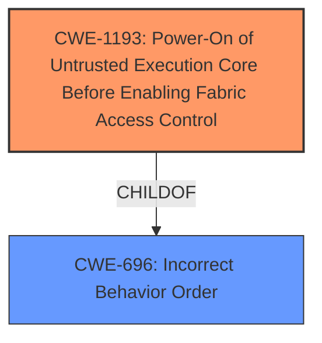

# Analysis for CVE-2021-44149

# Summary
| CWE ID | CWE Name | Confidence | CWE Abstraction Level | CWE Vulnerability Mapping Label | CWE-Vulnerability Mapping Notes |
|---|---|---|---|---|---|
| CWE-1193 | Power-On of Untrusted Execution Core Before Enabling Fabric Access Control | 0.8 | Base | Allowed | Primary CWE |

## Evidence and Confidence

*   **Confidence Score:** 0.8
*   **Evidence Strength:** HIGH

## Relationship Analysis
The primary CWE, CWE-1193, is a Base level CWE, providing a specific description of the vulnerability. It is a ChildOf CWE-696 (Incorrect Behavior Order). This hierarchical relationship indicates that the vulnerability is a specific instance of a broader class of issues related to the order of operations. There are no chain relationships for this CWE.

## Vulnerability Chain
The chain of events for this vulnerability starts with the **root cause**: the **lacking security access configuration for wakeup-related registers**. This leads to the ability of the NonSecure World to perform arbitrary memory read/write operations on Secure World memory, resulting in a TrustZone bypass. The chain is:

1.  **Improper configuration**: **lacking security access configuration for wakeup-related registers** (CWE-1193)
2.  **Vulnerability**: The NonSecure World can perform arbitrary memory read/write operations on Secure World memory.
3.  **Impact**: TrustZone bypass

## Summary of Analysis
The initial analysis focused on the **root cause** identified in the vulnerability description: **lacking security access configuration for wakeup-related registers**. The Retriever Results pointed to several potential CWEs, but CWE-1193 stood out as the most relevant due to its specific focus on the power-on sequence of untrusted execution cores before enabling fabric access control.

The evidence from the vulnerability description and CVE Reference Links Content Summary directly supports this mapping. The vulnerability stems from the OP-TEE OS CSU driver incorrectly configuring the Security Access (SA) policy, allowing the Normal World OS to set the System Reset Controller (SRC) wakeup pointers, which causes the system to boot into the Secure World even if the system was in a non-secure context before sleeping. This aligns perfectly with CWE-1193's description of enabling untrusted components before security features are programmed.

The graph relationships reinforce this selection, as CWE-1193 is a specific instance of a broader class of issues related to the order of operations (CWE-696). This level of specificity is crucial for accurately representing the vulnerability.

Therefore, CWE-1193 is the most appropriate CWE because it directly addresses the **root cause** of the vulnerability: the **improper power-on sequence that allows an untrusted execution core to operate before fabric access controls are enabled**. This selection is based on direct evidence from the vulnerability description, supported by the Retriever Results, and reinforced by the graph relationships.

Relevant CWE Information:

# Enhanced Context (25 CWEs)
The following CWEs were identified as potentially relevant to this vulnerability:

## CWE-367: Time-of-check Time-of-use (TOCTOU) Race Condition
CWE-367 was considered, but it is not applicable because the vulnerability does not involve a race condition where the state of a resource changes between a check and its use.

## CWE-667: Improper Locking
CWE-667 was considered, but it is not applicable because the vulnerability does not involve improper locking of resources.

## CWE-362: Concurrent Execution using Shared Resource with Improper Synchronization ('Race Condition')
CWE-362 was considered, but it is not applicable because the vulnerability does not involve concurrent execution and synchronization issues.

## CWE-404: Improper Resource Shutdown or Release
CWE-404 was considered, but it is not applicable because the vulnerability does not involve improper resource shutdown or release.

## CWE-366: Race Condition within a Thread
CWE-366 was considered, but it is not applicable because the vulnerability does not involve a race condition within a thread.

## CWE-125: Out-of-bounds Read
CWE-125 was considered, but it is not applicable because the vulnerability does not involve out-of-bounds reads.

## CWE-754: Improper Check for Unusual or Exceptional Conditions
CWE-754 was considered, but it is not applicable because the vulnerability does not involve improper checks for unusual or exceptional conditions.

## CWE-131: Incorrect Calculation of Buffer Size
CWE-131 was considered, but it is not applicable because the vulnerability does not involve incorrect calculation of buffer size.

## CWE-703: Improper Check or Handling of Exceptional Conditions
CWE-703 was considered, but it is too high-level and not specific to the vulnerability.

## CWE-755: Improper Handling of Exceptional Conditions
CWE-755 was considered, but it is not applicable because the vulnerability does not involve improper handling of exceptional conditions.

## CWE-367: Time-of-check Time-of-use (TOCTOU) Race Condition
CWE-367 was considered, but it is not applicable because the vulnerability does not involve a race condition where the state of a resource changes between a check and its use.

## CWE-362: Concurrent Execution using Shared Resource with Improper Synchronization ('Race Condition')
CWE-362 was considered, but it is not applicable because the vulnerability does not involve concurrent execution and synchronization issues.

## CWE-119: Improper Restriction of Operations within the Bounds of a Memory Buffer
CWE-119 was considered, but it is too general, and a more specific CWE is available.

## CWE-125: Out-of-bounds Read
CWE-125 was considered, but it is not applicable because the vulnerability does not involve out-of-bounds reads.

## CWE-476: NULL Pointer Dereference
CWE-476 was considered, but it is not applicable because the vulnerability does not involve null pointer dereferences.

## CWE-476: NULL Pointer Dereference
CWE-476 was considered, but it is not applicable because the vulnerability does not involve null pointer dereferences.

## CWE-787: Out-of-bounds Write
CWE-787 was considered, but it is not applicable because the vulnerability does not involve out-of-bounds writes.

## CWE-416: Use After Free
CWE-416 was considered, but it is not applicable because the vulnerability does not involve use-after-free issues.

## CWE-170: Improper Null Termination
CWE-170 was considered, but it is not applicable because the vulnerability does not involve improper null termination.

## CWE-123: Write-what-where Condition
CWE-123 was considered, but it is not applicable because the vulnerability does not involve a write-what-where condition.

## CWE-126: Buffer Over-read
CWE-126 was considered, but it is not applicable because the vulnerability does not involve buffer over-reads.

## CWE-20: Improper Input Validation
CWE-20 was considered, but it is too general, and a more specific CWE is available.

## CWE-822: Untrusted Pointer Dereference
CWE-822 was considered, but it is not applicable because the vulnerability does not involve untrusted pointer dereferences.

## CWE-823: Use of Out-of-range Pointer Offset
CWE-823 was considered, but it is not applicable because the vulnerability does not involve the use of out-of-range pointer offsets.

## CWE-190: Integer Overflow or Wraparound
CWE-190 was considered, but it is not applicable because the vulnerability does not involve integer overflows or wraparounds.