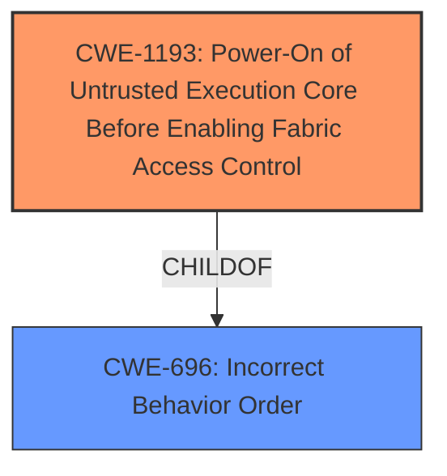

# Analysis for CVE-2021-44149

# Summary
| CWE ID | CWE Name | Confidence | CWE Abstraction Level | CWE Vulnerability Mapping Label | CWE-Vulnerability Mapping Notes |
|---|---|---|---|---|---|
| CWE-1193 | Power-On of Untrusted Execution Core Before Enabling Fabric Access Control | 0.8 | Base | Allowed | Primary CWE |

## Evidence and Confidence

*   **Confidence Score:** 0.8
*   **Evidence Strength:** HIGH

## Relationship Analysis
The primary CWE, CWE-1193, is a Base level CWE, providing a specific description of the vulnerability. It is a ChildOf CWE-696 (Incorrect Behavior Order). This hierarchical relationship indicates that the vulnerability is a specific instance of a broader class of issues related to the order of operations. There are no chain relationships for this CWE.

## Vulnerability Chain
The chain of events for this vulnerability starts with the **root cause**: the **lacking security access configuration for wakeup-related registers**. This leads to the ability of the NonSecure World to perform arbitrary memory read/write operations on Secure World memory, resulting in a TrustZone bypass. The chain is:

1.  **Improper configuration**: **lacking security access configuration for wakeup-related registers** (CWE-1193)
2.  **Vulnerability**: The NonSecure World can perform arbitrary memory read/write operations on Secure World memory.
3.  **Impact**: TrustZone bypass

## Summary of Analysis
The initial analysis focused on the **root cause** identified in the vulnerability description: **lacking security access configuration for wakeup-related registers**. The Retriever Results pointed to several potential CWEs, but CWE-1193 stood out as the most relevant due to its specific focus on the power-on sequence of untrusted execution cores before enabling fabric access control.

The evidence from the vulnerability description and CVE Reference Links Content Summary directly supports this mapping. The vulnerability stems from the OP-TEE OS CSU driver incorrectly configuring the Security Access (SA) policy, allowing the Normal World OS to set the System Reset Controller (SRC) wakeup pointers, which causes the system to boot into the Secure World even if the system was in a non-secure context before sleeping. This aligns perfectly with CWE-1193's description of enabling untrusted components before security features are programmed.

The graph relationships reinforce this selection, as CWE-1193 is a specific instance of a broader class of issues related to the order of operations (CWE-696). This level of specificity is crucial for accurately representing the vulnerability.

Therefore, CWE-1193 is the most appropriate CWE because it directly addresses the **root cause** of the vulnerability: the **improper power-on sequence that allows an untrusted execution core to operate before fabric access controls are enabled**. This selection is based on direct evidence from the vulnerability description, supported by the Retriever Results, and reinforced by the graph relationships.

Relevant CWE Information:

# Enhanced Context (25 CWEs)
The following CWEs were identified as potentially relevant to this vulnerability:

## CWE-367: Time-of-check Time-of-use (TOCTOU) Race Condition
CWE-367 was considered, but it is not applicable because the vulnerability does not involve a race condition where the state of a resource changes between a check and its use.

## CWE-667: Improper Locking
CWE-667 was considered, but it is not applicable because the vulnerability does not involve improper locking of resources.

## CWE-362: Concurrent Execution using Shared Resource with Improper Synchronization ('Race Condition')
CWE-362 was considered, but it is not applicable because the vulnerability does not involve concurrent execution and synchronization issues.

## CWE-404: Improper Resource Shutdown or Release
CWE-404 was considered, but it is not applicable because the vulnerability does not involve improper resource shutdown or release.

## CWE-366: Race Condition within a Thread
CWE-366 was considered, but it is not applicable because the vulnerability does not involve a race condition within a thread.

## CWE-125: Out-of-bounds Read
CWE-125 was considered, but it is not applicable because the vulnerability does not involve out-of-bounds reads.

## CWE-754: Improper Check for Unusual or Exceptional Conditions
CWE-754 was considered, but it is not applicable because the vulnerability does not involve improper checks for unusual or exceptional conditions.

## CWE-131: Incorrect Calculation of Buffer Size
CWE-131 was considered, but it is not applicable because the vulnerability does not involve incorrect calculation of buffer size.

## CWE-703: Improper Check or Handling of Exceptional Conditions
CWE-703 was considered, but it is too high-level and not specific to the vulnerability.

## CWE-755: Improper Handling of Exceptional Conditions
CWE-755 was considered, but it is not applicable because the vulnerability does not involve improper handling of exceptional conditions.

## CWE-367: Time-of-check Time-of-use (TOCTOU) Race Condition
CWE-367 was considered, but it is not applicable because the vulnerability does not involve a race condition where the state of a resource changes between a check and its use.

## CWE-362: Concurrent Execution using Shared Resource with Improper Synchronization ('Race Condition')
CWE-362 was considered, but it is not applicable because the vulnerability does not involve concurrent execution and synchronization issues.

## CWE-119: Improper Restriction of Operations within the Bounds of a Memory Buffer
CWE-119 was considered, but it is too general, and a more specific CWE is available.

## CWE-125: Out-of-bounds Read
CWE-125 was considered, but it is not applicable because the vulnerability does not involve out-of-bounds reads.

## CWE-476: NULL Pointer Dereference
CWE-476 was considered, but it is not applicable because the vulnerability does not involve null pointer dereferences.

## CWE-476: NULL Pointer Dereference
CWE-476 was considered, but it is not applicable because the vulnerability does not involve null pointer dereferences.

## CWE-787: Out-of-bounds Write
CWE-787 was considered, but it is not applicable because the vulnerability does not involve out-of-bounds writes.

## CWE-416: Use After Free
CWE-416 was considered, but it is not applicable because the vulnerability does not involve use-after-free issues.

## CWE-170: Improper Null Termination
CWE-170 was considered, but it is not applicable because the vulnerability does not involve improper null termination.

## CWE-123: Write-what-where Condition
CWE-123 was considered, but it is not applicable because the vulnerability does not involve a write-what-where condition.

## CWE-126: Buffer Over-read
CWE-126 was considered, but it is not applicable because the vulnerability does not involve buffer over-reads.

## CWE-20: Improper Input Validation
CWE-20 was considered, but it is too general, and a more specific CWE is available.

## CWE-822: Untrusted Pointer Dereference
CWE-822 was considered, but it is not applicable because the vulnerability does not involve untrusted pointer dereferences.

## CWE-823: Use of Out-of-range Pointer Offset
CWE-823 was considered, but it is not applicable because the vulnerability does not involve the use of out-of-range pointer offsets.

## CWE-190: Integer Overflow or Wraparound
CWE-190 was considered, but it is not applicable because the vulnerability does not involve integer overflows or wraparounds.

# Enhanced Query for CVE-2021-44149

## Vulnerability Description
An issue was discovered in Trusted Firmware OP-TEE Trusted OS through 3.15.0. The OPTEE-OS CSU driver for NXP i.MX6UL SoC devices lacks security access configuration for wakeup-related registers, resulting in TrustZone bypass because the NonSecure World can perform arbitrary memory read/write operations on Secure World memory. This involves a v cycle.

### Vulnerability Description Key Phrases
- **rootcause:** **lacking security access configuration for wakeup-related registers**
- **impact:** TrustZone bypass
- **product:** Trusted Firmware OP-TEE Trusted OS
- **version:** through 3.15.0
- **component:** OPTEE-OS CSU driver

## CVE Reference Links Content Summary
Based on the provided content, here's an analysis of CVE-2021-44149:

**Root Cause:**
The vulnerability stems from the OP-TEE OS CSU driver incorrectly configuring the Security Access (SA) policy for the ARM Cortex-A7 (CA7) block on NXP i.MX6UL SoCs. Specifically, the CA7 SA is set to "Secure," while the NXP boot ROM unconditionally wakes up in the secure processor state. This allows the Normal World OS to set the System Reset Controller (SRC) wakeup pointers, causing the system to boot into the Secure World even if the system was in a non-secure context before sleeping.

**Weaknesses/Vulnerabilities:**
*   **Insecure Wakeup:** The core issue is that the Normal World OS can control the wakeup pointers in the System Reset Controller (SRC), which are then used by the boot ROM.
*   **Incorrect CSU configuration:** The CSU driver sets the CA7 SA policy to "Secure", which, in combination with the secure world wakeup, allows Normal world code to execute in Secure World after wakeup.
*   **Lack of TrustZone Isolation:** The vulnerability violates the core purpose of TrustZone by allowing code that should execute in the Normal World to execute in Secure World.

**Impact of Exploitation:**
*   **TrustZone Bypass:** An attacker who controls the Normal World OS can use the suspend/wakeup functionality to execute arbitrary code in the Secure World, fully compromising the Trusted Execution Environment (TEE).
*   **Full System Compromise:** By gaining control of the Secure World, an attacker can potentially access sensitive data and control critical system functions.

**Attack Vectors:**
*   **Low Power State Transition:** The attack is triggered when the system transitions to and from a low power/suspend state.
*   **Manipulation of SRC Wakeup Pointers:** The Normal World OS manipulates the System Reset Controller (SRC) wakeup pointers before entering low power mode.

**Required Attacker Capabilities/Position:**
*   **Control over Normal World OS:** The attacker must have the ability to execute code in the Normal World OS (e.g. Linux) to manipulate the SRC wakeup pointers.
*   **Ability to trigger suspend/wakeup:** The attacker has to be able to put the system into a low power mode to trigger the vulnerability.

**Additional Notes:**
* The advisory highlights that simply changing the CA7 SA policy to "NonSecure" is a weaker mitigation. The proper solution involves using the CSU Config Security Level (CSL) to restrict access to the GPC and SRC blocks.
* The vulnerability affects all versions of OP-TEE OS that support the NXP i.MX6UL SoC, as well as forks based on them that do not correctly prevent Normal World control of the SRC.
* The content references CVE-2021-36133, indicating this is not the only CSU related vulnerability in OP-TEE.
* The content provides more detailed technical information than the basic CVE description, specifically explaining the interaction between the CA7 SA bit, boot ROM, SRC, and the suspend/wakeup sequence.

## Retriever Results

### Top Combined Results

| Rank | CWE ID | Name | Abstraction | Usage  | Retrievers | Individual Scores |
|------|--------|------|-------------|-------|------------|-------------------|
| 1 | 1285 | Improper Validation of Specified Index, Position, or Offset in Input | Base | Allowed | sparse | 0.293 |
| 2 | 1247 | Improper Protection Against Voltage and Clock Glitches | Base | Allowed | sparse | 0.290 |
| 3 | 284 | Improper Access Control | Pillar | Discouraged | sparse | 0.286 |
| 4 | 345 | Insufficient Verification of Data Authenticity | Class | Discouraged | sparse | 0.278 |
| 5 | 362 | Concurrent Execution using Shared Resource with Improper Synchronization ('Race Condition') | Class | Allowed-with-Review | sparse | 0.276 |
| 6 | 1193 | Power-On of Untrusted Execution Core Before Enabling Fabric Access Control | Base | Allowed | dense | 0.628 |
| 7 | 476 | NULL Pointer Dereference | Base | Allowed | graph | 0.002 |
| 8 | 119 | Improper Restriction of Operations within the Bounds of a Memory Buffer | Class | Discouraged | sparse | 0.273 |
| 9 | 126 | Buffer Over-read | Variant | Allowed | sparse | 0.271 |
| 10 | 367 | Time-of-check Time-of-use (TOCTOU) Race Condition | Base | Allowed | sparse | 0.266 |

# Complete CWE Specifications

## CWE-1285: Improper Validation of Specified Index, Position, or Offset in Input
**Abstraction:** Base
**Status:** Incomplete

### Description
The product receives input that is expected to specify an index, position, or offset into an indexable resource such as a buffer or file, but it does not validate or incorrectly validates that the specified index/position/offset has the required properties.

### Extended Description

Often, indexable resources such as memory buffers or files can be accessed using a specific position, index, or offset, such as an index for an array or a position for a file. When untrusted input is not properly validated before it is used as an index, attackers could access (or attempt to access) unauthorized portions of these resources. This could be used to cause buffer overflows, excessive resource allocation, or trigger unexpected failures. 

### Alternative Terms
None

### Relationships
ChildOf -> CWE-20

### Mapping Guidance
**Usage:** Allowed
**Rationale:** This CWE entry is at the Base level of abstraction, which is a preferred level of abstraction for mapping to the root causes of vulnerabilities.
**Comments:** Carefully read both the name and description to ensure that this mapping is an appropriate fit. Do not try to 'force' a mapping to a lower-level Base/Variant simply to comply with this preferred level of abstraction.
**Reasons:**
- Acceptable-Use

### Additional Notes
**[Maintenance]** This entry is still under development and will continue to see updates and content improvements.

### Observed Examples
- **CVE-2005-0369:** large ID in packet used as array index
- **CVE-2001-1009:** negative array index as argument to POP LIST command

## CWE-1247: Improper Protection Against Voltage and Clock Glitches
**Abstraction:** Base
**Status:** Stable

### Description
The device does not contain or contains incorrectly implemented circuitry or sensors to detect and mitigate voltage and clock glitches and protect sensitive information or software contained on the device.

### Extended Description

A device might support features such as secure boot which are supplemented with hardware and firmware support. This involves establishing a chain of trust, starting with an immutable root of trust by checking the signature of the next stage (culminating with the OS and runtime software) against a golden value before transferring control. The intermediate stages typically set up the system in a secure state by configuring several access control settings. Similarly, security logic for exercising a debug or testing interface may be implemented in hardware, firmware, or both. A device needs to guard against fault attacks such as voltage glitches and clock glitches that an attacker may employ in an attempt to compromise the system.

### Alternative Terms
None

### Relationships
ChildOf -> CWE-1384

### Mapping Guidance
**Usage:** Allowed
**Rationale:** This CWE entry is at the Base level of abstraction, which is a preferred level of abstraction for mapping to the root causes of vulnerabilities.
**Comments:** Carefully read both the name and description to ensure that this mapping is an appropriate fit. Do not try to 'force' a mapping to a lower-level Base/Variant simply to comply with this preferred level of abstraction.
**Reasons:**
- Acceptable-Use

### Observed Examples
- **CVE-2019-17391:** Lack of anti-glitch protections allows an attacker to launch a physical attack to bypass the secure boot and read protected eFuses.
- **CVE-2021-33478:** IP communication firmware allows access to a boot shell via certain impulses

## CWE-284: Improper Access Control
**Abstraction:** Pillar
**Status:** Incomplete

### Description
The product does not restrict or incorrectly restricts access to a resource from an unauthorized actor.

### Extended Description

Access control involves the use of several protection mechanisms such as:

  - Authentication (proving the identity of an actor)

  - Authorization (ensuring that a given actor can access a resource), and

  - Accountability (tracking of activities that were performed)

When any mechanism is not applied or otherwise fails, attackers can compromise the security of the product by gaining privileges, reading sensitive information, executing commands, evading detection, etc.

There are two distinct behaviors that can introduce access control weaknesses:

  - Specification: incorrect privileges, permissions, ownership, etc. are explicitly specified for either the user or the resource (for example, setting a password file to be world-writable, or giving administrator capabilities to a guest user). This action could be performed by the program or the administrator.

  - Enforcement: the mechanism contains errors that prevent it from properly enforcing the specified access control requirements (e.g., allowing the user to specify their own privileges, or allowing a syntactically-incorrect ACL to produce insecure settings). This problem occurs within the program itself, in that it does not actually enforce the intended security policy that the administrator specifies.

### Alternative Terms
Authorization: The terms "access control" and "authorization" are often used interchangeably, although many people have distinct definitions. The CWE usage of "access control" is intended as a general term for the various mechanisms that restrict which users can access which resources, and "authorization" is more narrowly defined. It is unlikely that there will be community consensus on the use of these terms.

### Relationships
None

### Mapping Guidance
**Usage:** Discouraged
**Rationale:** CWE-284 is extremely high-level, a Pillar. Its name, "Improper Access Control," is often misused in low-information vulnerability reports [REF-1287] or by active use of the OWASP Top Ten, such as "A01:2021-Broken Access Control". It is not useful for trend analysis.
**Comments:** Consider using descendants of CWE-284 that are more specific to the kind of access control involved, such as those involving authorization (Missing Authorization (CWE-862), Incorrect Authorization (CWE-863), Incorrect Permission Assignment for Critical Resource (CWE-732), etc.); authentication (Missing Authentication (CWE-306) or Weak Authentication (CWE-1390)); Incorrect User Management (CWE-286); Improper Restriction of Communication Channel to Intended Endpoints (CWE-923); etc.
**Reasons:**
- Frequent Misuse
- Abstraction
**Suggested Alternatives:**
- CWE-862: Missing Authorization
- CWE-863: Incorrect Authorization
- CWE-732: Incorrect Permission Assignment for Critical Resource
- CWE-306: Missing Authentication
- CWE-1390: Weak Authentication
- CWE-923: Improper Restriction of Communication Channel to Intended Endpoints

### Additional Notes
**[Maintenance]** 

This entry needs more work. Possible sub-categories include:

  - Trusted group includes undesired entities (partially covered by CWE-286)

  - Group can perform undesired actions

  - ACL parse error does not fail closed

### Observed Examples
- **CVE-2022-24985:** A form hosting website only checks the session authentication status for a single form, making it possible to bypass authentication when there are multiple forms
- **CVE-2022-29238:** Access-control setting in web-based document collaboration tool is not properly implemented by the code, which prevents listing hidden directories but does not prevent direct requests to files in those directories.
- **CVE-2022-23607:** Python-based HTTP library did not scope cookies to a particular domain such that "supercookies" could be sent to any domain on redirect

## CWE-345: Insufficient Verification of Data Authenticity
**Abstraction:** Class
**Status:** Draft

### Description
The product does not sufficiently verify the origin or authenticity of data, in a way that causes it to accept invalid data.

### Extended Description
Not provided

### Alternative Terms
None

### Relationships
ChildOf -> CWE-693

### Mapping Guidance
**Usage:** Discouraged
**Rationale:** This CWE entry is a level-1 Class (i.e., a child of a Pillar). It might have lower-level children that would be more appropriate
**Comments:** Examine children of this entry to see if there is a better fit
**Reasons:**
- Abstraction

### Additional Notes
**[Relationship]** "origin validation" could fall under this.

**[Maintenance]** The specific ways in which the origin is not properly identified should be laid out as separate weaknesses. In some sense, this is more like a category.

### Observed Examples
- **CVE-2022-30260:** Distributed Control System (DCS) does not sign firmware images and only relies on insecure checksums for integrity checks
- **CVE-2022-30267:** Distributed Control System (DCS) does not sign firmware images and only relies on insecure checksums for integrity checks
- **CVE-2022-30272:** Remote Terminal Unit (RTU) does not use signatures for firmware images and relies on insecure checksums

## CWE-362: Concurrent Execution using Shared Resource with Improper Synchronization ('Race Condition')
**Abstraction:** Class
**Status:** Draft

### Description
The product contains a concurrent code sequence that requires temporary, exclusive access to a shared resource, but a timing window exists in which the shared resource can be modified by another code sequence operating concurrently.

### Extended Description

A race condition occurs within concurrent environments, and it is effectively a property of a code sequence. Depending on the context, a code sequence may be in the form of a function call, a small number of instructions, a series of program invocations, etc.

A race condition violates these properties, which are closely related:

  - Exclusivity - the code sequence is given exclusive access to the shared resource, i.e., no other code sequence can modify properties of the shared resource before the original sequence has completed execution.

  - Atomicity - the code sequence is behaviorally atomic, i.e., no other thread or process can concurrently execute the same sequence of instructions (or a subset) against the same resource.

A race condition exists when an "interfering code sequence" can still access the shared resource, violating exclusivity.

The interfering code sequence could be "trusted" or "untrusted." A trusted interfering code sequence occurs within the product; it cannot be modified by the attacker, and it can only be invoked indirectly. An untrusted interfering code sequence can be authored directly by the attacker, and typically it is external to the vulnerable product.

### Alternative Terms
Race Condition

### Relationships
ChildOf -> CWE-691
CanPrecede -> CWE-416
CanPrecede -> CWE-476

### Mapping Guidance
**Usage:** Allowed-with-Review
**Rationale:** This CWE entry is a Class and might have Base-level children that would be more appropriate
**Comments:** Examine children of this entry to see if there is a better fit
**Reasons:**
- Abstraction

### Additional Notes
**[Maintenance]** The relationship between race conditions and synchronization problems (CWE-662) needs to be further developed. They are not necessarily two perspectives of the same core concept, since synchronization is only one technique for avoiding race conditions, and synchronization can be used for other purposes besides race condition prevention.

**[Research Gap]** Race conditions in web applications are under-studied and probably under-reported. However, in 2008 there has been growing interest in this area.

**[Research Gap]** Much of the focus of race condition research has been in Time-of-check Time-of-use (TOCTOU) variants (CWE-367), but many race conditions are related to synchronization problems that do not necessarily require a time-of-check.

**[Research Gap]** From a classification/taxonomy perspective, the relationships between concurrency and program state need closer investigation and may be useful in organizing related issues.

### Observed Examples
- **CVE-2022-29527:** Go application for cloud management creates a world-writable sudoers file that allows local attackers to inject sudo rules and escalate privileges to root by winning a race condition.
- **CVE-2021-1782:** Chain: improper locking (CWE-667) leads to race condition (CWE-362), as exploited in the wild per CISA KEV.
- **CVE-2021-0920:** Chain: mobile platform race condition (CWE-362) leading to use-after-free (CWE-416), as exploited in the wild per CISA KEV.

## CWE-1193: Power-On of Untrusted Execution Core Before Enabling Fabric Access Control
**Abstraction:** Base
**Status:** Draft

### Description
The product enables components that contain untrusted firmware before memory and fabric access controls have been enabled.

### Extended Description

 After initial reset, System-on-Chip (SoC) fabric access controls and other security features need to be programmed by trusted firmware as part of the boot sequence. If untrusted IPs or peripheral microcontrollers are enabled first, then the untrusted component can master transactions on the hardware bus and target memory or other assets to compromise the SoC boot firmware.

### Alternative Terms
None

### Relationships
ChildOf -> CWE-696

### Mapping Guidance
**Usage:** Allowed
**Rationale:** This CWE entry is at the Base level of abstraction, which is a preferred level of abstraction for mapping to the root causes of vulnerabilities.
**Comments:** Carefully read both the name and description to ensure that this mapping is an appropriate fit. Do not try to 'force' a mapping to a lower-level Base/Variant simply to comply with this preferred level of abstraction.
**Reasons:**
- Acceptable-Use

## CWE-476: NULL Pointer Dereference
**Abstraction:** Base
**Status:** Stable

### Description
The product dereferences a pointer that it expects to be valid but is NULL.

### Extended Description
Not provided

### Alternative Terms
NPD: Common abbreviation for Null Pointer Dereference
null deref: Common abbreviation for Null Pointer Dereference
NPE: Common abbreviation for Null Pointer Exception
nil pointer dereference: used for access of nil in Go programs

### Relationships
ChildOf -> CWE-710
ChildOf -> CWE-754
ChildOf -> CWE-754

### Mapping Guidance
**Usage:** Allowed
**Rationale:** This CWE entry is at the Base level of abstraction, which is a preferred level of abstraction for mapping to the root causes of vulnerabilities.
**Comments:** Carefully read both the name and description to ensure that this mapping is an appropriate fit. Do not try to 'force' a mapping to a lower-level Base/Variant simply to comply with this preferred level of abstraction.
**Reasons:**
- Acceptable-Use

### Observed Examples
- **CVE-2005-3274:** race condition causes a table to be corrupted if a timer activates while it is being modified, leading to resultant NULL dereference; also involves locking.
- **CVE-2002-1912:** large number of packets leads to NULL dereference
- **CVE-2005-0772:** packet with invalid error status value triggers NULL dereference

## CWE-119: Improper Restriction of Operations within the Bounds of a Memory Buffer
**Abstraction:** Class
**Status:** Stable

### Description
The product performs operations on a memory buffer, but it reads from or writes to a memory location outside the buffer's intended boundary. This may result in read or write operations on unexpected memory locations that could be linked to other variables, data structures, or internal program data.

### Extended Description
Not provided

### Alternative Terms
Buffer Overflow: This term has many different meanings to different audiences. From a CWE mapping perspective, this term should be avoided where possible. Some researchers, developers, and tools intend for it to mean "write past the end of a buffer," whereas others use the same term to mean "any read or write outside the boundaries of a buffer, whether before the beginning of the buffer or after the end of the buffer." Others could mean "any action after the end of a buffer, whether it is a read or write." Since the term is commonly used for exploitation and for vulnerabilities, it further confuses things.
buffer overrun: Some prominent vendors and researchers use the term "buffer overrun," but most people use "buffer overflow." See the alternate term for "buffer overflow" for context.
memory safety: Generally used for techniques that avoid weaknesses related to memory access, such as those identified by CWE-119 and its descendants. However, the term is not formal, and there is likely disagreement between practitioners as to which weaknesses are implicitly covered by the "memory safety" term.

### Relationships
ChildOf -> CWE-118
ChildOf -> CWE-20

### Mapping Guidance
**Usage:** Discouraged
**Rationale:** CWE-119 is commonly misused in low-information vulnerability reports when lower-level CWEs could be used instead, or when more details about the vulnerability are available.
**Comments:** Look at CWE-119's children and consider mapping to CWEs such as CWE-787: Out-of-bounds Write, CWE-125: Out-of-bounds Read, or others.
**Reasons:**
- Frequent Misuse

### Additional Notes
**[Applicable Platform]** 

It is possible in any programming languages without memory management support to attempt an operation outside of the bounds of a memory buffer, but the consequences will vary widely depending on the language, platform, and chip architecture.

### Observed Examples
- **CVE-2021-22991:** Incorrect URI normalization in application traffic product leads to buffer overflow, as exploited in the wild per CISA KEV.
- **CVE-2020-29557:** Buffer overflow in Wi-Fi router web interface, as exploited in the wild per CISA KEV.
- **CVE-2009-2550:** Classic stack-based buffer overflow in media player using a long entry in a playlist

## CWE-126: Buffer Over-read
**Abstraction:** Variant
**Status:** Draft

### Description
The product reads from a buffer using buffer access mechanisms such as indexes or pointers that reference memory locations after the targeted buffer.

### Extended Description
This typically occurs when the pointer or its index is incremented to a position beyond the bounds of the buffer or when pointer arithmetic results in a position outside of the valid memory location to name a few. This may result in exposure of sensitive information or possibly a crash.

### Alternative Terms
None

### Relationships
ChildOf -> CWE-125
ChildOf -> CWE-788

### Mapping Guidance
**Usage:** Allowed
**Rationale:** This CWE entry is at the Variant level of abstraction, which is a preferred level of abstraction for mapping to the root causes of vulnerabilities.
**Comments:** Carefully read both the name and description to ensure that this mapping is an appropriate fit. Do not try to 'force' a mapping to a lower-level Base/Variant simply to comply with this preferred level of abstraction.
**Reasons:**
- Acceptable-Use

### Additional Notes
**[Relationship]** These problems may be resultant from missing sentinel values (CWE-463) or trusting a user-influenced input length variable.

### Observed Examples
- **CVE-2022-1733:** Text editor has out-of-bounds read past end of line while indenting C code
- **CVE-2014-0160:** Chain: "Heartbleed" bug receives an inconsistent length parameter (CWE-130) enabling an out-of-bounds read (CWE-126), returning memory that could include private cryptographic keys and other sensitive data.
- **CVE-2009-2523:** Chain: product does not handle when an input string is not NULL terminated, leading to buffer over-read or heap-based buffer overflow.

## CWE-367: Time-of-check Time-of-use (TOCTOU) Race Condition
**Abstraction:** Base
**Status:** Incomplete

### Description
The product checks the state of a resource before using that resource, but the resource's state can change between the check and the use in a way that invalidates the results of the check. This can cause the product to perform invalid actions when the resource is in an unexpected state.

### Extended Description
This weakness can be security-relevant when an attacker can influence the state of the resource between check and use. This can happen with shared resources such as files, memory, or even variables in multithreaded programs.

### Alternative Terms
TOCTTOU: The TOCTTOU acronym expands to "Time Of Check To Time Of Use".
TOCCTOU: The TOCCTOU acronym is most likely a typo of TOCTTOU, but it has been used in some influential documents, so the typo is repeated fairly frequently.

### Relationships
ChildOf -> CWE-362
ChildOf -> CWE-362

### Mapping Guidance
**Usage:** Allowed
**Rationale:** This CWE entry is at the Base level of abstraction, which is a preferred level of abstraction for mapping to the root causes of vulnerabilities.
**Comments:** Carefully read both the name and description to ensure that this mapping is an appropriate fit. Do not try to 'force' a mapping to a lower-level Base/Variant simply to comply with this preferred level of abstraction.
**Reasons:**
- Acceptable-Use

### Additional Notes
**[Relationship]** TOCTOU issues do not always involve symlinks, and not every symlink issue is a TOCTOU problem.

**[Research Gap]** Non-symlink TOCTOU issues are not reported frequently, but they are likely to occur in code that attempts to be secure.

### Observed Examples
- **CVE-2015-1743:** TOCTOU in sandbox process allows installation of untrusted browser add-ons by replacing a file after it has been verified, but before it is executed
- **CVE-2003-0813:** A multi-threaded race condition allows remote attackers to cause a denial of service (crash or reboot) by causing two threads to process the same RPC request, which causes one thread to use memory after it has been freed.
- **CVE-2004-0594:** PHP flaw allows remote attackers to execute arbitrary code by aborting execution before the initialization of key data structures is complete.

