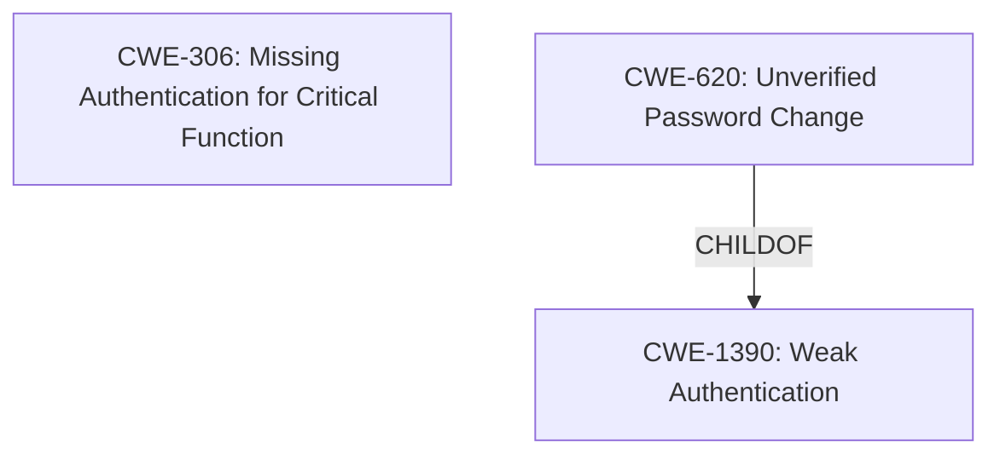

# Raw Analyzer Response for CVE-2021-44152

# Summary
| CWE ID | CWE Name | Confidence | CWE Abstraction Level | CWE Vulnerability Mapping Label | CWE-Vulnerability Mapping Notes |
|---|---|---|---|---|---|
| CWE-306 | Missing Authentication for Critical Function | 1.0 | Base | Allowed | Primary CWE |
| CWE-620 | Unverified Password Change | 0.8 | Base | Allowed | Secondary CWE |

## Evidence and Confidence

*   **Confidence Score:** 0.9
*   **Evidence Strength:** HIGH

## Relationship Analysis
The primary CWE is CWE-306 (Missing Authentication for Critical Function). CWE-620 (Unverified Password Change) is a child of CWE-1390 (Weak Authentication). CWE-306 and CWE-620 can be related where a missing authentication mechanism (CWE-306) leads to a password change function that does not require verification of the original password (CWE-620).

## Vulnerability Chain
The vulnerability chain starts with the **missing authentication** for the `/goform/change_password_process` endpoint (CWE-306). This **lack of authentication** leads to the ability to change any user's password without verification (CWE-620), ultimately resulting in unauthorized access to user accounts.

## Summary of Analysis
The initial assessment focused on the fact that an unauthenticated user can change any existing user password.
The core of the vulnerability is the **missing authentication** for a critical function, namely changing a password. The vulnerability description states: "Because /goform/change_password_process **does not verify authentication or authorization**, an unauthenticated user can change the password of any existing user." This directly points to CWE-306 (Missing Authentication for Critical Function).

CWE-620 (Unverified Password Change) is also applicable as a secondary weakness, highlighting that the password change process itself **lacks verification**. However, the primary issue is the **missing authentication** that allows an unauthenticated user to reach the password change functionality in the first place.

The relationship graph shows how these CWEs are connected, further solidifying the choice of CWE-306 as the primary cause and CWE-620 as a related secondary issue. Both are at the Base level of abstraction, offering specificity.

CWE-287 (Improper Authentication), CWE-285 (Improper Authorization), and CWE-863 (Incorrect Authorization) were considered but deemed less specific than CWE-306. CWE-306 directly addresses the core issue of **missing authentication**, whereas the others are broader classes.

The selection of CWE-306 and CWE-620 is based on the evidence from the vulnerability description and the supporting information from the retriever results and CWE specifications.

Relevant CWE Information:

# Enhanced Context (25 CWEs)

## CWE-807: Reliance on Untrusted Inputs in a Security Decision
**Abstraction Level**: Base
**Similarity Score**: 0.76
**Source**: dense

**Description**:
The product uses a protection mechanism that relies on the existence or values of an input, but the input can be modified by an untrusted actor in a way that bypasses the protection mechanism.
*Not Selected*: While untrusted input is involved, the primary issue is the missing authentication, not the reliance on the input itself.

## CWE-303: Incorrect Implementation of Authentication Algorithm
**Abstraction Level**: Base
**Similarity Score**: 0.76
**Source**: dense

**Description**:
The requirements for the product dictate the use of an established authentication algorithm, but the implementation of the algorithm is incorrect.
*Not Selected*: The description indicates **missing authentication**, not an incorrect implementation.

## CWE-639: Authorization Bypass Through User-Controlled Key
**Abstraction Level**: Base
**Similarity Score**: 0.75
**Source**: dense

**Description**:
The system's authorization functionality does not prevent one user from gaining access to another user's data or record by modifying the key value identifying the data.
*Not Selected*: The vulnerability focuses on the lack of authentication for changing passwords, rather than authorization bypass through a user-controlled key.

## CWE-1390: Weak Authentication
**Abstraction Level**: Class
**Similarity Score**: 0.75
**Source**: dense

**Description**:
The product uses an authentication mechanism to restrict access to specific users or identities, but the mechanism does not sufficiently prove that the claimed identity is correct.
*Not Selected*: Although related, the vulnerability is more specifically about the absence of authentication for a critical function.

## CWE-274: Improper Handling of Insufficient Privileges
**Abstraction Level**: Base
**Similarity Score**: 0.75
**Source**: dense

**Description**:
The product does not handle or incorrectly handles when it has insufficient privileges to perform an operation, leading to resultant weaknesses.
*Not Selected*: This is not about privilege handling but rather about **missing authentication**.

## CWE-307: Improper Restriction of Excessive Authentication Attempts
**Abstraction Level**: Base
**Similarity Score**: 0.75
**Source**: dense

**Description**:
The product does not implement sufficient measures to prevent multiple failed authentication attempts within a short time frame.
*Not Selected*: This vulnerability is about a **missing authentication** mechanism, not restrictions on authentication attempts.

## CWE-1391: Use of Weak Credentials
**Abstraction Level**: Class
**Similarity Score**: 0.75
**Source**: dense

**Description**:
The product uses weak credentials (such as a default key or hard-coded password) that can be calculated, derived, reused, or guessed by an attacker.
*Not Selected*: The vulnerability does not involve weak credentials but rather **missing authentication**.

## CWE-280: Improper Handling of Insufficient Permissions or Privileges
**Abstraction Level**: Base
**Similarity Score**: 0.75
**Source**: dense

**Description**:
The product does not handle or incorrectly handles when it has insufficient privileges to access resources or functionality as specified by their permissions. This may cause it to follow unexpected code paths that may leave the product in an invalid state.
*Not Selected*: This vulnerability is not about privilege handling or permissions, but about **missing authentication**.

## CWE-472: External Control of Assumed-Immutable Web Parameter
**Abstraction Level**: Base
**Similarity Score**: 0.74
**Source**: dense

**Description**:
The web application does not sufficiently verify inputs that are assumed to be immutable but are actually externally controllable, such as hidden form fields.
*Not Selected*: The issue is not related to external control of immutable parameters, but **missing authentication**.

## CWE-288: Authentication Bypass Using an Alternate Path or Channel
**Abstraction Level**: Base
**Similarity Score**: 0.74
**Source**: dense

**Description**:
The product requires authentication, but the product has an alternate path or channel that does not require authentication.
*Not Selected*: The description doesn't point to an alternate path but a direct lack of authentication.

## CWE-471: Modification of Assumed-Immutable Data (MAID)
**Abstraction Level**: base
**Similarity Score**: 4.33
**Source**: graph

**Description**:
CWE-471: Modification of Assumed-Immutable Data (MAID)
*Not Selected*: This doesn't involve modification of assumed-immutable data.

## CWE-425: Direct Request ('Forced Browsing')
**Abstraction Level**: base
**Similarity Score**: 4.33
**Source**: graph

**Description**:
CWE-425: Direct Request ('Forced Browsing')
*Not Selected*: There is no mention of forced browsing.

## CWE-98: Improper Control of Filename for Include/Require Statement in PHP Program ('PHP Remote File Inclusion')
**Abstraction Level**: variant
**Similarity Score**: 3.88
**Source**: graph

**Description**:
CWE-98: Improper Control of Filename for Include/Require Statement in PHP Program ('PHP Remote File Inclusion')
*Not Selected*: This is not a PHP remote file inclusion issue.

## CWE-178: Improper Handling of Case Sensitivity
**Abstraction Level**: base
**Similarity Score**: 3.76
**Source**: graph

**Description**:
CWE-178: Improper Handling of Case Sensitivity
*Not Selected*: This doesn't involve case sensitivity issues.

## CWE-22: Improper Limitation of a Pathname to a Restricted Directory ('Path Traversal')
**Abstraction Level**: base
**Similarity Score**: 3.65
**Source**: graph

**Description**:
CWE-22: Improper Limitation of a Pathname to a Restricted Directory ('Path Traversal')
*Not Selected*: This doesn't involve path traversal.

## CWE-836: Use of Password Hash Instead of Password for Authentication
**Abstraction Level**: base
**Similarity Score**: 3.64
**Source**: graph

**Description**:
CWE-83