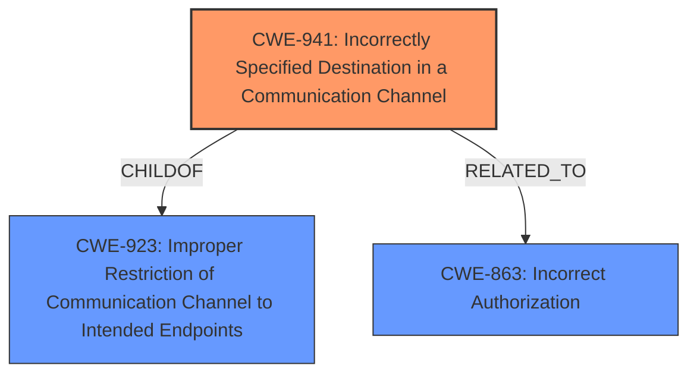

# Raw Analyzer Response for CVE-2021-44225

# Summary
| CWE ID | CWE Name | Confidence | CWE Abstraction Level | CWE Vulnerability Mapping Label | CWE-Vulnerability Mapping Notes |
|---|---|---|---|---|---|
| CWE-941 | Incorrectly Specified Destination in a Communication Channel | 0.9 | Base | Allowed | Primary CWE. The D-Bus policy does not sufficiently restrict the message destination. |
| CWE-863 | Incorrect Authorization | 0.7 | Class | Allowed-with-Review | Secondary candidate. The overly permissive D-Bus policy leads to access-control bypass. |

## Evidence and Confidence

*   **Confidence Score:** 0.8
*   **Evidence Strength:** HIGH

## Relationship Analysis
The primary relationship that influenced the CWE selection was the parent-child relationship between CWE-923 (Improper Restriction of Communication Channel to Intended Endpoints) and CWE-941 (Incorrectly Specified Destination in a Communication Channel). CWE-941 is a more specific base case of the more general class CWE-923. The description highlights that the D-Bus policy does not sufficiently restrict the message destination, aligning with the core concept of an incorrectly specified destination in a communication channel. CWE-863 (Incorrect Authorization) is related as the overly permissive policy leads to an access-control bypass.

## Vulnerability Chain
The vulnerability chain begins with a **misconfigured D-Bus policy (CWE-941)**, which fails to adequately restrict message destinations. This **leads to an access-control bypass (CWE-863)**, allowing unauthorized users to interact with and manipulate properties of the Keepalived service and potentially other services.

## Summary of Analysis
The initial analysis focused on identifying the root cause of the vulnerability, which is the **insufficiently restricted D-Bus policy**. The evidence from the vulnerability description clearly indicates that "the **D-Bus policy does not sufficiently restrict the message destination**". This aligns directly with CWE-941, which addresses scenarios where the intended destination in a communication channel is incorrectly specified. The retriever results also ranked CWE-941 as the top candidate.

CWE-863 was considered because the **impact** of the vulnerability is an **access-control bypass**. However, CWE-863 is a higher-level class, and the root cause is more precisely captured by CWE-941. The "CVE Reference Links Content Summary" states "The primary weakness is an access control bypass stemming from a misconfigured D-Bus policy." This shows that the access control bypass is a consequence of the root cause, which is the misconfigured D-Bus policy.

Therefore, the final decision is to map the vulnerability primarily to CWE-941, representing the root cause, and secondarily to CWE-863 as an impact. This provides a more accurate and complete representation of the vulnerability.

Relevant CWE Information:

# Enhanced Context (25 CWEs)
The following CWEs were identified as potentially relevant to this vulnerability:

## CWE-184: Incomplete List of Disallowed Inputs
**Abstraction Level**: Base
**Similarity Score**: 0.81
**Source**: dense

**Description**:
The product implements a protection mechanism that relies on a list of inputs (or properties of inputs) that are not allowed by policy or otherwise require other action to neutralize before additional processing takes place, but the list is incomplete.

**Mapping Guidance**:
- Usage: Allowed
- Rationale: This CWE entry is at the Base level of abstraction, which is a preferred level of abstraction for mapping to the root causes of vulnerabilities.

CWE-184 was not selected because the vulnerability isn't about a list of disallowed inputs, but rather about the destination of messages being insufficiently restricted.

## CWE-74: Improper Neutralization of Special Elements in Output Used by a Downstream Component ('Injection')
**Abstraction Level**: Class
**Similarity Score**: 0.80
**Source**: dense

**Description**:
The product constructs all or part of a command, data structure, or record using externally-influenced input from an upstream component, but it does not neutralize or incorrectly neutralizes special elements that could modify how it is parsed or interpreted when it is sent to a downstream component.

**Mapping Guidance**:
- Usage: Discouraged
- Rationale: CWE-74 is high-level and often misused when lower-level weaknesses are more appropriate.

CWE-74 was not selected because the vulnerability isn't about improper neutralization of special elements.

## CWE-183: Permissive List of Allowed Inputs
**Abstraction Level**: Base
**Similarity Score**: 0.78
**Source**: dense

**Description**:
The product implements a protection mechanism that relies on a list of inputs (or properties of inputs) that are explicitly allowed by policy because the inputs are assumed to be safe, but the list is too permissive - that is, it allows an input that is unsafe, leading to resultant weaknesses.

**Mapping Guidance**:
- Usage: Allowed
- Rationale: This CWE entry is at the Base level of abstraction, which is a preferred level of abstraction for mapping to the root causes of vulnerabilities.

CWE-183 was not selected because the vulnerability isn't about a list of allowed inputs that are too permissive, but rather the destination of messages being insufficiently restricted.

## CWE-138: Improper Neutralization of Special Elements
**Abstraction Level**: Class
**Similarity Score**: 0.78
**Source**: dense

**Description**:
The product receives input from an upstream component, but it does not neutralize or incorrectly neutralizes special elements that could be interpreted as control elements or syntactic markers when they are sent to a downstream component.

**Mapping Guidance**:
- Usage: Discouraged
- Rationale: This CWE entry is a level-1 Class (i.e., a child of a Pillar). It might have lower-level children that would be more appropriate

CWE-138 was not selected because the vulnerability isn't about improper neutralization of special elements.

## CWE-807: Reliance on Untrusted Inputs in a Security Decision
**Abstraction Level**: Base
**Similarity Score**: 0.77
**Source**: dense

**Description**:
The product uses a protection mechanism that relies on the existence or values of an input, but the input can be modified by an untrusted actor in a way that bypasses the protection mechanism.

**Mapping Guidance**:
- Usage: Allowed
- Rationale: This CWE entry is at the Base level of abstraction, which is a preferred level of abstraction for mapping to the root causes of vulnerabilities.

CWE-807 was not selected because the core issue is with the destination of the messages and not the reliance on untrusted inputs for a security decision.

## CWE-73: External Control of File Name or Path
**Abstraction Level**: Base
**Similarity Score**: 0.77
**Source**: dense

**Description**:
The product allows user input to control or influence paths or file names that are used in filesystem operations.

**Mapping Guidance**:
- Usage: Allowed
- Rationale: This CWE entry is at the Base level of abstraction, which is a preferred level of abstraction for mapping to the root causes of vulnerabilities.

CWE-73 was not selected because the vulnerability isn't about external control of file names or paths.

## CWE-41: Improper Resolution of Path Equivalence
**Abstraction Level**: Base
**Similarity Score**: 0.77
**Source**: dense

**Description**:
The product is vulnerable to file system contents disclosure through path equivalence. Path equivalence involves the use of special characters in file and directory names. The associated manipulations are intended to generate multiple names for the same object.

**Mapping Guidance**:
- Usage: Allowed
- Rationale: This CWE entry is at the Base level of abstraction, which is a preferred level of abstraction for mapping to the root causes of vulnerabilities.

CWE-41 was not selected because the vulnerability isn't about improper resolution of path equivalence.

## CWE-252: Unchecked Return Value
**Abstraction Level**: Base
**Similarity Score**: 0.77
**Source**: dense

**Description**:
The product does not check the return value from a method or function, which can prevent it from detecting unexpected states and conditions.

**Mapping Guidance**:
- Usage: Allowed
- Rationale: This CWE entry is at the Base level of abstraction, which is a preferred level of abstraction for mapping to the root causes of vulnerabilities.

CWE-252 was not selected because the vulnerability isn't related to unchecked return values.

## CWE-1289: Improper Validation of Unsafe Equivalence in Input
**Abstraction Level**: Base
**Similarity Score**: 0