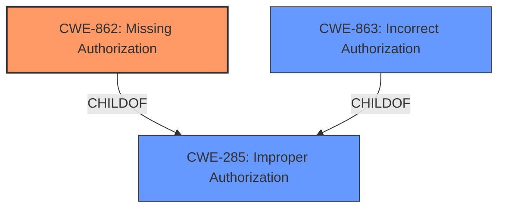

# Raw Analyzer Response for CVE-2021-44233

# Summary
| CWE ID | CWE Name | Confidence | CWE Abstraction Level | CWE Vulnerability Mapping Label | CWE-Vulnerability Mapping Notes |
|---|---|---|---|---|---|
| CWE-862 | Missing Authorization | 1.0 | Class | Allowed-with-Review | Primary CWE |
| CWE-285 | Improper Authorization | 0.7 | Class | Discouraged | Secondary Candidate |
| CWE-863 | Incorrect Authorization | 0.7 | Class | Allowed-with-Review | Secondary Candidate |

## Evidence and Confidence

*   **Confidence Score:** 1.0
*   **Evidence Strength:** HIGH

## Relationship Analysis
The primary CWE is CWE-862, which is a child of CWE-285 (Improper Authorization). CWE-863 (Incorrect Authorization) is a peer of CWE-862, both being children of CWE-285. While CWE-285 is a more general class, the description specifically states the application "**does not perform necessary authorization checks**," indicating an absence of authorization rather than an incorrect implementation. Thus, CWE-862 is more specific.

## Vulnerability Chain
The chain starts with the **missing authorization check** (CWE-862), leading to the **escalation of privileges** impact.

## Summary of Analysis
The initial assessment identified several candidate CWEs related to authorization issues. However, the vulnerability description explicitly states that the application "**does not perform necessary authorization checks**", which strongly suggests a **missing authorization** issue rather than an incorrect or insufficient one.

The phrase "**does not perform necessary authorization checks**" directly supports CWE-862 (Missing Authorization). The impact of this weakness is the escalation of privileges, as stated in the description.

Based on the evidence and relationship analysis, CWE-862 is the most appropriate choice because it accurately reflects the root cause of the vulnerability. It is also at the Class level, which is more specific than the Pillar level (CWE-284).

Relevant CWE Information:

# Enhanced Context (25 CWEs)

## CWE-862: Missing Authorization
**Abstraction:** Class
**Status:** Incomplete

### Description
The product **does not perform an authorization check** when an actor attempts to access a resource or perform an action.

### Extended Description
Not provided

### Alternative Terms
AuthZ: "AuthZ" is typically used as an abbreviation of "authorization" within the web application security community. It is distinct from "AuthN" (or, sometimes, "AuthC") which is an abbreviation of "authentication." The use of "Auth" as an abbreviation is discouraged, since it could be used for either authentication or authorization.

### Relationships
ChildOf -> CWE-285
ChildOf -> CWE-284

### Mapping Guidance
**Usage:** Allowed-with-Review
**Rationale:** This CWE entry is a Class and might have Base-level children that would be more appropriate
**Comments:** Examine children of this entry to see if there is a better fit
**Reasons:**
- Abstraction

## CWE-285: Improper Authorization
**Abstraction:** Class
**Status:** Draft

### Description
The product **does not perform or incorrectly performs an authorization check** when an actor attempts to access a resource or perform an action.

## CWE-863: Incorrect Authorization
**Abstraction:** Class
**Status:** Incomplete

### Description
The product performs an authorization check when an actor attempts to access a resource or perform an action, but it **does not correctly perform the check**.

CWE-284 (Improper Access Control) was considered but not used because it's a very high-level Pillar CWE. The suggested alternatives, CWE-862 and CWE-863, were further evaluated. CWE-285 was also considered, but it includes the possibility of not performing an authorization check or incorrectly performing it. Since the vulnerability description specifically mentioned the system "**does not perform necessary authorization checks**," CWE-862 becomes more accurate.

CWE-639 (Authorization Bypass Through User-Controlled Key) was also considered, however, this CWE is more specific and requires a user-controlled key to bypass authorization, which is not evident from the description. The other CWEs like CWE-352, CWE-269, and CWE-1275 are not relevant based on the vulnerability description.