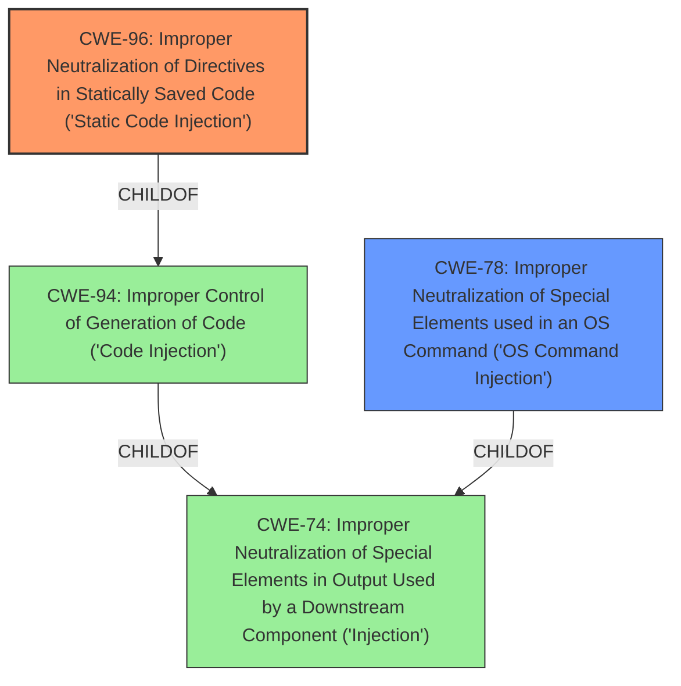

# Analysis Report for CVE-2021-44238

# Vulnerability Analysis Report: CVE-2021-44238

## Description


## Analysis (with Relationship Data)

# Summary
| CWE ID | CWE Name | Confidence | CWE Abstraction Level | CWE Vulnerability Mapping Label | CWE-Vulnerability Mapping Notes |
|---|---|---|---|---|---|
| CWE-96 | Improper Neutralization of Directives in Statically Saved Code ('Static Code Injection') | 0.8 | Base | Allowed | Primary CWE |
| CWE-78 | Improper Neutralization of Special Elements used in an OS Command ('OS Command Injection') | 0.5 | Base | Allowed | Secondary Candidate |
| CWE-95 | Improper Neutralization of Directives in Dynamically Evaluated Code ('Eval Injection') | 0.4 | Variant | Allowed | Secondary Candidate |
| CWE-434 | Unrestricted Upload of File with Dangerous Type | 0.3 | Base | Allowed | Secondary Candidate |

## Evidence and Confidence

*   **Confidence Score:** 0.8
*   **Evidence Strength:** MEDIUM

## Relationship Analysis
The primary relationship influencing the selection was the ChildOf relationship between CWE-96 and CWE-94. CWE-96 provides a more specific Base level description of the weakness than its parent CWE-94. CWE-78 is a peer of CWE-96 through their shared parent CWE-74. These relationships help to narrow down the possible CWEs and provide a more accurate classification.



## Vulnerability Chain
The chain of events is as follows:
  1.  Improper Neutralization of Directives in Statically Saved Code (**CWE-96**)
  2.  Remote Code Execution (Impact)

## Summary of Analysis
The initial assessment identified **CWE-96** [Improper Neutralization of Directives in Statically Saved Code ('Static Code Injection')] as the primary candidate due to the "**Remote Code Execution** (RCE) via /aya/module/admin/ust_tab_e.inc.php" description, which suggested code being injected into a statically saved file.
The Retriever Results showed **CWE-96** [Improper Neutralization of Directives in Statically Saved Code ('Static Code Injection')] as the top candidate. The analysis of the complete CWE specifications confirmed that **CWE-96** [Improper Neutralization of Directives in Statically Saved Code ('Static Code Injection')] is the most appropriate because the vulnerability involves code injection into a static file.

The relationship graph further supports this decision, as **CWE-96** [Improper Neutralization of Directives in Statically Saved Code ('Static Code Injection')] is a child of **CWE-94** [Improper Control of Generation of Code ('Code Injection')], making it a more specific classification.

**CWE-78** [Improper Neutralization of Special Elements used in an OS Command ('OS Command Injection')] was considered because RCE can be achieved through OS command injection. However, the description does not explicitly mention OS commands, reducing confidence in this selection.

**CWE-95** [Improper Neutralization of Directives in Dynamically Evaluated Code ('Eval Injection')] was considered, but it typically involves dynamic evaluation calls (e.g., "eval"), which are not explicitly mentioned in the vulnerability description.

**CWE-434** [Unrestricted Upload of File with Dangerous Type] was considered because the vulnerability could involve uploading a malicious file. However, the description focuses on code injection rather than file uploads.

The selection of **CWE-96** [Improper Neutralization of Directives in Statically Saved Code ('Static Code Injection')] is at the optimal level of specificity because it directly addresses the root cause: code being injected into a statically saved file, leading to remote code execution.

Relevant CWE Information:

# Enhanced Context (25 CWEs)

## CWE-74: Improper Neutralization of Special Elements in Output Used by a Downstream Component ('Injection')
**Abstraction Level**: Class
**Similarity Score**: 0.77
**Source**: dense

**Description**:
The product constructs all or part of a command, data structure, or record using externally-influenced input from an upstream component, but it does not neutralize or incorrectly neutralizes special elements that could modify how it is parsed or interpreted when it is sent to a downstream component.

**Mapping Guidance**:
- Usage: Discouraged
- Rationale: CWE-74 is high-level and often misused when lower-level weaknesses are more appropriate.

## CWE-80: Improper Neutralization of Script-Related HTML Tags in a Web Page (Basic XSS)
**Abstraction Level**: Variant
**Similarity Score**: 0.76
**Source**: dense

**Description**:
The product receives input from an upstream component, but it does not neutralize or incorrectly neutralizes special characters such as "<", ">", and "&" that could be interpreted as web-scripting elements when they are sent to a downstream component that processes web pages.

**Mapping Guidance**:
- Usage: Allowed
- Rationale: This CWE entry is at the Variant level of abstraction, which is a preferred level of abstraction for mapping to the root causes of vulnerabilities.

## CWE-917: Improper Neutralization of Special Elements used in an Expression Language Statement ('Expression Language Injection')
**Abstraction Level**: Base
**Similarity Score**: 0.76
**Source**: dense

**Description**:
The product constructs all or part of an expression language (EL) statement in a framework such as a Java Server Page (JSP) using externally-influenced input from an upstream component, but it does not neutralize or incorrectly neutralizes special elements that could modify the intended EL statement before it is executed.

**Mapping Guidance**:
- Usage: Allowed
- Rationale: This CWE entry is at the Base level of abstraction, which is a preferred level of abstraction for mapping to the root causes of vulnerabilities.

## CWE-184: Incomplete List of Disallowed Inputs
**Abstraction Level**: Base
**Similarity Score**: 0.76
**Source**: dense

**Description**:
The product implements a protection mechanism that relies on a list of inputs (or properties of inputs) that are not allowed by policy or otherwise require other action to neutralize before additional processing takes place, but the list is incomplete.

**Mapping Guidance**:
- Usage: Allowed
- Rationale: This CWE entry is at the Base level of abstraction, which is a preferred level of abstraction for mapping to the root causes of vulnerabilities.

## CWE-99: Improper Control of Resource Identifiers ('Resource Injection')
**Abstraction Level**: Class
**Similarity Score**: 0.76
**Source**: dense

**Description**:
The product receives input from an upstream component, but it does not restrict or incorrectly restricts the input before it is used as an identifier for a resource that may be outside the intended sphere of control.

**Mapping Guidance**:
- Usage: Allowed-with-Review
- Rationale: This CWE entry is a Class and might have Base-level children that would be more appropriate

## CWE-96: Improper Neutralization of Directives in Statically Saved Code ('Static Code Injection')
**Abstraction Level**: Base
**Similarity Score**: 0.75
**Source**: dense

**Description**:
The product receives input from an upstream component, but it does not neutralize or incorrectly neutralizes code syntax before inserting the input into an executable resource, such as a library, configuration file, or template.

**Mapping Guidance**:
- Usage: Allowed
- Rationale: This CWE entry is at the Base level of abstraction, which is a preferred level of abstraction for mapping to the root causes of vulnerabilities.

## CWE-915: Improperly Controlled Modification of Dynamically-Determined Object Attributes
**Abstraction Level**: Base
**Similarity Score**: 0.75
**Source**: dense

**Description**:
The product receives input from an upstream component that specifies multiple attributes, properties, or fields that are to be initialized or updated in an object, but it does not properly control which attributes can be modified.

**Mapping Guidance**:
- Usage: Allowed
- Rationale: This CWE entry is at the Base level of abstraction, which is a preferred level of abstraction for mapping to the root causes of vulnerabilities.

## CWE-470: Use of Externally-Controlled Input to Select Classes or Code ('Unsafe Reflection')
**Abstraction Level**: Base
**Similarity Score**: 0.7


## CWE Relationship Analysis

Current CWEs represent these abstraction levels: .


### Vulnerability Chain Analysis

**Chain starting from CWE-80:**
- 80 (Improper Neutralization of Script-Related HTML Tags in a Web Page (Basic XSS)) - ROOT


**Chain starting from CWE-96:**
- 96 (Improper Neutralization of Directives in Statically Saved Code ('Static Code Injection')) - ROOT


### CWE Relationship Diagram

```mermaid
graph TD
    classDef primary fill:#f96,stroke:#333,stroke-width:2px
    classDef secondary fill:#69f,stroke:#333
    classDef tertiary fill:#9e9,stroke:#333
```


*Report generated on 2025-04-01 16:11:05*
