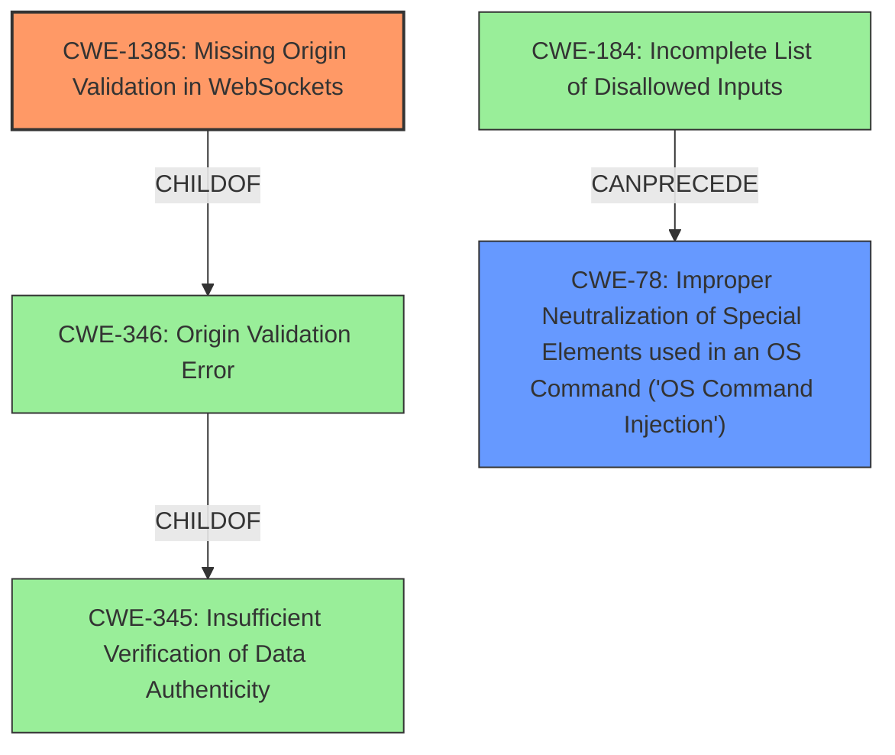

# Analysis for CVE-2021-44458

# Summary
| CWE ID    | CWE Name                                                                              | Confidence | CWE Abstraction Level | CWE Vulnerability Mapping Label | CWE-Vulnerability Mapping Notes |
| --------- | ------------------------------------------------------------------------------------- | ---------- | --------------------- | ------------------------------- | ------------------------------- |
| CWE-1385  | Missing Origin Validation in WebSockets                                               | 0.9        | Variant               | Allowed                         |                                 |
| CWE-78    | Improper Neutralization of Special Elements used in an OS Command ('OS Command Injection') | 0.7        | Base                  | Allowed                         | Secondary Candidate               |

## Evidence and Confidence

*   **Confidence Score:** 0.8
*   **Evidence Strength:** HIGH

## Relationship Analysis
The primary CWE is CWE-1385 which is a variant of CWE-346 (Origin Validation Error). CWE-346 is a class that is a child of CWE-345. CWE-78 is a base CWE that can follow CWE-184.

## Vulnerability Chain
The vulnerability chain starts with a **lack of websocket authentication** (CWE-1385), allowing a malicious website to make unauthorized websocket connections to the Lens application. This leads to the attacker being able to **execute arbitrary commands** on the victim's machine with the privileges of the Lens user (CWE-78).

## Summary of Analysis
The initial analysis focused on identifying the root cause of the vulnerability, which is the **lack of websocket authentication**. The vulnerability description and the CVE reference links content summary both point to this as the primary issue. The attacker exploits this by hosting a malicious website that makes unauthorized websocket connections to the Lens application, leading to arbitrary command execution.

The selection of CWE-1385 is based on the following evidence:
- CVE Reference Links Content Summary: "**Root cause of vulnerability: Lack of websocket authentication** in Lens application."
- CVE Reference Links Content Summary: "The Lens application on Linux systems **does not properly authenticate websocket connections**, allowing an attacker to establish a connection to the Lens application through a malicious website."
- Retriever Results: CWE-1385 is the top combined result with a high score.
- CWE-1385 Description: "The product uses a WebSocket, but it **does not properly verify that the source of data or communication is valid**." This aligns perfectly with the vulnerability description.
- CWE-1385 Mapping Guidance: Usage is ALLOWED and Rationale states that "This CWE entry is at the Variant level of abstraction, which is a preferred level of abstraction for mapping to the root causes of vulnerabilities."

The selection of CWE-78 is based on the following evidence:
- Vulnerability Description Key Phrases: "**impact:** execute arbitrary commands as the Lens user"
- CVE Reference Links Content Summary: "**Impact of exploitation:** Successful exploitation allows an attacker to **execute arbitrary commands** on the victim's machine with the privileges of the Lens user."
- Retriever Results: CWE-78 is in the top combined results.
- CWE-78 Description: "The product constructs all or part of an OS command using externally-influenced input from an upstream component, but it does not neutralize or incorrectly neutralizes special elements that could modify the intended OS command when it is sent to a downstream component."

CWE-20 was considered but rejected. While **improper input validation** may be a contributing factor, the more specific **missing origin validation** is the root cause. Therefore, CWE-1385 is the more appropriate choice. Similarly, CWE-79 (Cross-site Scripting) was considered, but the attack vector is not directly related to script injection into a web page. The core issue is the **lack of authentication** on the websocket connection, which allows the attacker to bypass security measures and execute commands.

The selected CWEs are at the optimal level of specificity because CWE-1385 is a Variant that directly addresses the **missing origin validation** in websockets, and CWE-78 covers the **impact of arbitrary command execution**. These are the most precise classifications based on the provided evidence and relationship analysis.

Relevant CWE Information:

# Enhanced Context (25 CWEs)
The following CWEs were identified as potentially relevant to this vulnerability:

## CWE-1289: Improper Validation of Unsafe Equivalence in Input
**Abstraction Level**: Base
**Similarity Score**: 0.77
**Source**: dense

**Description**:
The product receives an input value that is used as a resource identifier or other type of reference, but it does not validate or incorrectly validates that the input is equivalent to a potentially-unsafe value.

**Mapping Guidance**:
- Usage: Allowed
- Rationale: This CWE entry is at the Base level of abstraction, which is a preferred level of abstraction for mapping to the root causes of vulnerabilities.

## CWE-74: Improper Neutralization of Special Elements in Output Used by a Downstream Component ('Injection')
**Abstraction Level**: Class
**Similarity Score**: 0.75
**Source**: dense

**Description**:
The product constructs all or part of a command, data structure, or record using externally-influenced input from an upstream component, but it does not neutralize or incorrectly neutralizes special elements that could modify how it is parsed or interpreted when it is sent to a downstream component.

**Mapping Guidance**:
- Usage: Discouraged
- Rationale: CWE-74 is high-level and often misused when lower-level weaknesses are more appropriate.

## CWE-184: Incomplete List of Disallowed Inputs
**Abstraction Level**: Base
**Similarity Score**: 0.75
**Source**: dense

**Description**:
The product implements a protection mechanism that relies on a list of inputs (or properties of inputs) that are not allowed by policy or otherwise require other action to neutralize before additional processing takes place, but the list is incomplete.

**Mapping Guidance**:
- Usage: Allowed
- Rationale: This CWE entry is at the Base level of abstraction, which is a preferred level of abstraction for mapping to the root causes of vulnerabilities.

## CWE-138: Improper Neutralization of Special Elements
**Abstraction Level**: Class
**Similarity Score**: 0.75
**Source**: dense

**Description**:
The product receives input from an upstream component, but it does not neutralize or incorrectly neutralizes special elements that could be interpreted as control elements or syntactic markers when they are sent to a downstream component.

**Mapping Guidance**:
- Usage: Discouraged
- Rationale: This CWE entry is a level-1 Class (i.e., a child of a Pillar). It might have lower-level children that would be more appropriate

## CWE-41: Improper Resolution of Path Equivalence
**Abstraction Level**: Base
**Similarity Score**: 0.74
**Source**: dense

**Description**:
The product is vulnerable to file system contents disclosure through path equivalence. Path equivalence involves the use of special characters in file and directory names. The associated manipulations are intended to generate multiple names for the same object.

**Mapping Guidance**:
- Usage: Allowed
- Rationale: This CWE entry is at the Base level of abstraction, which is a preferred level of abstraction for mapping to the root causes of vulnerabilities.

## CWE-183: Permissive List of Allowed Inputs
**Abstraction Level**: Base
**Similarity Score**: 0.74
**Source**: dense

**Description**:
The product implements a protection mechanism that relies on a list of inputs (or properties of inputs) that are explicitly allowed by policy because the inputs are assumed to be safe, but the list is too permissive - that is, it allows an input that is unsafe, leading to resultant weaknesses.

**Mapping Guidance**:
- Usage: Allowed
- Rationale: This CWE entry is at the Base level of abstraction, which is a preferred level of abstraction for mapping to the root causes of vulnerabilities.

## CWE-807: Reliance on Untrusted Inputs in a Security Decision
**Abstraction Level**: Base
**Similarity Score**: 0.74
**Source**: dense

**Description**:
The product uses a protection mechanism that relies on the existence or values of an input, but the input can be modified by an untrusted actor in a way that bypasses the