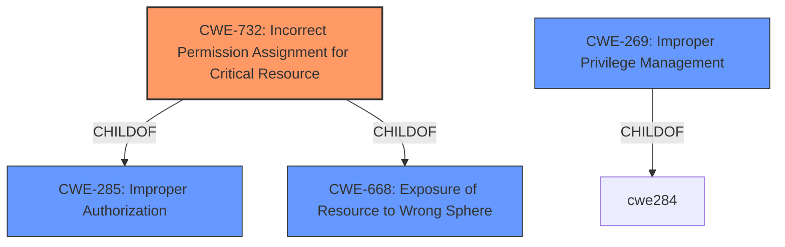

# Analysis Report for CVE-2021-44466

# Vulnerability Analysis Report: CVE-2021-44466

## Description


## Analysis (with Relationship Data)

# Summary
| CWE ID | CWE Name | Confidence | CWE Abstraction Level | CWE Vulnerability Mapping Label | CWE-Vulnerability Mapping Notes |
|---|---|---|---|---|---|
| CWE-732 | Incorrect Permission Assignment for Critical Resource | 0.9 | Class | Allowed-with-Review | Primary CWE: The installer **incorrectly assigns permissions**, allowing lower-privileged users to replace the VPN executable. |
| CWE-269 | Improper Privilege Management | 0.6 | Class | Discouraged | Secondary Candidate: The **improper access controls** can be seen as a failure in privilege management, but CWE-732 is a more direct match. |

## Evidence and Confidence

*   **Confidence Score:** 0.9
*   **Evidence Strength:** HIGH

## Relationship Analysis
The primary relationship is between CWE-732 and its parents, particularly CWE-285 (Improper Authorization) and CWE-668 (Exposure of Resource to Wrong Sphere). CWE-732 is more specific than its parents, making it a better fit. CWE-269 (Improper Privilege Management) is a broader category that applies, but CWE-732 directly addresses the **incorrect permission assignment** aspect.



## Vulnerability Chain
The vulnerability chain starts with the **improper access controls** during installation. This leads to a situation where lower-privileged users can modify the VPN executable. Finally, when a higher-privileged user executes the modified file, it results in local privilege escalation.

## Summary of Analysis
The primary CWE is CWE-732 (Incorrect Permission Assignment for Critical Resource). This is based on the evidence that the installer fails to set appropriate ACLs, leading to **incorrect permissions** for the VPN executable. "Vulnerability Description Key Phrases" lists "**improper access controls**" as the root cause. The "CVE Reference Links Content Summary" mentions the installer fails to set appropriate Access Control Lists (ACLs) on the installation directory when a custom install path is selected.

The retriever results also list CWE-732 as the top candidate.

CWE-269 (Improper Privilege Management) was considered because the vulnerability ultimately leads to privilege escalation. However, CWE-732 is more specific to the root cause: the incorrect assignment of permissions. The MITRE mapping guidance for CWE-269 discourages its use when more specific CWEs are available.

The choice of CWE-732 is at the optimal level of specificity because it directly addresses the **incorrect permission assignment**, which is the root cause of the vulnerability.


## CWE Relationship Analysis

Current CWEs represent these abstraction levels: .


### Vulnerability Chain Analysis

**Chain starting from CWE-732:**
- 732 (Incorrect Permission Assignment for Critical Resource) - ROOT


**Chain starting from CWE-285:**
- 285 (Improper Authorization) - ROOT


### CWE Relationship Diagram

```mermaid
graph TD
    classDef primary fill:#f96,stroke:#333,stroke-width:2px
    classDef secondary fill:#69f,stroke:#333
    classDef tertiary fill:#9e9,stroke:#333
```


*Report generated on 2025-04-02 03:58:10*
