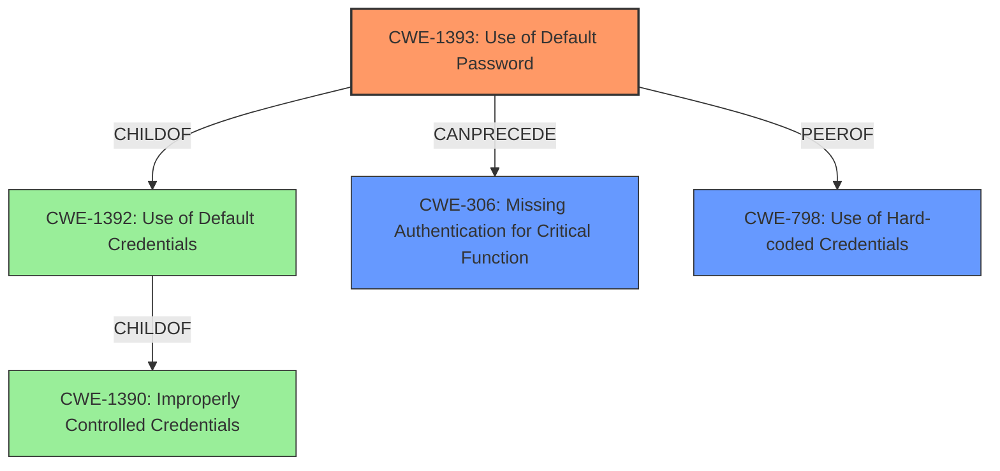

# Raw Analyzer Response for CVE-2021-44480

# Summary
| CWE ID  | CWE Name | Confidence | CWE Abstraction Level | CWE Vulnerability Mapping Label | CWE-Vulnerability Mapping Notes |
|-----------------|-----------------------------------------------------|------------|-------------------------|---------------------------------|---------------------------------------------------------------------------------------------------|
| **CWE-1393** | Use of Default Password | 0.9 | Base | Allowed | Primary CWE. The vulnerability description clearly indicates the use of default passwords. |
| CWE-306 | Missing Authentication for Critical Function | 0.7 | Base | Allowed | Secondary candidate. The use of default credentials implies a **lack of proper authentication**. |
| CWE-798 | Use of Hard-coded Credentials | 0.6 | Base | Allowed | Secondary candidate. **Default passwords** can be seen as a form of **hard-coded credentials**, although the default credentials can typically be changed. |
| CWE-1391 | Use of Weak Credentials | 0.5 | Class | Allowed-with-Review | Secondary candidate. This is a more general class that encompasses default passwords, but CWE-1393 is more specific. |

## Evidence and Confidence

*   **Confidence Score:** 0.9
*   **Evidence Strength:** HIGH

## Relationship Analysis
The primary CWE is CWE-1393, which is a specific type of CWE-1392 (Use of Default Credentials), and CWE-1392 is a child of CWE-1390 (Improperly Controlled Credentials). CWE-306 is related as the **lack of authentication** is enabled by the **use of default credentials**. CWE-798 is related because **default credentials** are technically **hard-coded credentials**. We chose CWE-1393 for its specificity.

## Vulnerability Chain
The vulnerability chain starts with the **use of default passwords** (CWE-1393). This leads to a **lack of proper authentication** (CWE-306), allowing remote attackers to **listen to device surroundings**.

## Summary of Analysis
The initial assessment identified the use of default credentials as the primary issue. The analysis was based on the vulnerability description, which explicitly states that the Wokka Lokka Q50 devices use **default passwords** such as "123456" and "523681". This aligns directly with CWE-1393 (Use of Default Password).
The retriever results also listed CWE-1393 with a high score. The chain of events is that because the device uses default passwords, it can be exploited allowing unauthorized access to the device's surroundings. The graph relationships support this, as CWE-1393 is a specific type of credential issue, and can lead to **missing authentication**.
The selection of CWE-1393 is at the optimal level of specificity because it precisely describes the **root cause**: the **use of default passwords**. The other CWEs considered (CWE-306, CWE-798, CWE-1391) are either consequences of the default password use or more general categories.

Relevant CWE Information:
- **Vulnerability Description Key Phrases**: **weakness:** **default credentials**
- **CVE Reference Links Content Summary**: **Root Cause:** Lack of forced password change, **use of a default password** (123456 or 523681) for SMS control, and unencrypted transmission of geolocation data.

The other CWEs were considered, but not used:

*   **CWE-319: Cleartext Transmission of Sensitive Information:** The vulnerability description focuses on the use of default passwords, not the transmission of data in cleartext, so it is not as relevant.
*   **CWE-1391: Use of Weak Credentials:** While default passwords are weak, CWE-1393 is more specific.
*   **CWE-306: Missing Authentication for Critical Function:** The **use of default passwords** is a bypass of authentication, but the vulnerability description focuses on the default password itself, so it is not as relevant.
*   **CWE-522: Insufficiently Protected Credentials:** The **use of default passwords** is a credential protection issue, but the vulnerability description focuses on the default password itself, so it is not as relevant.
*   **CWE-259: Use of Hard-coded Password:** While **default passwords** are similar to **hard-coded passwords**, they are intended to be changed, which is a key difference, making CWE-1393 more applicable.
*   **CWE-321: Use of Hard-coded Cryptographic Key:** The vulnerability does not involve cryptographic keys.
*   **CWE-1188: Initialization of a Resource with an Insecure Default:** This CWE is related, but not as direct as CWE-1393.
*   **CWE-256: Plaintext Storage of a Password:** The vulnerability is about the password being a default, not about its storage.
*   **CWE-912: Hidden Functionality:** The vulnerability does not involve hidden functionality.