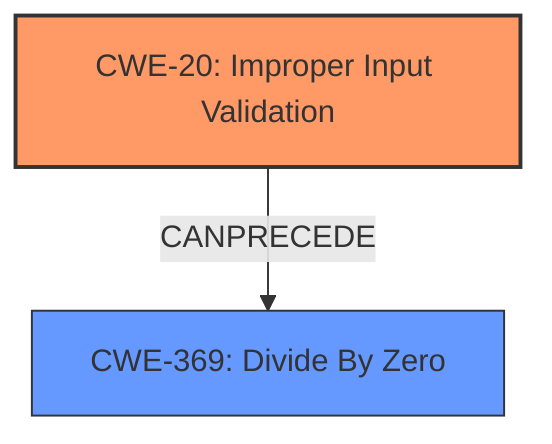

# Analysis Report for CVE-2021-44483

# Vulnerability Analysis Report: CVE-2021-44483

## Description


## Analysis (with Relationship Data)

# Summary
| CWE ID | CWE Name | Confidence | CWE Abstraction Level | CWE Vulnerability Mapping Label | CWE-Vulnerability Mapping Notes |
|---|---|---|---|---|---|
| CWE-20 | Improper Input Validation | 0.9 | Class | Primary | Discouraged |
| CWE-369 | Divide By Zero | 0.7 | Base | Secondary | Allowed |

## Evidence and Confidence

*   **Confidence Score:** 0.8
*   **Evidence Strength:** MEDIUM

## Relationship Analysis
The primary relationship considered here is that CWE-20 [Improper Input Validation] is a broad class that can lead to specific errors like a divide-by-zero. There isn't a direct parent-child relationship between CWE-20 and CWE-369, but CWE-20 can definitely precede CWE-369 in a vulnerability chain. The abstraction levels also influenced the decision. CWE-20 is a Class, while CWE-369 is a Base, representing a more specific type of error.



## Vulnerability Chain
The vulnerability chain starts with the **lack of input validation** (CWE-20), which then leads to a divide-by-zero error (CWE-369), ultimately causing the application to crash.

## Summary of Analysis
The initial analysis focused on the **lack of input validation** as the root cause, leading to a divide-by-zero. This is supported by the "Vulnerability Description Key Phrases" section. The key phrase is **"lack of input validation"** which leads to the impact of a crash due to a divide-by-zero error.

The retriever results listed several potential CWEs, including CWE-665 [Improper Initialization], CWE-20 [Improper Input Validation], CWE-125 [Out-of-bounds Read], CWE-119 [Improper Restriction of Operations within the Bounds of a Memory Buffer], and CWE-787 [Out-of-bounds Write].

CWE-20 [Improper Input Validation] was selected as the primary CWE because the vulnerability description explicitly mentions a **"lack of input validation"**. This aligns with the CWE's description of failing to validate input properties required for safe and correct data processing. While CWE-20 is discouraged for misuse in low-information reports, the description contains the explicit root cause, so this is the best fit.

CWE-369 [Divide By Zero] was considered as a secondary CWE since the vulnerability results in a divide-by-zero error. This aligns with the CWE's description.

The CWEs are at appropriate levels of specificity. CWE-20 is a Class, representing a general category of input validation issues. CWE-369 is a Base, providing a more specific type of error.

Relevant CWE Information:

# Enhanced Context (25 CWEs)
The following CWEs were identified as potentially relevant to this vulnerability:

## CWE-681: Incorrect Conversion between Numeric Types
**Abstraction Level**: Base
**Similarity Score**: 0.76
**Source**: dense

**Description**:
When converting from one data type to another, such as long to integer, data can be omitted or translated in a way that produces unexpected values. If the resulting values are used in a sensitive context, then dangerous behaviors may occur.

**Mapping Guidance**:
- Usage: Allowed
- Rationale: This CWE entry is at the Base level of abstraction, which is a preferred level of abstraction for mapping to the root causes of vulnerabilities.

## CWE-369: Divide By Zero
**Abstraction Level**: Base

**Description**:
The program divides a value by zero.

## Vulnerability Description
An issue was discovered in YottaDB through r1.32 and V7.0-000. A **lack of input validation** in calls to eb_div in sr_port/eb_muldiv.c allows attackers to crash the application by performing a divide by zero.

### Vulnerability Description Key Phrases
- **rootcause:** **lack of input validation**
- **impact:** crash the application
- **vector:** divide by zero


## CWE Relationship Analysis

Current CWEs represent these abstraction levels: .


### Vulnerability Chain Analysis

**Chain starting from CWE-787:**
- 787 (Out-of-bounds Write) - ROOT


**Chain starting from CWE-125:**
- 125 (Out-of-bounds Read) - ROOT


### CWE Relationship Diagram

```mermaid
graph TD
    classDef primary fill:#f96,stroke:#333,stroke-width:2px
    classDef secondary fill:#69f,stroke:#333
    classDef tertiary fill:#9e9,stroke:#333
```


*Report generated on 2025-04-01 16:30:00*
