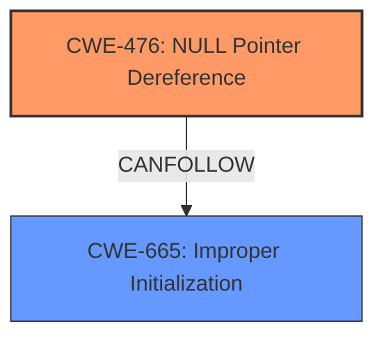

# Enhanced Analysis for CVE-2021-44492

# Summary
| CWE ID | CWE Name | Confidence | CWE Abstraction Level | CWE Vulnerability Mapping Label | CWE-Vulnerability Mapping Notes |
|---|---|---|---|---|---|
| **CWE-476** | **NULL Pointer Dereference** | 1.0 | Base | Allowed | Primary CWE: The vulnerability description and CVE reference link content summary explicitly mention a **NULL pointer dereference** as the root cause. |
| CWE-665 | Improper Initialization | 0.6 | Class | Discouraged | Secondary CWE: The vulnerability involves a type being incorrectly initialized, which could lead to the **NULL pointer dereference**. This makes **improper initialization** a possible contributing factor. |

## Evidence and Confidence

*   **Confidence Score:** 0.9
*   **Evidence Strength:** HIGH

## Relationship Analysis
The primary relationship is that **CWE-476 (NULL Pointer Dereference)** can be a consequence of **CWE-665 (Improper Initialization)**. This means that the improper initialization of the type could directly lead to a **NULL pointer dereference** later in the code execution.



## Vulnerability Chain
The vulnerability chain starts with the crafted input, which leads to the incorrect initialization of a type. This incorrect initialization results in a **NULL pointer dereference** and a subsequent crash.
  - Crafted Input -> Incorrect Type Initialization -> **NULL Pointer Dereference** -> Crash

## Summary of Analysis
The primary assessment is based on the provided evidence, which clearly indicates a **NULL pointer dereference**.

*   **Vulnerability Description Key Phrases:** "**rootcause:** **NULL pointer dereference**"
*   **CVE Reference Links Content Summary:** The summary indicates that the root cause of the vulnerability is the fixes and enhancements related to the fuzz testing. There are multiple issues that can lead to a crash, segmentation fault, or other unexpected behavior.

The graph relationship shows the potential connection between improper initialization and **NULL pointer dereference**, which supports the consideration of CWE-665 as a contributing factor.

CWE-476 is chosen as the primary CWE because the vulnerability description explicitly mentions a **NULL pointer dereference**. It is at the Base level of abstraction, which is the preferred level.

CWE-665 is considered as a secondary CWE because the vulnerability description mentions incorrect type initialization that leads to the **NULL pointer dereference**. It is at the Class level of abstraction, and the mapping guidance discourages its use if a more specific child CWE exists.

Relevant CWE Information:

# Enhanced Context (25 CWEs)
The following CWEs were identified as potentially relevant to this vulnerability:

## CWE-665: Improper Initialization
**Abstraction Level**: Class
**Similarity Score**: 0.79
**Source**: dense

**Description**:
The product does not initialize or incorrectly initializes a resource, which might leave the resource in an unexpected state when it is accessed or used.

**Mapping Guidance**:
- Usage: Discouraged
- Rationale: This CWE entry is a level-1 Class (i.e., a child of a Pillar). It might have lower-level children that would be more appropriate

## CWE-476: NULL Pointer Dereference
**Abstraction Level**: Base
**Similarity Score**: 5595.32
**Source**: sparse

**Description**:
The product dereferences a pointer that it expects to be valid but is NULL.

**Mapping Guidance**:
- Usage: Allowed
- Rationale: This CWE entry is at the Base level of abstraction, which is a preferred level of abstraction for mapping to the root causes of vulnerabilities.

## CWE-822: Untrusted Pointer Dereference
**Abstraction Level**: Base
**Similarity Score**: 5427.22
**Source**: sparse

**Description**:
The product obtains a value from an untrusted source, converts this value to a pointer, and dereferences the resulting pointer.

**Mapping Guidance**:
- Usage: Allowed
- Rationale: This CWE entry is at the Base level of abstraction, which is a preferred level of abstraction for mapping to the root causes of vulnerabilities.

## CWE-681: Incorrect Conversion between Numeric Types
**Abstraction Level**: Base
**Similarity Score**: 4.33
**Source**: graph

**Description**:
CWE-681: Incorrect Conversion between Numeric Types

**Mapping Guidance**:
- Usage: Allowed
- Rationale: This CWE entry is at the Base level of abstraction, which is a preferred level of abstraction for mapping to the root causes of vulnerabilities.

## CWE-456: Missing Initialization of a Variable
**Abstraction Level**: Variant
**Similarity Score**: 4.33
**Source**: graph

**Description**:
CWE-456: Missing Initialization of a Variable

**Mapping Guidance**:
- Usage: Allowed
- Rationale: This CWE entry is at the Variant level of abstraction, which is a preferred level of abstraction for mapping to the root causes of vulnerabilities.

## CWE-787: Out-of-bounds Write
**Abstraction Level**: Base
**Similarity Score**: 4.33
**Source**: graph

**Description**:
CWE-787: Out-of-bounds Write

**Mapping Guidance**:
- Usage: Allowed
- Rationale: This CWE entry is at the Base level of abstraction, which is a preferred level of abstraction for mapping to the root causes of vulnerabilities.

### Other CWEs Considered But Not Used:

*   **CWE-822 (Untrusted Pointer Dereference)**: This CWE was considered but not used because the description mentions an untrusted source. The provided vulnerability description does not indicate that the pointer being dereferenced comes from an untrusted source.
*   **CWE-681 (Incorrect Conversion between Numeric Types)**: This CWE was considered but not used because it doesn't fit the vulnerability description, which focuses on incorrect type initialization and a **NULL pointer dereference**, not numeric type conversions.
*   **CWE-456 (Missing Initialization of a Variable)**: This CWE was considered but not used because although the vulnerability involves an initialization problem, the description explicitly states that the type is incorrectly initialized, not missing initialization entirely.
*   **CWE-787 (Out-of-bounds Write)**: This CWE was considered but not used because the vulnerability description points to a **NULL pointer dereference** rather than an out-of-bounds write.


## CWE Relationship Analysis

Current CWEs represent these abstraction levels: .


### Vulnerability Chain Analysis

**Chain starting from CWE-476:**
- 476 (NULL Pointer Dereference) - ROOT


**Chain starting from CWE-822:**
- 822 (Untrusted Pointer Dereference) - ROOT


### CWE Relationship Diagram

```mermaid
graph TD
    classDef primary fill:#f96,stroke:#333,stroke-width:2px
    classDef secondary fill:#69f,stroke:#333
    classDef tertiary fill:#9e9,stroke:#333
```