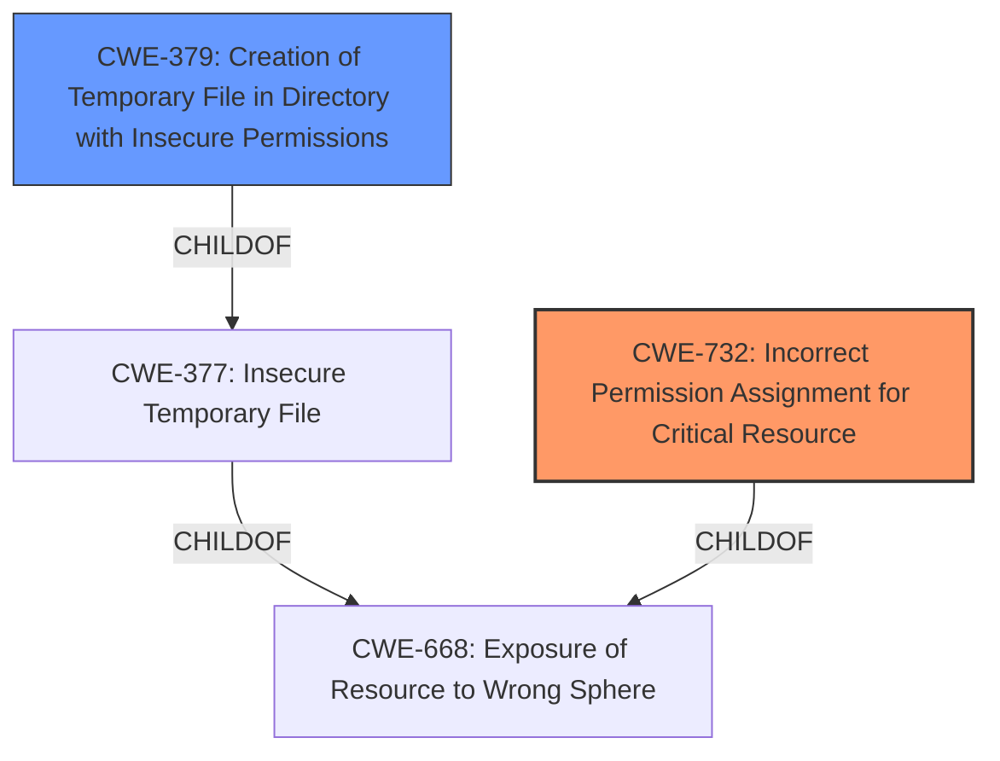

# Analysis for CVE-2021-44512

# Summary
| CWE ID | CWE Name | Confidence | CWE Abstraction Level | CWE Vulnerability Mapping Label | CWE-Vulnerability Mapping Notes |
|---|---|---|---|---|---|
| CWE-732 | Incorrect Permission Assignment for Critical Resource | 1.0 | Class | Allowed-with-Review | Primary CWE |
| CWE-379 | Creation of Temporary File in Directory with Insecure Permissions | 0.8 | Base | Allowed | Secondary Candidate |

## Evidence and Confidence

*   **Confidence Score:** 0.9
*   **Evidence Strength:** HIGH

## Relationship Analysis
The primary CWE, CWE-732 (Incorrect Permission Assignment for Critical Resource), is a Class-level CWE. A more specific Base CWE, CWE-379 (Creation of Temporary File in Directory with Insecure Permissions) which is a child of CWE-377, was also considered due to the vulnerability occurring in the context of temporary file creation within a directory with insecure permissions. CWE-379 is a child of CWE-377 (Insecure Temporary File), which is a child of CWE-668 (Exposure of Resource to Wrong Sphere). The relationship analysis guided the decision to map to both CWE-732 and CWE-379, capturing both the general permission issue and the specific context of temporary files.

## Vulnerability Chain
The vulnerability chain starts with the **world-writable permissions** on the `/tmp/tmate/sessions` directory, which allows a local attacker to compromise session handling and obtain read-write session IDs.
  - **Root Cause:** CWE-732: Incorrect Permission Assignment for Critical Resource.
  - **Weakness:** CWE-379: Creation of Temporary File in Directory with Insecure Permissions (in the /tmp directory).
  - **Impact:** Compromise of session handling and potential privilege escalation.

## Summary of Analysis
The initial analysis focused on identifying the root cause of the vulnerability based on the provided description and CVE reference. The key phrase "**world-writable permissions**" immediately pointed to a permission-related issue. The CVE reference content summary confirmed that the `/tmp/tmate/sessions` directory had insecure permissions, allowing local attackers to manipulate files and potentially hijack sessions.

The Retriever results highlighted several relevant CWEs, including CWE-732, CWE-59, CWE-276, CWE-377, CWE-427 and CWE-379. Among these, CWE-732 (Incorrect Permission Assignment for Critical Resource) stood out as the primary candidate due to its direct relevance to the identified root cause. Additionally, CWE-379 (Creation of Temporary File in Directory with Insecure Permissions) was considered as a more specific weakness related to the creation of temporary files with insecure permissions.

The relationship analysis revealed that CWE-379 is a child of CWE-377 (Insecure Temporary File), which in turn is a child of CWE-668 (Exposure of Resource to Wrong Sphere). While CWE-379 is more specific, CWE-732 directly addresses the **incorrect permission assignment**, making it the primary CWE.

The final decision was to map the vulnerability to CWE-732 as the primary CWE, reflecting the root cause of the insecure permissions, and CWE-379 as a secondary CWE, providing more specific context related to temporary files. This combination provides a comprehensive representation of the vulnerability.

The selection of CWE-732 as the primary CWE is at the optimal level of specificity because it directly represents the root cause identified in the vulnerability description and CVE reference. The addition of CWE-379 provides further context without overgeneralizing the classification.

Relevant CWE Information:

# Enhanced Context (25 CWEs)

## CWE-330: Use of Insufficiently Random Values
**Abstraction Level**: Class
**Similarity Score**: 0.82
**Source**: dense

**Description**:
The product uses insufficiently random numbers or values in a security context that depends on unpredictable numbers.

**Mapping Guidance**:
- Usage: Discouraged
- Rationale: This CWE entry is a level-1 Class (i.e., a child of a Pillar). It might have lower-level children that would be more appropriate

**Rationale for not selecting:** This CWE is not relevant because the vulnerability is not related to random number generation.

## CWE-667: Improper Locking
**Abstraction Level**: Class
**Similarity Score**: 0.78
**Source**: dense

**Description**:
The product does not properly acquire or release a lock on a resource, leading to unexpected resource state changes and behaviors.

**Mapping Guidance**:
- Usage: Allowed-with-Review
- Rationale: This CWE entry is a Class and might have Base-level children that would be more appropriate

**Rationale for not selecting:** This CWE is not relevant because the vulnerability is not related to locking mechanisms.

## CWE-754: Improper Check for Unusual or Exceptional Conditions
**Abstraction Level**: Class
**Similarity Score**: 0.78
**Source**: dense

**Description**:
The product does not check or incorrectly checks for unusual or exceptional conditions that are not expected to occur frequently during day to day operation of the product.

**Mapping Guidance**:
- Usage: Allowed-with-Review
- Rationale: This CWE entry is a Class and might have Base-level children that would be more appropriate

**Rationale for not selecting:** This CWE is not relevant because the vulnerability is not related to checking for exceptional conditions.

## CWE-703: Improper Check or Handling of Exceptional Conditions
**Abstraction Level**: Pillar
**Similarity Score**: 0.78
**Source**: dense

**Description**:
The product does not properly anticipate or handle exceptional conditions that rarely occur during normal operation of the product.

**Mapping Guidance**:
- Usage: Discouraged
- Rationale: This CWE entry is extremely high-level, a Pillar.

**Rationale for not selecting:** This CWE is not relevant because the vulnerability is not related to handling exceptional conditions.

## CWE-203: Observable Discrepancy
**Abstraction Level**: Base
**Similarity Score**: 0.77
**Source**: dense

**Description**:
The product behaves differently or sends different responses under different circumstances in a way that is observable to an unauthorized actor, which exposes security-relevant information about the state of the product, such as whether a particular operation was successful or not.

**Mapping Guidance**:
- Usage: Allowed
- Rationale: This CWE entry is at the Base level of abstraction, which is a preferred level of abstraction for mapping to the root causes of vulnerabilities.

**Rationale for not selecting:** This CWE is not relevant because the vulnerability does not involve observable discrepancies in behavior.

## CWE-331: Insufficient Entropy
**Abstraction Level**: Base
**Similarity Score**: 0.77
**Source**: dense

**Description**:
The product uses an algorithm or scheme that produces insufficient entropy, leaving patterns or clusters of values that are more likely to occur than others.

**Mapping Guidance**:
- Usage: Allowed
- Rationale: This CWE entry is at the Base level of abstraction, which is a preferred level of abstraction for mapping to the root causes of vulnerabilities.

**Rationale for not selecting:** This CWE is not relevant because the vulnerability is not related to entropy.

## CWE-668: Exposure of Resource to Wrong Sphere
**Abstraction Level**: Class
**Similarity Score**: 0.77
**Source**: dense

**Description**:
The product exposes a resource to the wrong control sphere, providing unintended actors with inappropriate access to the resource.

**Mapping Guidance**:
- Usage: Discouraged
- Rationale: CWE-668 is high-level and is often misused as a catch-all when lower-level CWE IDs might be applicable. It is sometimes used for low-information vulnerability reports [REF-1287]. It is a level-1 Class (i.e., a child of a Pillar). It is not useful for trend analysis.

**Rationale for not selecting:** This CWE is too general; CWE-732 and CWE-379 provide more specific classifications.

## CWE-41: Improper Resolution of Path Equivalence
**Abstraction Level**: Base
**Similarity Score**: 0.77
**Source**: dense

**Description**:
The product is vulnerable to file system contents disclosure through path equivalence. Path equivalence involves the use of special characters in file and directory names. The associated manipulations are intended to generate multiple names for the same object.

**Mapping Guidance**:
- Usage: Allowed
- R