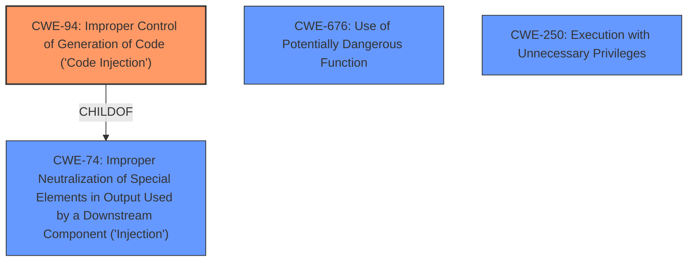

# Raw Analyzer Response for CVE-2021-44521

# Summary
| CWE ID | CWE Name | Confidence | CWE Abstraction Level | CWE Vulnerability Mapping Label | CWE-Vulnerability Mapping Notes |
|---|---|---|---|---|---|
| CWE-94 | Improper Control of Generation of Code ('Code Injection') | 0.9 | Base | Allowed-with-Review | Primary CWE |
| CWE-676 | Use of Potentially Dangerous Function | 0.7 | Base | Allowed | Secondary Candidate |
| CWE-250 | Execution with Unnecessary Privileges | 0.6 | Base | Allowed | Secondary Candidate |

## Evidence and Confidence

*   **Confidence Score:** 0.9
*   **Evidence Strength:** HIGH

## Relationship Analysis
The primary CWE is CWE-94, which is related to code injection. It has a parent CWE of CWE-74 (Improper Neutralization of Special Elements in Output Used by a Downstream Component ('Injection')), indicating that it is a specific type of injection vulnerability. The secondary CWEs, CWE-676 and CWE-250, represent additional aspects of the vulnerability.

## Vulnerability Chain
The vulnerability chain starts with the configuration of Apache Cassandra that enables user-defined functions and scripted user-defined functions, but disables threads for user-defined functions. This leads to the ability for an attacker with sufficient permissions to create user-defined functions. The attacker then uses this ability to inject arbitrary code, resulting in the execution of that code on the host.
  - The root cause is the insecure configuration (`enable_user_defined_functions_threads false`) and the **improper control of code generation** (CWE-94) due to the **use of potentially dangerous functions** (CWE-676) for UDF execution without proper sandboxing.
  - The impact is arbitrary code execution.

## Summary of Analysis
The primary weakness is CWE-94 (Improper Control of Generation of Code ('Code Injection')), as the attacker is able to inject and execute arbitrary code via user-defined functions. This is supported by the vulnerability description, which states "it is possible for an attacker to execute arbitrary code on the host." The configuration `enable_user_defined_functions_threads false` causes UDFs to run within the Cassandra daemon thread which has broader permissions which, combined with the ability to turn off the Security Manager, allows an attacker to escape the UDF sandbox. The ability to disable the security manager is evidence for the **execution with unnecessary privileges** (CWE-250). The use of scripted UDFs themselves, without proper sandboxing, is evidence for the **use of potentially dangerous functions** (CWE-676).

I considered CWE-732 (Incorrect Permission Assignment for Critical Resource) and CWE-863 (Incorrect Authorization), but they are not as directly relevant as CWE-94. The vulnerability is not primarily about incorrect permissions or authorization, but rather about the ability to inject and execute arbitrary code.

The chosen CWEs are at the optimal level of specificity. CWE-94 is a base-level CWE that accurately describes the root cause of the vulnerability. The secondary CWEs provide additional context, but are not as central to the vulnerability.

Relevant CWE Information:

# Enhanced Context (25 CWEs)
The following CWEs were identified as potentially relevant to this vulnerability:

## CWE-74: Improper Neutralization of Special Elements in Output Used by a Downstream Component ('Injection')
**Abstraction Level**: Class
**Similarity Score**: 0.76
**Source**: dense

**Description**:
The product constructs all or part of a command, data structure, or record using externally-influenced input from an upstream component, but it does not neutralize or incorrectly neutralizes special elements that could modify how it is parsed or interpreted when it is sent to a downstream component.

**Mapping Guidance**:
- Usage: Discouraged
- Rationale: CWE-74 is high-level and often misused when lower-level weaknesses are more appropriate.

## CWE-676: Use of Potentially Dangerous Function
**Abstraction Level**: Base
**Status:** Draft

### Description
The product invokes a potentially dangerous function that could introduce a vulnerability if it is used incorrectly, but the function can also be used safely.

### Extended Description
Not provided

### Alternative Terms
None

### Relationships
ChildOf -> CWE-1177

### Mapping Guidance
**Usage:** Allowed
**Rationale:** This CWE entry is at the Base level of abstraction, which is a preferred level of abstraction for mapping to the root causes of vulnerabilities.
**Comments:** Carefully read both the name and description to ensure that this mapping is an appropriate fit. Do not try to 'force' a mapping to a lower-level Base/Variant simply to comply with this preferred level of abstraction.
**Reasons:**
- Acceptable-Use

### Additional Notes
**[Relationship]** This weakness is different than CWE-242 (Use of Inherently Dangerous Function). CWE-242 covers functions with such significant security problems that they can never be guaranteed to be safe. Some functions, if used properly, do not directly pose a security risk, but can introduce a weakness if not called correctly. These are regarded as potentially dangerous. A well-known example is the strcpy() function. When provided with a destination buffer that is larger than its source, strcpy() will not overflow. However, it is so often misused that some developers prohibit strcpy() entirely.

### Observed Examples
- **CVE-2007-1470:** Library has multiple buffer overflows using sprintf() and strcpy()
- **CVE-2009-3849:** Buffer overflow using strcat()
- **CVE-2006-2114:** Buffer overflow using strcpy()

## CWE-250: Execution with Unnecessary Privileges
**Abstraction Level**: Base
**Status:** Draft

### Description
The product performs an operation at a privilege level that is higher than the minimum level required, which creates new weaknesses or amplifies the consequences of other weaknesses.

### Extended Description
New weaknesses can be exposed because running with extra privileges, such as root or Administrator, can disable the normal security checks being performed by the operating system or surrounding environment. Other pre-existing weaknesses can turn into security vulnerabilities if they occur while operating at raised privileges.

Privilege management functions can behave in some less-than-obvious ways, and they have different quirks on different platforms. These inconsistencies are particularly pronounced if you are transitioning from one non-root user to another. Signal handlers and spawned processes run at the privilege of the owning process, so if a process is running as root when a signal fires or a sub-process is executed, the signal handler or sub-process will operate with root privileges.

### Alternative Terms
None

### Relationships
ChildOf -> CWE-269
ChildOf -> CWE-657

### Mapping Guidance
**Usage:** Allowed
**Rationale:** This CWE entry is at the Base level of abstraction, which is a preferred level of abstraction for mapping to the root causes of vulnerabilities.
**Comments:** Carefully read both the name and description to ensure that this mapping is an appropriate fit. Do not try to 'force' a mapping to a lower-level Base/Variant simply to comply with this preferred level of abstraction.
**Reasons:**
- Acceptable-Use

### Additional Notes
**[Relationship]** There is a close association with CWE-653 (Insufficient Separation of Privileges). CWE-653 is about providing separate components for each privilege; CWE-250 is about ensuring that each component has the least amount of privileges possible.

**[Maintenance]** CWE-271, CWE-272, and CWE-250 are all closely related and possibly overlapping. CWE-271 is probably better suited as a category. Both CWE-272 and CWE-250 are in active use by the community. The "least privilege" phrase has multiple interpretations.

**[Maintenance]** The Taxonomy_Mappings to ISA/IEC 62443 were added in CWE 4.10, but they are still under review and might change in future CWE versions. These draft mappings were performed by members of the "Mapping CWE to 62443" subgroup of the CWE-CAPEC ICS/OT Special Interest Group (SIG), and their work is incomplete as of CWE 4.10. The mappings are included to facilitate discussion and review by the broader ICS/OT community, and they are likely to change in future CWE versions.

### Observed Examples
- **CVE-2007-4217:** FTP client