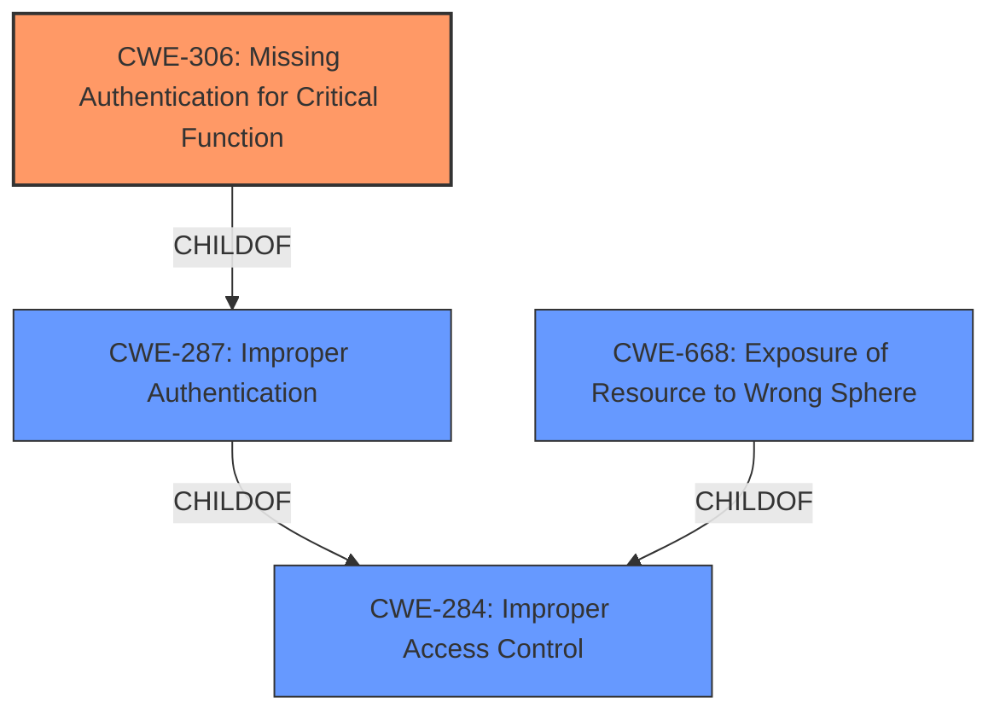

# Analysis for CVE-2021-44524

# Summary
| CWE ID | CWE Name | Confidence | CWE Abstraction Level | CWE Vulnerability Mapping Label | CWE-Vulnerability Mapping Notes |
|---|---|---|---|---|---|
| CWE-306 | Missing Authentication for Critical Function | 0.9 | Base | Primary | Allowed |
| CWE-668 | Exposure of Resource to Wrong Sphere | 0.6 | Class | Secondary | Discouraged |
| CWE-287 | Improper Authentication | 0.5 | Class | Secondary | Discouraged |
| CWE-284 | Improper Access Control | 0.3 | Pillar | Secondary | Discouraged |

## Evidence and Confidence

*   **Confidence Score:** 0.9
*   **Evidence Strength:** HIGH

## Relationship Analysis
The primary CWE is CWE-306, which is a base-level weakness indicating a complete lack of authentication for critical functions. CWE-306 is a child of CWE-287 (Improper Authentication), which in turn is a child of CWE-284 (Improper Access Control). This hierarchy reflects the progression from a general access control issue to a specific authentication failure, and finally to the complete absence of authentication. CWE-668 (Exposure of Resource to Wrong Sphere) is considered due to the potential exposure of the internal user authentication service, but it's a higher-level classification.

## Vulnerability Chain
The chain begins with the **insufficient limitation of access to the internal user authentication service**, leading to a **missing authentication** check (CWE-306). This allows an **unauthenticated remote attacker to trigger actions on behalf of valid user accounts**. The vulnerability could also lead to **exposure of resources to the wrong sphere** (CWE-668)

## Summary of Analysis
The initial assessment considered several CWEs, with CWE-668 having the highest retriever score. However, the vulnerability description explicitly mentions **insufficiently limit the access to the internal user authentication service**, which directly indicates a **missing authentication** issue.

The evidence supporting CWE-306 is strong, as it directly reflects the root cause described in the vulnerability description: "Affected applications **insufficiently limit the access to the internal user authentication service**." This **lack of proper access control** on the authentication service allows unauthenticated attackers to perform actions on behalf of valid users.

CWE-668 was considered but ultimately deemed less specific than CWE-306. While the **exposure of the authentication service** is a consequence, the root cause is the **missing authentication**. Similarly, CWE-287 (Improper Authentication) is too general, as the vulnerability involves a complete absence of authentication rather than a flawed authentication mechanism. CWE-284 (Improper Access Control) is also too high-level.

The selected CWEs are at the optimal level of specificity, with CWE-306 accurately representing the root cause of the vulnerability. The confidence in this assessment is high (0.9) due to the direct match between the vulnerability description and the CWE definition.

Relevant CWE Information:
# Enhanced Context (25 CWEs)
The following CWEs were identified as potentially relevant to this vulnerability:

## CWE-274: Improper Handling of Insufficient Privileges
**Abstraction Level**: Base
**Similarity Score**: 0.77
**Source**: dense

**Description**:
The product does not handle or incorrectly handles when it has insufficient privileges to perform an operation, leading to resultant weaknesses.

**Mapping Guidance**:
- Usage: Discouraged
- Rationale: This CWE entry could be deprecated in a future version of CWE.
- *Not Selected*: Insufficient privileges is not the root cause.

## CWE-653: Improper Isolation or Compartmentalization
**Abstraction Level**: Class
**Similarity Score**: 0.77
**Source**: dense

**Description**:
The product does not properly compartmentalize or isolate functionality, processes, or resources that require different privilege levels, rights, or permissions.

**Mapping Guidance**:
- Usage: Allowed
- Rationale: This CWE entry is at the Base level of abstraction, which is a preferred level of abstraction for mapping to the root causes of vulnerabilities.
- *Not Selected*: Improper isolation is not the root cause.

## CWE-1220: Insufficient Granularity of Access Control
**Abstraction Level**: Base
**Similarity Score**: 0.76
**Source**: dense

**Description**:
The product implements access controls via a policy or other feature with the intention to disable or restrict accesses (reads and/or writes) to assets in a system from untrusted agents. However, implemented access controls lack required granularity, which renders the control policy too broad because it allows accesses from unauthorized agents to the security-sensitive assets.

**Mapping Guidance**:
- Usage: Allowed
- Rationale: This CWE entry is at the Base level of abstraction, which is a preferred level of abstraction for mapping to the root causes of vulnerabilities.
- *Not Selected*: This is about granularity of existing access controls, but the described vulnerability is about missing access control.

## CWE-280: Improper Handling of Insufficient Permissions or Privileges 
**Abstraction Level**: Base
**Similarity Score**: 0.76
**Source**: dense

**Description**:
The product does not handle or incorrectly handles when it has insufficient privileges to access resources or functionality as specified by their permissions. This may cause it to follow unexpected code paths that may leave the product in an invalid state.

**Mapping Guidance**:
- Usage: Allowed
- Rationale: This CWE entry is at the Base level of abstraction, which is a preferred level of abstraction for mapping to the root causes of vulnerabilities.
- *Not Selected*: Insufficient permissions is not the root cause.

## CWE-807: Reliance on Untrusted Inputs in a Security Decision
**Abstraction Level**: Base
**Similarity Score**: 0.76
**Source**: dense

**Description**:
The product uses a protection mechanism that relies on the existence or values of an input, but the input can be modified by an untrusted actor in a way that bypasses the protection mechanism.

**Mapping Guidance**:
- Usage: Allowed
- Rationale: This CWE entry is at the Base level of abstraction, which is a preferred level of abstraction for mapping to the root causes of vulnerabilities.
- *Not Selected*: This is about an existing protection mechanism that is bypassed, but the described vulnerability is about missing protection mechanism.

## CWE-668: Exposure of Resource to Wrong Sphere
**Abstraction Level**: Class
**Similarity Score**: 0.75
**Source**: dense

**Description**:
The product exposes a resource to the wrong control sphere, providing unintended actors with inappropriate access to the resource.

**Mapping Guidance**:
- Usage: Discouraged
- Rationale: CWE-668 is high-level and is often misused as a catch-all when lower-level CWE IDs might be applicable. It is sometimes used for low-information vulnerability reports [REF-1287]. It is a level-1 Class (i.e., a child of a Pillar). It is not useful for trend analysis.
- *Selected as Secondary*: While it is a valid high-level concern, CWE-306 is more specific and accurately describes the root cause.

## CWE-639: Authorization Bypass Through User-Controlled Key
**Abstraction Level**: Base
**Similarity Score**: 0.75
**Source**: dense

**Description**:
The system's authorization functionality does not prevent one user from gaining access to another user's data or record by modifying the key value identifying the data.

**Mapping Guidance**:
- Usage: Allowed
- Rationale: This CWE entry is at the Base level of abstraction, which is a preferred level of abstraction for mapping to the root causes of vulnerabilities.
- *Not Selected*: This is about modifying a key to bypass authorization, but the described vulnerability is about missing authentication.

## CWE-303: Incorrect Implementation of Authentication Algorithm
**Abstraction Level**: Base
**Similarity Score**: 0.74
**Source**: dense

**Description**:
The requirements for the product dictate the use of an established authentication algorithm, but the implementation of the algorithm is incorrect.

**Mapping Guidance**:
- Usage: Allowed
- Rationale: This CWE entry is at the Base level of abstraction, which is a preferred level of abstraction for mapping to the root causes of vulnerabilities.
- *Not Selected*: This is about incorrect implementation of authentication algorithm, but the described