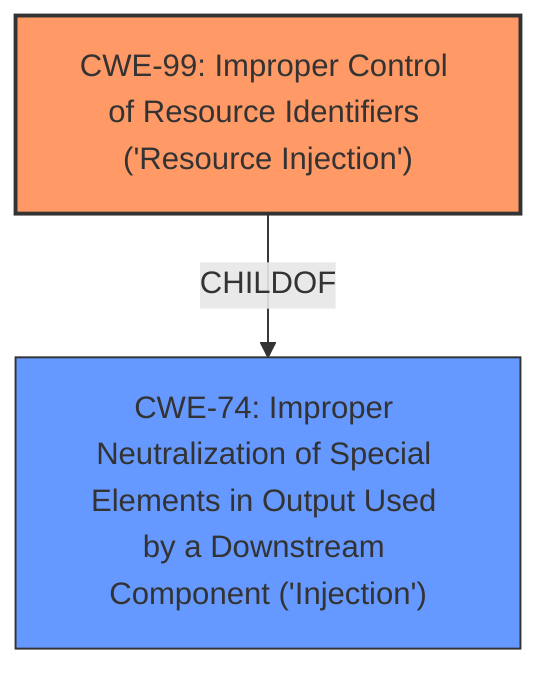

# Analysis for CVE-2021-44537

# Summary
| CWE ID | CWE Name | Confidence | CWE Abstraction Level | CWE Vulnerability Mapping Label | CWE-Vulnerability Mapping Notes |
|---|---|---|---|---|---|
| CWE-99 | Improper Control of Resource Identifiers ('Resource Injection') | 0.9 | Class | Primary | Allowed-with-Review |
| CWE-74 | Improper Neutralization of Special Elements in Output Used by a Downstream Component ('Injection') | 0.6 | Class | Secondary | Discouraged |

## Evidence and Confidence

*   **Confidence Score:** 0.9
*   **Evidence Strength:** HIGH

## Relationship Analysis
The primary CWE, CWE-99, is a child of CWE-74. CWE-99 is a Class-level CWE, and the guidance indicates that a more specific Base-level child should be sought if possible. However, in this case, the description aligns well with the definition of CWE-99. CWE-74 is a higher-level, more general CWE describing injection issues and is discouraged for use when a more specific CWE is available.

## Vulnerability Chain
The vulnerability chain starts with the **Improper Control of Resource Identifiers** (CWE-99). The missing URL validation allows a malicious server to inject a URL into the ownCloud client, leading to remote code execution.

## Summary of Analysis
The initial assessment, based on the vulnerability description and key phrases, strongly suggests CWE-99 as the primary weakness. The "CVE Reference Links Content Summary" section supports this by explicitly mentioning "Improper Control of Resource Identifiers ('Resource Injection')" and "Missing URL validation". The retriever results also list CWE-99 as a relevant CWE.

The hierarchical relationships, specifically the parent-child relationship between CWE-99 and CWE-74, influenced the decision to prioritize CWE-99 as the more specific and accurate representation of the vulnerability.

The selection of CWE-99 is based on direct evidence from the vulnerability description and supporting information from the CVE reference. The CWE description aligns well with the vulnerability's details, making it the optimal choice. The evidence includes the vulnerability description key phrases, especially "**Resource Injection**", and the CVE reference summary, which states "Improper Control of Resource Identifiers ('Resource Injection')" and "Missing URL validation".

Relevant CWE Information:

# Enhanced Context (25 CWEs)
The following CWEs were identified as potentially relevant to this vulnerability:

## CWE-74: Improper Neutralization of Special Elements in Output Used by a Downstream Component ('Injection')
**Abstraction Level**: Class
**Similarity Score**: 0.77
**Source**: dense

**Description**:
The product constructs all or part of a command, data structure, or record using externally-influenced input from an upstream component, but it does not neutralize or incorrectly neutralizes special elements that could modify how it is parsed or interpreted when it is sent to a downstream component.

**Mapping Guidance**:
- Usage: Discouraged
- Rationale: CWE-74 is high-level and often misused when lower-level weaknesses are more appropriate.

## CWE-99: Improper Control of Resource Identifiers ('Resource Injection')
**Abstraction Level**: Class
**Similarity Score**: 0.76
**Source**: dense

**Description**:
The product receives input from an upstream component, but it does not restrict or incorrectly restricts the input before it is used as an identifier for a resource that may be outside the intended sphere of control.

**Mapping Guidance**:
- Usage: Allowed-with-Review
- Rationale: This CWE entry is a Class and might have Base-level children that would be more appropriate
- Comments: Examine children of this entry to see if there is a better fit
- Reasons:
- Abstraction

## CWE-78: Improper Neutralization of Special Elements used in an OS Command ('OS Command Injection')
**Abstraction Level**: base
**Similarity Score**: 3.57
**Source**: graph

**Description**:
CWE-78: Improper Neutralization of Special Elements used in an OS Command ('OS Command Injection')

**Mapping Guidance**:
- Usage: Allowed
- Rationale: This CWE entry is at the Base level of abstraction, which is a preferred level of abstraction for mapping to the root causes of vulnerabilities.