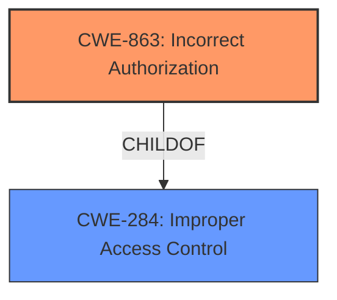

# Analysis for CVE-2021-44550

# Summary
| CWE ID | CWE Name | Confidence | CWE Abstraction Level | CWE Vulnerability Mapping Label | CWE-Vulnerability Mapping Notes |
|---|---|---|---|---|---|
| CWE-863 | Incorrect Authorization | 0.8 | Class | Primary | Allowed-with-Review |
| CWE-284 | Improper Access Control | 0.6 | Pillar | Secondary | Discouraged |

## Evidence and Confidence

*   **Confidence Score:** 0.7
*   **Evidence Strength:** MEDIUM

## Relationship Analysis
The primary relationship influencing the CWE selection is the hierarchical structure. CWE-863 (Incorrect Authorization) is a child of CWE-284 (Improper Access Control). While CWE-863 is more specific, the evidence does not fully support it. The provided information is still high level and the analysis is not fully confident in a authorization weakness, thus the combination of CWE-863 and CWE-284.

## Vulnerability Chain
The chain of events is as follows:
1.  **Root Cause:** **Incorrect Access Control** in CoreNLP 4.3.2 via the classifier in NERServlet.java
2.  The application includes unvalidated data in HTTP response headers.
3.  **Impact:** This can enable cache-poisoning, cross-site scripting, cross-user defacement, page hijacking, cookie manipulation or open redirect.

## Summary of Analysis
Initially, the vulnerability description points towards an **Incorrect Access Control** issue. The CVE Reference Links Content Summary confirms that the `classifier`, `outputFormat`, and `preserveSpacing` parameters are added to the response headers without proper validation.

The Retriever Results suggest several CWEs, including CWE-782, CWE-732, CWE-284, CWE-863, and CWE-306.

CWE-863 (Incorrect Authorization) is a strong candidate because the vulnerability involves **incorrect access control**. However, the evidence doesn't provide specific details on how the authorization check is incorrectly performed. It simply states that there is an **incorrect access control**.

CWE-284 (Improper Access Control) is a high-level pillar that broadly covers access control issues. Given the limited information, it serves as a suitable secondary CWE to capture the overall nature of the vulnerability.

CWE-782 (Exposed IOCTL with Insufficient Access Control) and CWE-781 (Improper Address Validation in IOCTL with METHOD_NEITHER I/O Control Code) are not applicable because the vulnerability doesn't involve IOCTLs.

CWE-732 (Incorrect Permission Assignment for Critical Resource) is not applicable since there is no evidence of incorrect permission assignments.

CWE-306 (Missing Authentication for Critical Function) is not applicable because the issue is not about missing authentication.

CWE-917 (Improper Neutralization of Special Elements used in an Expression Language Statement ('Expression Language Injection')) might appear relevant because the application includes unvalidated data in HTTP response headers, potentially leading to injection vulnerabilities. However, the primary issue is **incorrect access control**, making CWE-917 a less direct fit.

Based on the available evidence and the hierarchical relationship between CWE-863 and CWE-284, the final assessment is:

*   **Primary CWE:** CWE-863 (Incorrect Authorization)
*   **Secondary CWE:** CWE-284 (Improper Access Control)

The selection of CWE-863 is based on the description of the **Incorrect Access Control**. Since the CVE description is brief and high level, CWE-284 is included as a more general description.

Relevant CWE Information:

# Enhanced Context (25 CWEs)
The following CWEs were identified as potentially relevant to this vulnerability:

## CWE-691: Insufficient Control Flow Management
**Abstraction Level**: Pillar
**Similarity Score**: 0.80
**Source**: dense

**Description**:
The code does not sufficiently manage its control flow during execution, creating conditions in which the control flow can be modified in unexpected ways.

**Mapping Guidance**:
- Usage: Discouraged
- Rationale: This CWE entry is extremely high-level, a Pillar. However, classification research is limited for weaknesses of this type, so there can be gaps or organizational difficulties within CWE that force use of this weakness, even at such a high level of abstraction.

## CWE-664: Improper Control of a Resource Through its Lifetime
**Abstraction Level**: Pillar
**Similarity Score**: 0.77
**Source**: dense

**Description**:
The product does not maintain or incorrectly maintains control over a resource throughout its lifetime of creation, use, and release.

**Mapping Guidance**:
- Usage: Discouraged
- Rationale: This CWE entry is high-level when lower-level children are available.

## CWE-274: Improper Handling of Insufficient Privileges
**Abstraction Level**: Base
**Similarity Score**: 0.76
**Source**: dense

**Description**:
The product does not handle or incorrectly handles when it has insufficient privileges to perform an operation, leading to resultant weaknesses.

**Mapping Guidance**:
- Usage: Discouraged
- Rationale: This CWE entry could be deprecated in a future version of CWE.

## CWE-653: Improper Isolation or Compartmentalization
**Abstraction Level**: Class
**Similarity Score**: 0.76
**Source**: dense

**Description**:
The product does not properly compartmentalize or isolate functionality, processes, or resources that require different privilege levels, rights, or permissions.

**Mapping Guidance**:
- Usage: Allowed
- Rationale: This CWE entry is at the Base level of abstraction, which is a preferred level of abstraction for mapping to the root causes of vulnerabilities.

## CWE-1220: Insufficient Granularity of Access Control
**Abstraction Level**: Base
**Similarity Score**: 0.75
**Source**: dense

**Description**:
The product implements access controls via a policy or other feature with the intention to disable or restrict accesses (reads and/or writes) to assets in a system from untrusted agents. However, implemented access controls lack required granularity, which renders the control policy too broad because it allows accesses from unauthorized agents to the security-sensitive assets.

**Mapping Guidance**:
- Usage: Allowed
- Rationale: This CWE entry is at the Base level of abstraction, which is a preferred level of abstraction for mapping to the root causes of vulnerabilities.

## CWE-280: Improper Handling of Insufficient Permissions or Privileges
**Abstraction Level**: Base
**Similarity Score**: 0.75
**Source**: dense

**Description**:
The product does not handle or incorrectly handles when it has insufficient privileges to access resources or functionality as specified by their permissions. This may cause it to follow unexpected code paths that may leave the product in an invalid state.

**Mapping Guidance**:
- Usage: Allowed
- Rationale: This CWE entry is at the Base level of abstraction, which is a preferred level of abstraction for mapping to the root causes of vulnerabilities.

## CWE-703: Improper Check or Handling of Exceptional Conditions
**Abstraction Level**: Pillar
**Similarity Score**: 0.75
**Source**: dense

**Description**:
The product does not properly anticipate or handle exceptional conditions that rarely occur during normal operation of the product.

**Mapping Guidance**:
- Usage: Discouraged
- Rationale: This CWE entry is extremely high-level, a Pillar.

## CWE-668: Exposure of Resource to Wrong Sphere
**Abstraction Level**: Class
**Similarity Score**: 0.75
**Source**: dense

**Description**:
The product exposes a resource to the wrong control sphere, providing unintended actors with inappropriate access to the resource.

**Mapping Guidance**:
- Usage: Discouraged
- Rationale: CWE-668 is high-level and is often misused as a catch-all when lower-level CWE IDs might be applicable. It is sometimes used for low-information vulnerability reports [REF-1287]. It is a level-1 Class (i.e., a child of a Pillar). It is not useful for trend analysis.

## CWE-705: Incorrect Control Flow Scoping
**Abstraction Level**: Class
**Similarity Score**: 0.74
**Source**: dense

**Description**:
The product does not properly return control flow to the proper location after it has completed a task or detected an unusual condition.

**Mapping Guidance**:
- Usage: Allowed-with-Review
- Rationale: This CWE entry is a Class and might have Base-level children that would be more appropriate

## CWE-1289: Improper Validation of Unsafe Equivalence in Input
**Abstraction Level**: Base
**Similarity Score**: 0.74
**Source**: dense

**Description**:
The product receives an input value that is used as a resource identifier or other type of reference, but it