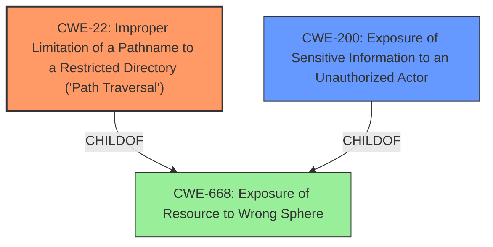

# Analysis Report for CVE-2021-44586

# Vulnerability Analysis Report: CVE-2021-44586

## Description


## Analysis (with Relationship Data)

# Summary
| CWE ID | CWE Name | Confidence | CWE Abstraction Level | CWE Vulnerability Mapping Label | CWE-Vulnerability Mapping Notes |
|---|---|---|---|---|---|
| CWE-22 | Improper Limitation of a Pathname to a Restricted Directory ('Path Traversal') | 1.0 | Base | Primary | Allowed |
| CWE-200 | Exposure of Sensitive Information to an Unauthorized Actor | 0.7 | Class | Secondary | Discouraged |

## Evidence and Confidence

*   **Confidence Score:** 0.85
*   **Evidence Strength:** HIGH

## Relationship Analysis
The primary weakness identified is CWE-22, a **Base** level weakness, which accurately describes the path traversal vulnerability. CWE-22 is a child of higher-level **Class** CWEs that deal with information exposure and access control issues (CWE-668). The vulnerability involves accessing resources outside the intended directory, thus relating to path traversal concepts. The secondary weakness, CWE-200, is a **Class** level weakness that describes the impact of exposing sensitive information.



## Vulnerability Chain
The vulnerability chain starts with **improper input validation** of the `fileName` parameter, leading to a **path traversal** vulnerability (CWE-22). This allows an attacker to **download arbitrary files**, resulting in **exposure of sensitive information** (CWE-200).

## Summary of Analysis
The primary assessment is based on the provided evidence from the **CVE Reference Links Content Summary**. The content explicitly states:

> The root cause is a path traversal vulnerability in the `/images;/../backup/download` endpoint. The application doesn't properly sanitize the `fileName` parameter, allowing an attacker to use `..` sequences to navigate to parent directories and access arbitrary files on the server.

This clearly points to CWE-22, which is defined as:

> The product uses external input to construct a pathname that is intended to identify a file or directory that is located underneath a restricted parent directory, but the product does not properly neutralize special elements within the pathname that can cause the pathname to resolve to a location that is outside of the restricted directory.

The relationship graph shows how CWE-22 fits within the broader context of access control and information exposure. CWE-22 is chosen because it is the most specific **Base** level CWE that accurately describes the vulnerability, as opposed to the more generic **Class** level CWE-200.

CWE-200 is considered a secondary weakness because it represents the impact of the primary weakness (CWE-22) rather than the root cause. While the vulnerability leads to the exposure of sensitive information, the underlying issue is the path traversal that enables this exposure.

Relevant CWE Information:

# Enhanced Context (25 CWEs)

## CWE-611: Improper Restriction of XML External Entity Reference
**Abstraction Level**: Base
**Similarity Score**: 0.80
**Source**: dense

**Description**:
The product processes an XML document that can contain XML entities with URIs that resolve to documents outside of the intended sphere of control, causing the product to embed incorrect documents into its output.

**Why Not Used:** This CWE is specific to XML external entity injection, which is not the case here. The vulnerability is related to path traversal, not XML processing.

## CWE-552: Files or Directories Accessible to External Parties
**Abstraction Level**: Base
**Similarity Score**: 0.77
**Source**: dense

**Description**:
The product makes files or directories accessible to unauthorized actors, even though they should not be.

**Why Not Used:** This is too broad. CWE-22 is more specific to the path traversal nature of the vulnerability.

## CWE-73: External Control of File Name or Path
**Abstraction Level**: Base
**Similarity Score**: 0.77
**Source**: dense

**Description**:
The product allows user input to control or influence paths or file names that are used in filesystem operations.

**Why Not Used:** CWE-73 is a more general case than CWE-22, which specifies the improper limitation of a path name to a restricted directory. Since the vulnerability description highlights path traversal, CWE-22 is more appropriate.

## CWE-538: Insertion of Sensitive Information into Externally-Accessible File or Directory
**Abstraction Level**: Base
**Similarity Score**: 0.77
**Source**: dense

**Description**:
The product places sensitive information into files or directories that are accessible to actors who are allowed to have access to the files, but not to the sensitive information.

**Why Not Used:** This CWE is about *placing* sensitive information where it shouldn't be, not about *accessing* files with sensitive information through path traversal.

## CWE-41: Improper Resolution of Path Equivalence
**Abstraction Level**: Base
**Similarity Score**: 0.77
**Source**: dense

**Description**:
The product is vulnerable to file system contents disclosure through path equivalence. Path equivalence involves the use of special characters in file and directory names. The associated manipulations are intended to generate multiple names for the same object.

**Why Not Used:** The vulnerability description focuses on path traversal using `..` sequences, not on path equivalence issues.

## CWE-610: Externally Controlled Reference to a Resource in Another Sphere
**Abstraction Level**: Class
**Similarity Score**: 0.77
**Source**: dense

**Description**:
The product uses an externally controlled name or reference that resolves to a resource that is outside of the intended control sphere.

**Why Not Used:** This CWE is too broad and doesn't specifically address path traversal.

## CWE-668: Exposure of Resource to Wrong Sphere
**Abstraction Level**: Class
**Similarity Score**: 0.76
**Source**: dense

**Description**:
The product exposes a resource to the wrong control sphere, providing unintended actors with inappropriate access to the resource.

**Why Not Used:** This CWE is a high-level **Class** and less descriptive than CWE-22.

## CWE-23: Relative Path Traversal
**Abstraction Level**: Base
**Similarity Score**: 0.76
**Source**: dense

**Description**:
The product uses external input to construct a pathname that should be within a restricted directory, but it does not properly neutralize sequences such as ".." that can resolve to a location that is outside of that directory.

**Why Not Used:** CWE-23 and CWE-22 are very similar. CWE-22 is slightly preferred because it is more general, encompassing both relative and absolute path traversal.

## CWE-74: Improper Neutralization of Special Elements in Output Used by a Downstream Component ('Injection')
**Abstraction Level**: Class
**Similarity Score**: 0.76
**Source**: dense

**Description**:
The product constructs all or part of a command, data structure, or record using externally-influenced input from an upstream component, but it does not neutralize or incorrectly neutralizes special elements that could modify how it is parsed or interpreted when it is sent to a downstream component.

**Why Not Used:** This is a broad injection category and doesn't accurately reflect the path traversal vulnerability.

## CWE-59: Improper Link Resolution Before File Access ('Link Following')
**Abstraction Level**: Base
**Similarity Score**: 0.75
**Source**: dense

**Description**:
The product attempts to access a file based on the filename, but it does not properly prevent that filename from identifying a link or shortcut that resolves to an unintended resource.

**Why Not Used:** The vulnerability does not involve symbolic links, so CWE-59 is not applicable.

## CWE-639: Authorization Bypass Through User-Controlled Key
**Abstraction Level**: Base
**Similarity Score**: 7861.58
**Source**: sparse

**Description**:
The system's authorization functionality does not prevent one user from gaining access to another user's data or record by modifying the key value identifying the data.

**Why Not Used:** The description emphasizes unauthorized access via path traversal, not by manipulating user-controlled keys.

## CWE-78: Improper Neutralization of Special Elements used in an OS Command ('OS Command Injection')
**Abstraction Level**: base
**Similarity Score**: 4.59
**Source**: graph

**Description**:
CWE-78: Improper Neutralization of Special Elements used in an OS Command ('OS Command Injection')

**Why Not Used:** The vulnerability is related to file path manipulation, not OS command injection.

## CWE-425: Direct Request ('Forced Browsing')
**Abstraction Level**: base


## CWE Relationship Analysis

Current CWEs represent these abstraction levels: .


### Vulnerability Chain Analysis

**Chain starting from CWE-73:**
- 73 (External Control of File Name or Path) - ROOT


**Chain starting from CWE-41:**
- 41 (Improper Resolution of Path Equivalence) - ROOT


### CWE Relationship Diagram

```mermaid
graph TD
    classDef primary fill:#f96,stroke:#333,stroke-width:2px
    classDef secondary fill:#69f,stroke:#333
    classDef tertiary fill:#9e9,stroke:#333
```


*Report generated on 2025-04-02 01:55:12*
